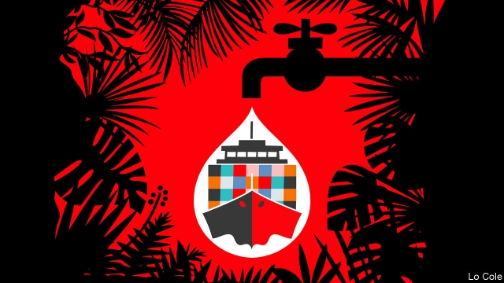
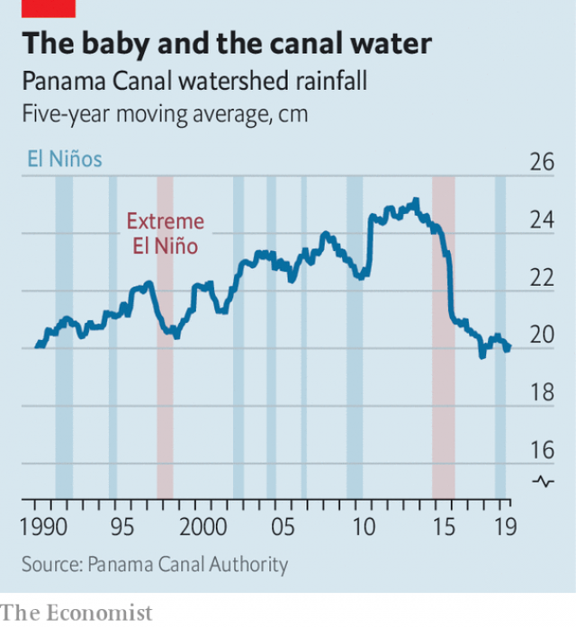
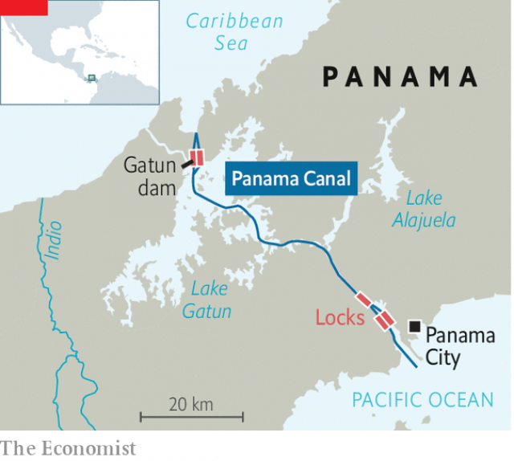

###### Beyond seasonable drought

# Climate change threatens the Panama Canal 

 

> print-edition iconPrint edition | The Americas | Sep 21st 2019 

TAKE IN THE view from atop Gatun dam and fathom what is missing. Container ships float idly on Lake Gatun, near the midpoint of the Panama Canal, awaiting passage to the Caribbean sea, their gateway to the Atlantic Ocean. What look like islands are hilltops poking up from a valley that American engineers flooded a century ago, creating what was then the world’s largest artificial lake. All seems well. But a security guard from the Panama Canal Authority (ACP) points down to a problem: the water lapping against the dam is 1.8 metres (six feet) lower than it should be. 

That water is Panama’s lifeblood. Lake Gatun stores rain during the wet season, which usually runs from mid-April through to mid-December, for use in the dry one. It supplies drinking water to Panama city, the capital, as does man-made Lake Alajuela nearby. It is also two-fifths of the canal, a shortcut between oceans for 3% of the world’s maritime trade, as well as for cruise ships and an occasional nuclear submarine. The ACP provides an eighth of the national government’s revenue. “Water is money here,” says Oscar McKay, an engineer at the dam site. 

A normal rainy season fills Lake Gatun to 26.5 metres above sea level. By the end of the dry season that usually falls to 25.9 metres. Prolonged dry seasons have big consequences. If the water level falls below 24.4 metres, the ACP must limit the weight of big “NEOPANAMAX” container ships lest their hulls scrape on the lake bed. Below 24 metres smaller “PANAMAX” ships would risk bumping on the bottom of the locks reserved for them as they enter and leave the lake. This June, after Panama’s most intense drought since independence in 1903, Lake Gatun fell nearly to that level. In 2016, during a longer (but less severe) dry spell, it fell below that for the first time. 

Panama city’s rising population and the canal’s growing traffic make such low water levels more likely. Each time a ship passes through the canal’s locks, Lake Gatun releases 200m litres (52m American gallons) of water. In a dry month, outflows through the canal can reduce the lake’s level by 80cm. 

This year many ships had to transit the canal with less than their maximum load of cargo. That cost the ACP a few million dollars in revenue. The canal came “this close” to losing much more, says an executive, holding his thumb and forefinger together. It narrowly avoided having to impose draught restrictions on PANAMAX ships. 

Rain since July has raised the water level to 24.7 metres but has not lowered apprehensions. Several severe droughts since 2014 may indicate that dry seasons are becoming longer. That would threaten not only Panama’s water supply and government revenues but the canal’s role as a hub of trade. “The whole global supply chain depends on consistency,” says Onésimo Sánchez, a former manager at the ACP. If the canal falters, shipping firms will turn to competing routes, even if they cost more. 

There is little doubt that climate change threatens Panama. Rising seas will submerge the low-lying Caribbean islands of San Blas, a tourist attraction and home to several thousand Guna, an indigenous group. Warmer temperatures will speed evaporation, and thus reduce water levels in Lake Gatun. But pinning blame for recent droughts on climate change is harder. 

Panama’s worst droughts have happened during extreme occurrences of El Niño, a natural phenomenon in which warm water moves eastwards across the equatorial Pacific Ocean. Longer cycles like the Pacific Decadal Oscillation, which alternates every 20-30 years between warm phases that make El Niños stronger and more frequent and cooler ones, make the role of climate change harder to discern. 

Residents of the capital do not doubt that changes are afoot. The rainy season once brought daily showers of three to four hours. Now the same amount of rain falls in an hour. Eight of the ten biggest storms in the city, measured by rainfall within 24 hours, have occurred since 2000. Despite those downpours, the canal area has had six straight years of below-average rainfall (see chart). The dry season is lengthening. This year it began a month earlier than usual and ended a month late. The current drought is the first severe one to occur in a mild El Niño year. 

 

This unprecedented concurrence suggests that climate change is directly responsible, the ACP believes. “To be completely sure you’d have to wait a hundred years,” notes Carlos Vargas, the ACP’s vice-president for water and environment. And even if climate change is not the culprit now, it may strengthen future El Niños, which would lengthen droughts and increase their intensity. Some scientists think that if, as expected, the equatorial eastern Pacific warms faster than other regions, extreme El Niños will double in frequency to once a decade by 2100. 

Water shortages imperil the canal’s expansion plans. In 2016 a new set of locks allowed the passage of NEOPANAMAX ships. The canal needs another upgrade to accommodate new “ultra-large” vessels. But work cannot start while water levels are so uncertain, ACP officials say. 

 

If droughts become frequent, shipping firms may favour more reliable routes between the Atlantic and Pacific oceans, such as rail lines across the United States. Someday, climate change could open up for navigation the ice-clogged Northwest Passage through the Arctic. That would cut by about 4,000km (2,500 miles) the length of a journey from Shanghai to New York, which is 19,500km via Panama. 

To secure the canal’s future, the ACP has to plan now. “We cannot go back to what we had in the past,” says Mr Vargas. Already the ACP has stopped producing hydroelectricity from the Gatun dam. It is studying ways to raise water levels, including by digging a third artificial lake to supply Panama city and piping water from the Indio river to Lake Gatun. “They’re going to have to do all of them,” says Merei Heras, a former environment minister, sipping a drink in a café as rain pelts down. Deepening Lake Gatun is not an option because the mountains nearby would collapse. 

Drought-proofing the canal will be disruptive, forcing people to move and hurting habitats down-river from water-diversion projects. Panama’s only answer to the global havoc caused by climate change, it seems, is to do local damage. ■ 

