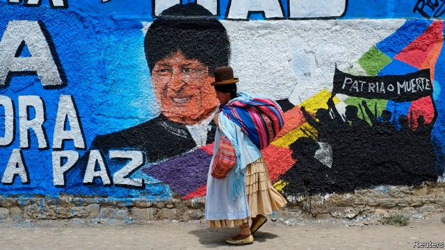

###### High and mighty

# El Alto shares Evo Morales’s indigenous identity, not his socialism 

 

> print-edition iconPrint edition | The Americas | Sep 21st 2019 

EL ALTO HOVERS over La Paz, Bolivia’s administrative capital, like the blade of a guillotine. In 1781 Tupac Katari, an indigenous leader, laid siege to Spanish La Paz 500 metres (1,600 feet) below. In the early 2000s protests by alteños forced out of office two Bolivian presidents: Gonzalo Sánchez de Lozada, who sought to export Bolivia’s gas through Chile, a rival, and Carlos Mesa, his successor, who resisted their demands to nationalise gas reserves. That paved the way for the election in 2005 of Evo Morales, Bolivia’s first indigenous president, and a member of the Aymara people, who regard El Alto as their capital.  

Mr Morales is counting on its support as he tries to persuade Bolivians to extend his 13 years in office in an election due in October. But alteños are independent-minded. Some resent his decision to run in defiance of a referendum vote in 2016. But their reservations run deeper. Mr Morales is a leftist, and El Alto is an entrepreneurial place that likes low taxes and lax regulation. Its support of his socialism is selective. Bolivia’s most revolutionary city is in some ways its most liberal. 

El Alto, at 4,150 metres the world’s highest city, has thrived during Mr Morales’s presidency. With a population of 900,000 it is Bolivia’s second-largest, after low-lying Santa Cruz, and its fastest-growing. The city got its start in the early 20th century when migrants began arriving from the altiplano, the Andean highlands of western Bolivia. They established neighbourhoods governed by practices brought from their villages, such as rotating leadership. In 1957 these joined to form the neighbourhood council, which took on the role of the state. Alongside workers’ organisations, it dug the first wells and built roads. It also provided law and order, which has sometimes meant executing suspected criminals. The council, now called Fejuve, still helps with the provision of infrastructure on the city’s growing fringes. El Alto was incorporated as a city separate from La Paz in 1985. 

In the “gas war” of 2003 rebels on the clifftop blocked roads that connect La Paz to much of the rest of Bolivia. Mr Sánchez de Lozada sent in the army. After nearly 60 people were killed, he fled the country. The insurrection helps define the city today. Roger Chambi, an Aymara activist, points out to a visitor the building housing Radio San Gabriel, where insurgent leaders held a hunger strike. El Alto’s defiant slogan—“On its feet, never its knees”—appears everywhere. 

Politics now seems less urgent. “Right now, it’s all about the economy,” says Mr Chambi. El Alto is the hub of an international network that trades in goods of all kinds, many of them smuggled. These link the city’s rich merchants, called qamiris, to manufacturers in China. They often extend to other Bolivian cities and into Brazil and Argentina. Perhaps four-fifths of alteños work in the informal economy. Bolivia’s “shadow economy” is the world’s largest as a share of GDP, according to the IMF. 

El Alto’s commercial heart is the vast, open-air 16 de Julio market, open on Thursdays and Sundays. Nearly untaxed and unregulated, traders pay their union for permits to open stalls selling everything from herbal cures to car parts. Aymara women guard the wares, bowler hats tipped forwards. Many qamiris own market stalls. Beyond the market, small businesses spill onto the streets. Multi-storey dwellings are springing up. Owners leave the brick exposed in the (mistaken) belief that this exempts them from tax. Plots of land appear in city records as empty, another ruse to avoid tax. Artful dodging earns respect. When he worked briefly as a bartender, “I did everything I could not to sell beer with receipts,” says Mr Chambi. 

The garish façades of “chalets” relieve the brick-brown streetscape. The qamiris who own them may not pay taxes, but unlike Bolivia’s longer-established elite they don’t buy property in Miami, says Mr Chambi. They bankroll fiestas that take place every weekend. Once a year one qamiri gets the expensive honour of paying more than anyone else for Gran Poder, a carnival in La Paz. 

Outsiders often see El Alto as a reflection of their biases. Leftists celebrate the communal features of its economy. They include aini: help from neighbours for building or business, which the beneficiary is expected to reciprocate. The fiestas are a way of giving food and drink to the poor. Anarchists admire El Alto’s self-regulation, liberals its vigorous capitalism. The city seems to combine all these. Pablo Mamani, a sociologist, describes El Alto as a city “with broad solidarity”, but “absolutely liberal” in economic matters. 

El Alto tends to vote for Mr Morales and cheered his nationalisation of gas reserves in 2006. It likes subsidies and public works, but demands that the state keep its distance. “El Alto expects a lot from the state,” says Mr Mamani. That goes along with an ethic of self-reliance. In Aymara culture, “one has to work for oneself.” 

Alteños give Mr Morales little credit for their prosperity. Many are sceptical about his run for re-election (in which Mr Mesa will be his main opponent). They remember the Aymara practice of rotating leadership, even if they do not always practise it. “People view [Mr Morales’s campaign] suspiciously,” says Mr Chambi. 

El Alto has nonetheless supported him, except on two occasions. In 2010, when he tried to cut subsidies for petrol, alteños blocked roads again. He backed down. Five years later they rejected his party’s mayoral candidate in favour of Soledad Chapetón, an Aymara woman of the centre-left. Those are sharp reminders to Mr Morales: don’t take El Alto for granted.■ 

