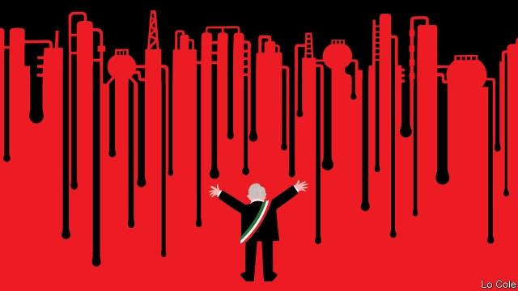

###### Bello

# Why Latin America’s left loves the petroleum economy 

 

> print-edition iconPrint edition | The Americas | Sep 21st 2019 

“COMMUNISM IS SOVIET power plus electrification,” declared Vladimir Lenin in 1920. A century later, Andrés Manuel López Obrador’s methodology for the redemption of Mexico is his morning press conference plus oil. He wants to raise oil output by almost half, and is poised to build Dos Bocas, an $8bn refinery that will be his country’s largest. Mr López Obrador (or AMLO, as he is known) defends this as boosting Mexico’s energy security and sovereignty. 

Jair Bolsonaro, Brazil’s far-right president, claims that environmentalism is a left-wing plot. Latin American leftists’ enthusiasm for oil refineries suggests otherwise. In Brazil Luiz Inácio Lula da Silva, president from 2003 to 2011, ordered Petrobras, the state-controlled oil company, to build four of them. In Ecuador, Rafael Correa conducted a $2.2bn upgrade to a refinery. Peru’s Ollanta Humala began a similar $3.5bn upgrade. 

There are good reasons for AMLO to want to exploit Mexico’s natural resources to the full. Oil can help power growth and fill the treasury. But he is going about it in a different way from his predecessor, Enrique Peña Nieto, who opened up oil and gas to private investment but left Pemex, the state oil company, indebted and shot through with corruption. In May, AMLO’s government announced that no private bidders had met the terms for Dos Bocas’s construction. It will now be handled, opaquely, by the state. He is throwing public money at Pemex without requiring its reform. 

In private, officials admit concern. Dos Bocas is a “pendejada” (a load of bullshit), admits one. Mexico has no trouble importing gasoline from refineries on the United States’ Gulf coast, says David Shields, an energy consultant in Mexico City. Money would be better spent on repairing inefficient existing refineries, or on expanding distribution grids for electricity and natural gas (though private investment could do those jobs). 

Ideology in part explains the enthusiasm for such projects among leftists. Fossil-fuel nationalism is a throwback to the concerns of the Latin American left of the mid 20th century. AMLO’s adviser for the project is José Alberto Celestinos, aged 90, who was in charge of building refineries for Pemex in the 1970s. “Oil is a fundamental national symbol in Mexico,” says Lorenzo Meyer, a historian. “To think of clean energy policies like in Europe is a luxury Mexicans can’t give themselves.” 

And, of course, big state projects offer the opportunity for many to make money. Few people expect Dos Bocas to hit its budget. The only one of Lula’s refineries to be completed cost $20bn, nine times its original estimate. Half of the $5bn that Mr Correa’s government spent on oil projects was stolen, according to his successor. 

In energy terms, Latin America cannot be accused of being a dirty region. It has the world’s cleanest energy matrix, largely because of its large hydroelectric dams (though in Mexico, with fewer big rivers, they provide less than a quarter of electricity compared with around half in the region as a whole). Most of Latin America’s carbon emissions come from land-use changes and transport, as growing middle classes jump into cars. It could do its bit for the world by halting deforestation and embracing electric vehicles. 

Some Latin American countries have encouraged non-conventional renewable technologies, such as wind and solar, whose price has fallen steeply. Rather than copy European subsidies, they have done so by fixing targets and by using auctions in which the market determines the supply price, notes Lisa Viscidi, an energy specialist at the Inter-American Dialogue, a think-tank in Washington. More than 40% of Uruguay’s electricity comes from wind, while solar plants provide 8% of Chile’s. Both countries have had left-wing governments—but have no significant oil. The same goes for Costa Rica, which has set (and appears to be on track to meet) a target of producing all of its electricity from renewable sources by 2021. 

In Mexico Mr Peña held three auction rounds for non-conventionals. AMLO has cancelled the fourth round. “They don’t have a renewables policy,” says Mr Shields. That is partly because the auctions involve private investment, which AMLO distrusts, partly because wind and solar power are intermittent, and partly because nature has provided Mexico with a bounty of hydrocarbons. But if AMLO looks around the world, he will see that oil is rarely fuel for corruption-free development, and that before too long it may be technologically redundant. 

