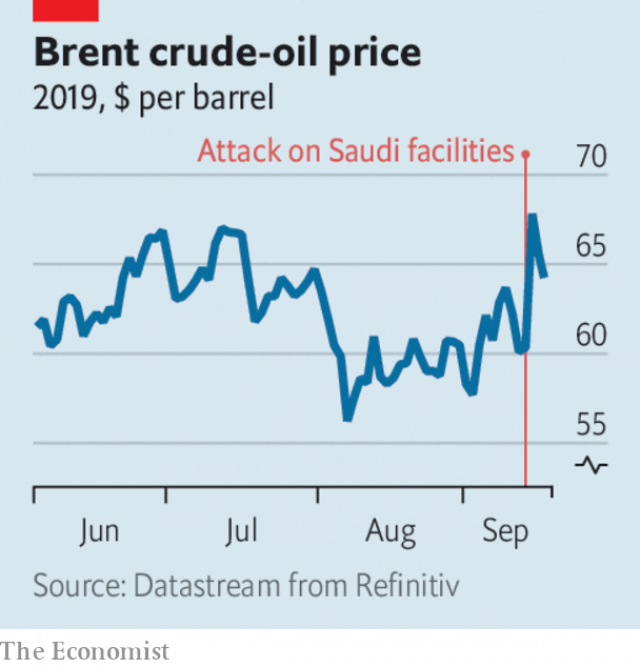

###### A warming world

# Business this week 

> Sep 21st 2019 

Saudi Arabia sought to assure markets that oil production levels would return to normal within weeks following the attack on two oil facilities, which cut around 5.7m barrels of oil a day from output. Analysts are sceptical that production can recover in such a short timespan. The attack had caused a huge spike in the price of Brent crude. See article. 

The Federal Reserve sliced its benchmark interest rate for the second time within two months, by another quarter of a percentage point to a range of between 1.75% and 2%. There has been mounting evidence that uncertainty over trade is starting to drag on the economy, especially manufacturing. But with services flourishing and consumer spending buoyant, two of the Fed’s rate-setters voted against a cut. See article. 

Earlier the Fed injected billions of dollars into the financial system because of an unexpected shortfall of cash available to banks, leading to a surge in the “repo rate” for overnight loans. It was the Fed’s first such surprise intervention in money markets since the financial crisis. See article.  

The chief economist of the European Central Bank defended its decision to cut interest rates and restart its quantitative-easing scheme amid fierce criticism from Germany and the Netherlands. The ECB reduced its main rate to -0.5%, taking it further into negative territory. Jens Weidmann, the head of Germany’s Bundesbank, said the ECB had overreacted to the euro zone’s slowdown. Bild, a German newspaper, lampooned Mario Draghi, the ECB’s soon-to-retire president, as Count Draghila, lamenting the “horror” for prudent savers who are being sucked dry. Mr Draghi steps down on Halloween. See article. 

Purdue Pharma filed for bankruptcy protection, part of a tentative settlement it has reached with 24 states and thousands of local governments to resolve claims that the aggressive marketing of its OxyContin painkiller contributed to America’s opioid crisis. Under its bankruptcy plan the drugmaker will become a public trust and the Sackler family will relinquish ownership. Purdue says the settlement is worth $10bn, but that is not enough for the two dozen states, including California and New York, that are contesting the agreement. See article. 

WeWork postponed its IPO amid tepid interest from investors and a drop in its expected stockmarket value. The office-rental firm has never made a profit and was trying to go public amid market doubts about the prospects for other loss-making startups that have floated shares this year. Adam Neumann, WeWork’s hipsterish CEO, said he was “humbled” by the experience. See article. 

Another blockbuster IPO that was shelved earlier this year was back on track, but in a much slimmer form. Anheuser-Busch InBev started taking orders for an offering of shares in its Asian division minus its Australian business, which it sold after pulling the IPO two months ago. The brewer will float the shares on the Hong Kong stock exchange at the end of the month. 

Under pressure from an activist investor,  at&t was reportedly considering whether to divest its Direc TV business, a satellite-media provider that the telecoms giant acquired in 2015 as part of its diversification strategy. Elliott, an activist hedge fund, revealed recently that it has bought a stake in AT&T and criticised its management’s approach to acquisitions, which has saddled the company with around $160bn in net debt. 

The United Automobile Workers union held its first strike at General Motors since 2007. Around 48,000 employees downed tools, disrupting more than 50 factories and car-parts warehouses. A collective-bargaining deal agreed to in 2015 has expired, but the company says the pay rises and other terms in a new contract are generous. The union argues that it made sacrifices when GM faced bankruptcy in 2009, and that its workers should be rewarded for creating “a healthy, profitable industry”. 

Facebook announced its plans for an independent “oversight board” to regulate decisions it makes about censorship on the social network. The board will hear its first cases in 2020, and will eventually have 40 members. 

Sandoz stopped distributing its Zantac heartburn medicine while regulators investigate the presence of an impurity called NDMA, which is classified as a probable human carcinogen. The Swiss drugmaker said that this was a precautionary measure. 

 

The move towards autonomous cars stepped up a gear when Shanghai became the first city in China to allow test vehicles to carry passengers. The riders will be volunteers and a driver will sit in the car, but if there are no accidents on Shanghai’s complex and busy road system the three car firms that have been granted the permits will get the green light to increase their fleets. 

