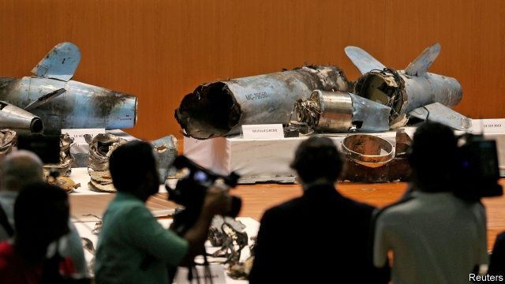
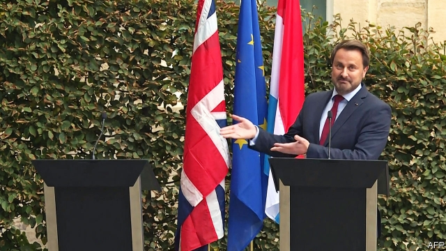

###### A warming world

# Politics this week 

 

> Sep 21st 2019 

Donald Trump said he would impose fresh sanctions on Iran following an audacious missile and drone attack on two oil facilities in Saudi Arabia: the Abqaiq crude-processing plant, the biggest of its kind in the world, and the Khurais oilfield. Claims by Houthi rebels in Yemen that they staged the attack were dismissed by American and Saudi officials. The Houthis are backed by Iran in a proxy war fighting a Saudi-led coalition. Iran insists it was not responsible for the strike. See article. 

Israel’s general election, the second this year, produced no clear result. Binyamin Netanyahu’s Likud coalition lost seats, so he will struggle to remain prime minister. The centrist Blue and White party, led by Benny Gantz, a former general, is now the largest in the Knesset but will need the support of other parties to form a government, which could take months. See article. 

The first round of Tunisia’s presidential election narrowed the field to two contenders: Kais Saied, a conservative law professor, and Nabil Karoui, a wealthy populist who is in jail on tax-evasion charges and has been described as the Tunisian Berlusconi. Turnout was a mere 45%. Disappointed liberals lament that the run-off later this month will be a race between the Godfather and the Terminator. See article.  

Prosecutors at the International Criminal Court have appealed against the acquittal of Laurent Gbagbo, a former president of Ivory Coast, on charges of crimes against humanity. The charges are related to a disputed election in 2010 in which Mr Gbagbo refused to accept he had lost. About 3,000 people died in the subsequent violence. 

A fire at a boarding school near Monrovia, the capital of Liberia, killed at least 27 people. 

Donald Trump named Robert O’Brien as his fourth national security adviser, replacing John Bolton. Mr O’Brien is the State Department’s hostage negotiator, working to free American captives in countries such as North Korea and Yemen. He is the author of “While America Slept: Restoring American Leadership to a World in Crisis”. See article. 

Mr Trump said that his administration would abrogate California’s laws on car emissions, which set higher standards than federal rules, “in order to produce far less expensive cars for the consumer”. Regulators have often griped that the state dictates rules for the country as a whole. California vowed to fight the administration all the way to the Supreme Court. 

Fires raging in the forests of Borneo and Sumatra blanketed South-East Asia in a thick haze. Indonesia deployed more than 9,000 people to fight them, but the unusually dry conditions hampered their efforts. See article. 

African swine fever, a disease that is harmless to humans but fatal to pigs, was detected in South Korea. Since first being reported in China in August 2018, the disease has spread through much of East Asia. See article. 

Rodrigo Duterte, the president of the Philippines, appeared to admit that he was behind an assassination attempt on a local official whom he had accused of being involved in the drugs trade. His aides later claimed the president had misspoken because of his poor grasp of Tagalog, the country’s main language. 

The Solomon Islands switched its diplomatic allegiance from Taiwan to China, leaving Taiwan with diplomatic relations with just 16 countries. Taiwan’s president, Tsai Ing-wen, who is running for re-election, described the move as an attempt by China to intimidate Taiwanese voters. 

The government of Hong Kong announced the cancellation of a large fireworks display that had been due to take place on October 1st, China’s national day. It said it made the decision because of “public safety”, a clear reference to recent pro-democracy unrest. Violence erupted again, with protesters throwing petrol bombs. Hundreds of people gathered outside the British consulate to ask for Britain’s support. 

Venezuela’s dictatorial government, led by Nicolás Maduro, freed from prison Edgar Zambrano, a congressman who is a senior adviser to Juan Guaidó, the president of the opposition-controlled national assembly. Mr Guaidó is recognised by the assembly and by more than 50 countries as Venezuela’s interim president. Mr Maduro said that 55 lawmakers from his United Socialist Party would take their seats in the national assembly after boycotting it for three years. 

A Spanish court released from prison Hugo Carvajal, a former chief of Venezuela’s military intelligence service who had turned against the regime. The court turned down an extradition request by the United States, which accuses him of arranging to ship 5,600kg of cocaine from Venezuela to Mexico in 2006. Mr Carvajal, also known as El Pollo (The Chicken) was arrested in Spain in April.  

A photo emerged taken in 2001 showing Justin Trudeau, Canada’s prime minister, wearing “brownface” make-up at a party at a private school where he taught. Mr Trudeau, who is running for re-election, explained that he had dressed up as Aladdin for a party with an Arabian Nights theme. He said he was “deeply sorry”. 

 

While Britain’s Supreme Court reviewed the legality of his suspension of Parliament, Boris Johnson met European leaders in Luxembourg, where he found little respite from the turmoil at home. The British prime minister’s Luxembourger counterpart mocked him for skipping a press conference because anti-Brexit protesters were too rowdy. Other EU leaders said trying to humiliate Mr Johnson was a mistake; a close aide of Angela Merkel, the German chancellor, said the episode “did not serve the European cause”. 

Matteo Renzi, a former prime minister of Italy, caused consternation when he said he was splitting from the Democratic Party (PD) he used to lead. He insists, though, that he still supports the new coalition between the PD and the Five Star Movement, which was created to prevent Matteo Salvini, the populist leader of the Northern League, from triggering an early election. See article. 

A fresh election looked probable in Spain, after talks between the caretaker Socialist government and the left-wing Podemos party broke down. It would be the fourth general election in four years. See article. 

A huge strike paralysed much of Paris, particularly its Metro, in protest at plans by the president, Emmanuel Macron, to rationalise France’s excessively generous pension system. 

