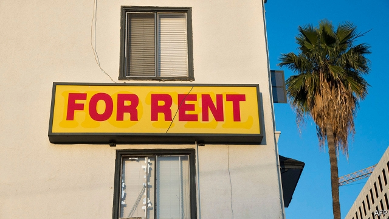

###### Progressives for regression

# Democrats clamour again for rent control 

 

> print-edition iconPrint edition | United States | Sep 21st 2019 

AMERICAN CITIES took up rent control in a moment of crisis during the second world war, when workers migrated en masse to factories just as the building of new housing was sharply restricted to conserve materials. In response the federal government froze prices on 80% of the country’s rental stock. Today America’s thriving cities face a homemade crisis. The typical one-bedroom flat in New York now rents for $2,450; the equivalent in San Francisco rents for $3,620. Although the building of new housing is no longer constrained by a massive war effort—only by rules and regulations of questionable design—Democrats in charge of high-cost cities are trying to revive these old ideas. 

Oregon passed a statewide rent-control measure in February. New York passed a complicated bill over the objections of its powerful property lobby in June. Gavin Newsom, the governor of California, is expected to sign one into law soon even though voters rejected a rent-control expansion effort last November. Bernie Sanders, a socialist senator running for president, included nationwide rent-control as part of his housing-policy plan (at a cost of $2.5trn over ten years). Mr Sanders’s proposal suggests a nationwide cap of either 3% or 150% of inflation, whichever is higher. Elizabeth Warren has said that states should not pre-empt local efforts at rent control, but has not gone so far as to propose a national standard. 

Rent control is reviled by almost all economists because of the distortions it creates in housing markets. While some people benefit, the resulting shortages harm non-subsidised residents and incentivise flat-hoarding by tenants and neglect by landlords. The most recent crop of efforts, which are better designed, may not be so bad. But they are, in the end, a means of temporary political appeasement because the true, underlying problem—supply—is harder for Democrats to tackle. 

Rather than enabling bureaucrats to fix the price of all one-bedroom flats in the city, new efforts at rent control instead aim to limit the annual rate of increase on specified units. The higher this cap is set, the less distorting (and therefore more pointless) the policy becomes. Oregon has set its annual cap at 7% plus inflation. California would place it at 5% plus local inflation. Neither of these is likely to apply outside the hottest rental markets. The typical flat in Portland, Oregon, would not have been affected last year, according to data from Zillow, a property website, though those in Los Angeles would have been. 

Even with more careful design, problems still arise. When three Stanford economists, Rebecca Diamond, Franklin Qian and Timothy McQuade, studied San Francisco’s rent-control scheme they found that though the lucky renters stayed put, affected landlords cut supply by 15%, driving up rents by 5% citywide. More than half of rental stock in New York City is either rent-controlled or rent-stabilised, though prices have surged all the same. When The Economist examined the most recent New York Housing and Vacancy Survey, conducted in 2017, we found 25,000 households in Manhattan with annual incomes greater than $200,000 living in rent-controlled and rent-stabilised flats. Landlords with such affluent tenants could petition to get rid of rent restrictions, but this mechanism has now been removed by the state legislature. At least the little people are being looked after.■ 

