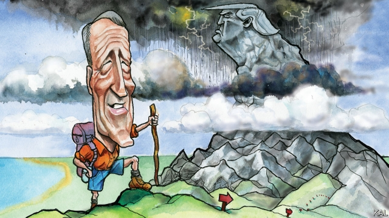

###### Lexington

# Mark Sanford is back on the trail 

 

> print-edition iconPrint edition | United States | Sep 21st 2019 

NOWHERE IN AMERICA is more synonymous with rebellion than Charleston harbour, where Mark Sanford launched his tilt at President Donald Trump this week. Glinting in the sun behind the veteran Republican—a two-term governor of South Carolina and five-term congressman—was Fort Sumter, target of the Confederacy’s first shots. Farther off, a blur on the horizon, was Fort Johnson, where South Carolina’s state flag was first raised in defiance during the revolutionary war. But Mr Sanford, who lives round the corner, was keen “not to imply any symbolism”, which was understandable. His primary campaign, which he mounted with the aid of a life-size cut-out of Mr Trump he found on Amazon, a fake cardboard cheque for a trillion dollars (payable to: “Burden of Future Generations”) and a couple of volunteers to hold them, may be the most doomed action the venerable port has ever witnessed. 

The three state-wide rallies Mr Sanford held that day were attended by a few journalists and fewer bystanders. South Carolinians have little reason to notice his campaign. The state’s Republicans, along with those in Arizona, Kansas and Nevada, have already said they will not hold a presidential primary. The Republican National Committee, which has dissolved its primary debate committee, is pressing others to follow suit. “In some countries—with all respect to your mother country—they have coronations,” said Mr Sanford in his stump speech, nodding sensitively to Lexington, who had joined him earlier on a two-hour drive from Columbia. “But in the American system we have debate and elections. We need a debate on what it means to be a Republican.” 

Mr Trump’s tightening grip on his party has probably spared him the heavyweight challenger his conservative critics have been longing for. John Kasich has no interest in a losing fight; Nikki Haley is keeping her powder dry; Mitt Romney’s rebelliousness is confined to an occasional admonishing tweet. As things stand, this has left the field to three lesser challengers: Bill Weld, the moderate former governor of Massachusetts, Joe Walsh, a populist former congressman from Illinois, and Mr Sanford, whose record warrants most respect. A solid small-government conservative, for whom a big future was once predicted, he is now best-known for the calamitous denouement to his governorship and marriage a decade ago. He was found to have snuck off to visit his mistress in Argentina after informing aides that he was “hiking the Appalachian trail”. Yet an improbable return to politics four years later, when he won his old congressional seat in Charleston, helped mend his reputation. And so, in some quarters, did his subsequent refusal to join his Republican colleagues in bending the knee to a president most had previously denounced and still abhorred. After criticising Mr Trump’s divisiveness, protectionism and profligacy, Mr Sanford was unseated by a Trump-endorsed primary opponent last year. It was his first electoral defeat. 

He says his refusal to genuflect was indirectly a result of his humiliation. “I owed it to the people who gave me a second chance to shoot straight down the middle.” His disgrace might even be a political advantage, he thinks: “There’s almost an added element of relatability that comes with public failure.” His wrongdoing certainly made him more famous. Compared with some of the things Mr Trump stands accused of, it also looks less serious now. Of the three conservative groups he and his fellow challengers represent—moderates, working-class populists and small-government conservatives—Mr Sanford’s is probably the smallest. Yet it may be the most mutinous (most moderates having already gone Democratic). While he almost certainly cannot beat Mr Trump, it is therefore not all that hard to imagine him embarrassing the president sufficiently to hurt his re-election prospects. Of the past four incumbent presidents to face a primary challenge, only one—Nixon in 1972—won re-election. 

The debate Mr Sanford called is worth having, too. While he glumly acknowledges how most Republicans have cheered as Mr Trump abandoned free trade and fiscal restraint, the former governor clings to a hope that this shift will be temporary: “For 25 years I’ve been out there talking to people, and the central premise of this campaign is that all those conversations about the debt and spending issue were real.” Mr Trump’s remaking of his party has been exaggerated, he suggests, by the president’s eccentric personality and lucky timing. Republican voters picked him as a disrupter and are now rewarding him for the historic growth cycle he is presiding over, but: “I would argue the value proposition with Trump evaporates the minute the economy goes down.” 

In truth, there was never much evidence that Republicans cared about the deficit (except in opposition, which doesn’t count). Yet Mr Sanford is probably right that Mr Trump has not changed their thinking for good on other issues. History suggests relatively few voters care about trade, the president’s obsession, for example. And as Mr Trump’s hold on power is less firm than his hold on his party, this points to a great uncertainty about what Republicans will stand for post-Trump. In some ways the party may snap back. In others—probably including the president’s antipathy to immigration, which Mr Sanford also deplores—it will not. And no doubt that rejig will again be shaped by electoral happenstance and the character of the leaders that emerge. 

Which makes it worth underlining how unlikely Mr Sanford’s new role as saviour of the republic would until recently have seemed. The recklessness he displayed in his Argentine flit was not a one-off. He was accused of squandering state resources: for example, by commandeering a government plane to go for a haircut. His divorce papers noted his habit of dive-bombing his children in a family plane. Though agreeable to Lexington, he also has a mixed reputation as a boss. That such a man could now seem so heroic does not say much for the state of the Republican Party. ■ 

