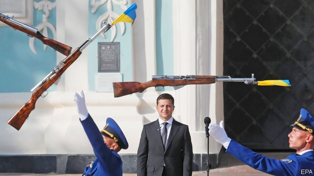

###### Black snow

# Rudy Giuliani’s foreign adventures 

 

> print-edition iconPrint edition | United States | Sep 21st 2019 

OF ALL THE meetings that will take place between heads of state at the United Nations in New York next week, the one between Presidents Donald Trump and Volodymyr Zelensky (pictured), a comedian turned president of Ukraine, may be the strangest. Last month, as Ukraine’s government was trying to negotiate the release of its prisoners from Russia, it received news from Washington. The White House had frozen $250m of military assistance to Ukraine that had already been approved by Congress until further review. The administration set no criteria or time frame for the review. But a month earlier, in a telephone conversation with Mr Zelensky, then newly elected, Mr Trump said he was “convinced the new Ukrainian government would be able to quickly improve the image of Ukraine and complete the investigations of corruption cases, which inhibited the interaction between Ukraine and the USA.” 

There were two cases Mr Trump seemed particularly interested in. The first involved the affairs of Hunter Biden, son of the candidate for the Democratic presidential nomination, who sat on the board of a private Ukrainian gas firm while his father was America’s vice-president. The second involved the downfall of Paul Manafort, Mr Trump’s former campaign chairman, who took a $12.7m off-the-books payment for his work for an ex-president of Ukraine, Viktor Yanukovich, and is now in prison. It was up to the new president to satisfy Mr Trump that he was on the right side. 

If Mr Zelensky was still in any doubt about what was expected of him, Rudy Giuliani, Mr Trump’s personal lawyer, was there to help. A few days after the telephone conversation between the two presidents, Mr Giuliani flew to Madrid to meet Mr Zelensky’s adviser, Andriy Yermak. He urged Mr Yermak to investigate the matters that were of interest to Mr Trump and held out the prospect of a state visit to America and a meeting with the president. 

That meeting in Madrid was arranged by Kurt Volker, America’s special envoy, whose efforts to help Ukraine restore its territorial integrity and sovereignty over the Donbas region were undermined by the suspension of military aid. Although the State Department insisted Mr Giuliani was merely acting in his private capacity rather than on behalf of the state, in the eyes of any reasonable person—particularly the one from Ukraine where oligarchs wield much informal power—Mr Giuliani was more important than a state official; he was Mr Trump’s consigliere. 

Fittingly, Mr Giuliani’s main source of disinformation on Ukraine was Yuriy Lutsenko, a controversial former prosecutor-general. Mr Lutsenko first tried to sabotage anti-corruption efforts by Ukrainian activists and American-backed investigators, then accused his critics of conspiring against Mr Trump. Trying to ingratiate himself with the White House, and settle his own scores, Mr Lutsenko declared that the stuff about Mr Manafort was all part of an anti-Trump conspiracy. 

Mr Lutsenko also dragged Marie Yovanovitch, an experienced American career diplomat and ambassador to Ukraine, through the mud, alleging she was acting in the interests of the Democrats. Ms Yovanovitch, who supported the anti-corruption fight in Ukraine (a fight which also targeted Mr Lutsenko) was recalled before the end of her term, despite the State Department’s statement that the claims against her were an “outright fabrication”. 

Mr Giuliani liked Mr Lutsenko’s improbable version of events, though. In May he told Fox News that he had cancelled his planned trip to Kiev, because he thought he was about to walk “into a group of people that are enemies of the president, and in some cases enemies of the United States.” One of the enemies named was Serhiy Leshchenko, a journalist, anti-corruption campaigner and member of parliament who investigated Mr Manafort. 

Mr Leshchenko had been working for Mr Zelensky’s team, advising the neophyte president on foreign affairs. But Mr Giuliani’s statement made the new president uneasy. A few days later Mr Leshchenko was told that he could not be offered a formal position in Mr Zelensky’s new administration, since this would jeopardise Ukraine’s relations with a strategic partner. 

As a result of all this, Mr Giuliani and his boss have become the subject of an investigation by the House committees on Foreign Affairs, Intelligence and Oversight. He denies wrongdoing (“I wouldn’t do an unethical thing in my life,” he told CNN). On September 9th the Democratic chairmen of the three committees sent a formal request to the White House and the State Department, instructing them to turn over the documents related to what look like attempts to coerce the Ukrainian government into conducting politically motivated investigations. If Mr Trump really had pressured Ukraine to serve the ends of his re-election campaign, “this would represent a staggering abuse of power, a boon to Moscow, and a betrayal of the public trust”, the letter says. 

Less than a week after the launch of the investigation, the White House unfroze the funds for military assistance without explaining the hold-up. “There were a lot of senior Republicans who were asking WTF,” one former official says. But the damage has been done. Mr Giuliani’s adventures in Ukrainian politics undermined the American government’s efforts to bolster its ally militarily and subverted its anti-corruption message. Vladimir Putin has long maintained that he is no worse than his American “partners”—they just hide things better. Mr Giuliani and Mr Trump are in danger of proving him right. ■ 

