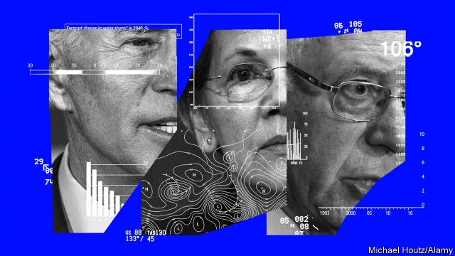
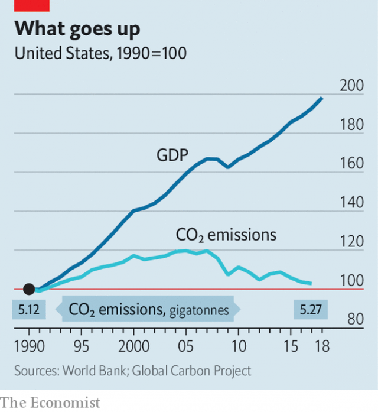
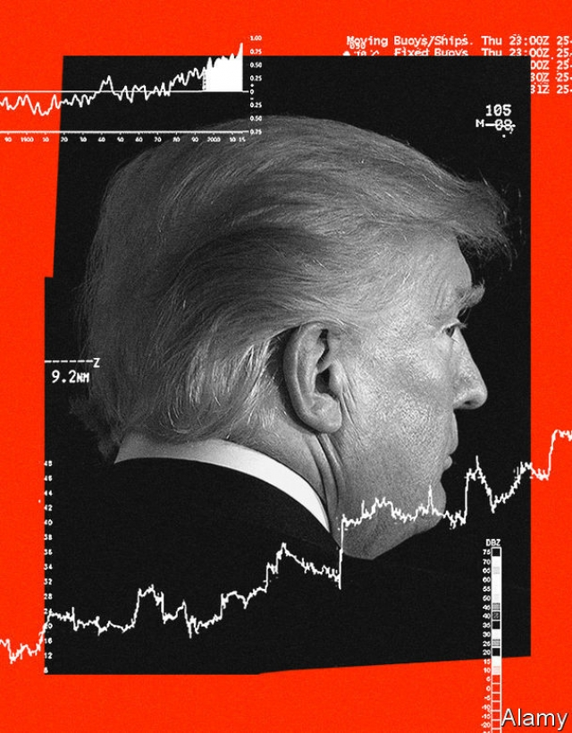
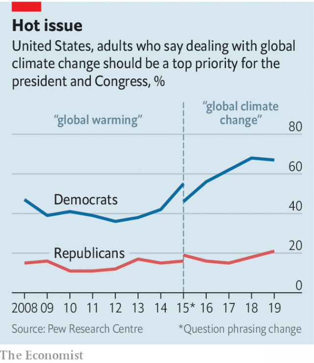
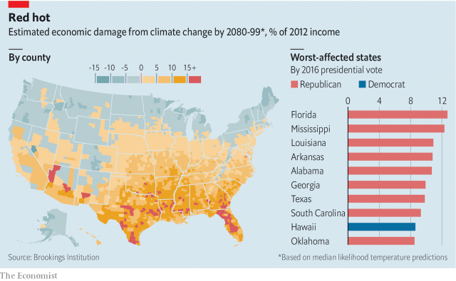

###### The obstacle course

# Will the Democrats’ green schemes make any difference? 

 

> print-edition iconPrint edition | United States | Sep 21st 2019 

EARLIER THIS month dozens of teenagers gathered in a New York City park to paint. They were preparing for the Climate Strike they would attend on September 20th, one of the rallies to be held in more than 150 countries around the world. The students made cardboard waves, to signify rising sea levels, and emblazoned banners with demands for action. “I want you to act as if our house is on fire because it is,” one sign read. 

America has stood out, to date, for being the largest contributor to climate change and for its leaders’ reluctance to do much about it. In 2017 President Donald Trump announced that America would withdraw from the Paris climate agreement, in which countries pledged to limit the average rise in temperatures to “well below” 2°C. In the past four weeks alone his administration has loosened regulation of methane, said it would revoke California’s right to set emissions standards for cars and rolled back rules on efficient light bulbs. “I look better under an incandescent light,” Mr Trump quipped, without supporting evidence. 

But where the young lead, a growing number are following. Those Americans who think global warming is real outnumber those who do not by more than five to one. For the first time climate change has become a prominent issue in a Democratic presidential campaign. On September 4th CNN spent seven hours asking Democratic contenders what they would do about it. Candidates are tripping over themselves to convey their plans’ ambition, from Joe Biden’s $1.7trn proposal for a “clean-energy revolution” to Bernie Sanders’s $16.3trn “nationwide mobilisation”. 

The Democrats’ last serious legislative climate proposal came a decade ago. Edward Markey and Henry Waxman, two congressmen, introduced a cap-and-trade bill. Originally a conservative idea, cap-and-trade puts a price on carbon and creates a market in the right to emit. The bill passed the House and foundered in the Senate. Climate policies have had greater success on the state level—more than half of states have targets for clean energy. These policies, coupled with tax credits for wind and solar power, have helped spur a rush of investment in renewables. America’s shale bonanza has created a glut of inexpensive gas that has been the main force putting coal plants out of business. Wind and solar farms have become cheap enough, in many instances, to outcompete even gas. 

Democrats are now presenting broader, national plans for several reasons. Warmer oceans are linked to the stronger hurricanes, like Harvey, Sandy and Maria, that have battered America’s coasts. Last year three wildfires in California killed 89 people and caused more than $11bn in damage. Mr Trump’s own Director of National Intelligence warned that climate change and “ecological degradation”, by fuelling competition for resources and social discontent, pose a security threat. And yet the administration has ignored or tried to rubbish such warnings—which is another reason for the spike of interest in climate on the left. The Pew Research Centre reports that 57% of Americans view climate change as a “major threat”, up from 40% in 2013. Among Democrats, the share is 84%.  

 

The contenders for the Democratic presidential nomination are also responding to the Green New Deal, a proposal unveiled in February by Alexandria Ocasio-Cortez, a new congresswoman, and Mr Markey, now a senator. The resolution calls for an economy with net-zero emissions (that is, sucking as much carbon dioxide out of the atmosphere as it puts in) and a broader social transformation, with universal health care and guaranteed jobs. 

The plans proposed by the top candidates for the Democratic nomination are more detailed than this. Mr Sanders’s plan is the most costly, but Elizabeth Warren, Mr Biden’s closest competitor, would spend $3trn. The leading contenders aspire to net zero emissions by 2050, if not before. They would phase out subsidies for fossil fuels and increase spending on research into technologies such as energy storage (today’s batteries cannot balance the variable power from the sun and wind over long periods). Most candidates propose ways to support cleaner power abroad. These include sticks—taxes on goods from countries without robust climate policies, for example—as well as carrots, such as aid for zero-emissions electricity in poor countries, to counter China’s support for coal.  

Three candidates—Kamala Harris, Pete Buttigieg and Julian Castro—support a carbon tax or fee, which economists like for its ability to spur lower emissions across the economy, without trying to anticipate the success of any given technology. Four former Federal Reserve chairmen and 27 Nobel-prize-winning economists advocate a carbon tax whose proceeds are distributed to Americans in equal lump sums. This also has the backing of ExxonMobil, Total and other oil giants. Mr Biden and Mr Sanders seem to favour a carbon tax, too, though their plans are less explicit. Ms Warren would consider a tax but has proposed a clean energy standard requiring electricity generators, buildings and cars to bring emissions to zero. This would not span the economy as a carbon price would, but it caps emissions for certain sectors and has the political benefit of obscuring costs.  

 

Democrats’ broader goals sometimes clash with their environmental ones. Top candidates espouse plans to support American manufacturing of clean technology, even though the deployment of renewable energy has benefited so much from cheap batteries and solar panels made in Asia. Ms Warren would require products with technology from federally funded research to be made in America with union labour, probably increasing its cost. The main feature of her “Green Marshall Plan” is $100bn of federal spending to help other countries buy such American tech. This emphasis on jobs would risk making zero-carbon power more expensive, slowing its take-up. Mr Sanders and Ms Warren would also ban nuclear power, which produces no greenhouse gases. Michael Bloomberg, a former mayor of New York who has spent a fortune campaigning for the closure of American coal plants, finds most Democrats’ proposals maddening. “What on earth have any of these people done to have a cogent plan that is doable?” he asks. 

 

Climate policy should be made palatable, especially to those most affected by a fast shift to clean power. In Los Angeles this year, dismayed workers at gas plants almost scuttled the mayor’s plan to expand solar power. But the biggest risk to a better policy comes from lack of support partly from Democrats in coal- and gas-producing states, like West Virginia’s Joe Manchin, and mainly from Republicans. Pew’s polling shows that just 27% of Republicans consider climate change a major threat. 

There are some signs of a generational conflict within the Republican Party that could eventually lead to change. Among millennial conservatives, 59% say that climate change is having at least some effect on America. More than 80% support expanding the use of wind and solar power. Alex Flint, a longtime Senate staffer, conducts polls and focus groups to help advise Republicans on climate change. In one swing district, he found that half of all conservatives were more likely to support a Republican incumbent working to limit climate change. The trend was particularly pronounced among conservative women.  

 

The rhetoric of some Republicans has started to change, too. “I didn’t come to Congress to argue with a thermometer,” Congressman Matt Gaetz declared earlier this year. Lindsey Graham, a senator from South Carolina, insists Republicans “owe it to the country to have an alternative to the Green New Deal”. But partisanship is working against this shift—the Green New Deal has prompted some Republicans to portray climate policies as socialist schemes to ban hamburgers. For now, those Republicans who worry about the climate venture no further than advocating for more R&D spending, as Lamar Alexander, Mr Graham and Lisa Murkowski do in the Senate. 

Democrats view these proposals warily. Republican support for long-term research can give the impression of action, but can sap efforts to deploy the technologies available now. Only two of the 252 Republicans in Congress favour a carbon tax. One of them, Francis Rooney, has held town-hall meetings and lunches in his district to explain himself to conservative constituents, but he says it is tough going. Climate scepticism, he says, “is identified as conservative Republican doctrine”. That is despite Republican-leaning bits of the country being at greatest risk (see chart). Eventually more Republicans may support action as the effects of climate change become clear. By then, however, the damage would be even harder to reverse. ■ 

Correction (September 19th 2019): An earlier version of this article stated that there were more than 150 rallies being held worldwide. In fact, rallies are being held in more than 150 countries. Sorry. 

