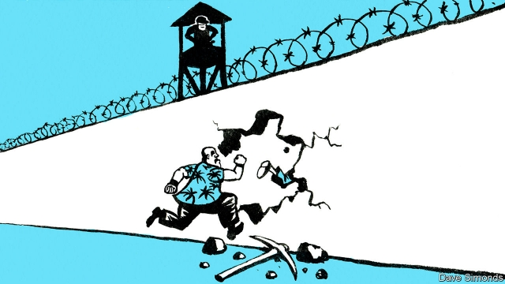

###### Breaking into jail

# An administrative error reveals the fear Filipinos have of the police 

 

> print-edition iconPrint edition | Asia | Sep 28th 2019 

WHEN RODRIGO DUTERTE threatens criminals, they pay attention. After all, since becoming president of the Philippines three years ago he has championed an all-out war on drugs that has claimed between 5,000 and 20,000 lives (the numbers are disputed). So when Mr Duterte warned a big group of convicts freed from prison by mistake that, if they failed to turn themselves back in, the police would return them to their cells dead or alive, 2,221 duly surrendered. The odd thing was, the prisons authority said that only 1,914 had been released in error. Although part of the discrepancy may have been because of further mistakes on the part of the aptly named Bureau of Corrections, part, at least, was because of the terror with which Filipinos now regard the police. 

Behind the turreted gateway of the National Penitentiary, south of Manila, lurk the likes of Antonio Sanchez, a notorious rapist and murderer. Mr Sanchez had believed he could get away with his crimes because he was mayor of a provincial town, but in 1993 a judge imprisoned him for 40 years. News this year that Mr Sanchez might be freed early for good behaviour caused an uproar. It then emerged that hundreds of other prisoners had already been freed early for good behaviour, even though the severity of their crimes should have made them ineligible. Mr Duterte dismissed the director-general of the Bureau of Corrections, called for a special prosecutor to investigate the debacle and instructed the convicts in question to report back to prison. 

Predictably, the list of mistakenly freed prisoners released by the bureau omitted some names that should have been on it and included some prisoners who had been let go on legitimate grounds. To be on the safe side, it seems, some 300 people who weren’t on the bureau’s list surrendered. 

The newly re-incarcerated convicts will be wondering what sort of regime now awaits them. The dismissed director-general of the Bureau of Corrections, Nicanor Faeldon, was himself a former jailbird, having joined an unsuccessful mutiny when he was in the army. He even escaped twice. The new director-general is Gerald Bantag, who faces homicide charges related to the deaths of ten prisoners in a grenade blast in his office when he was warden of a municipal jail. The police say Mr Bantag was negligent in allowing weapons into the prison. Mr Duterte describes him as “professional”. It may be that prison is no safer for the nervous convicts than life on the run. 

