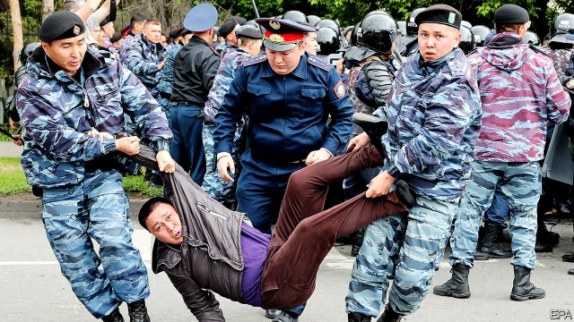

###### Truncheons at the ready

# Kazakhstan promises to allow public protests, just not yet 

 

> print-edition iconPrint edition | Asia | Sep 28th 2019 

KAZAKHSTAN’S NEW president, Kassym-Jomart Tokayev, has tried to sound like a refreshing change after decades of autocracy. Early this month, in his first state-of-the-nation speech, he said his “listening state” would show greater tolerance of dissent. Days earlier, citizens had witnessed the astonishing sight of pro-democracy marches proceeding without arrests. But other protests, including a recent spate targeting the country’s giant neighbour and benefactor, China, have elicited a very different response. In Kazakhstan old political habits die hard. 

The protesters want an end to what they regard as Chinese economic domination of their country. The demonstrations, the most recent of which took place on September 21st in the country’s two biggest cities, Almaty and Nur-Sultan, as well as several other towns, have involved only a few hundred people. But relations with China, with which Kazakhstan shares a 1,800-km border, are highly sensitive. Kazakhstan has benefited enormously from China’s global infrastructure-building scheme, the Belt and Road Initiative (BRI). There are 55 Chinese projects under way in the country, worth $27.5bn. Kazakhstan’s government takes great pride in this. It likes to describe the country as the “buckle” of BRI’s belt. 

Many Kazakhs do not share this enthusiasm. They are leery of China’s economic influence: it controls more than one-fifth of Kazakhstan’s oil output and is expanding into other areas, including manufacturing, construction and chemicals. They worry about the opacity of China’s projects, the possibility that Kazakhstan will not be able to repay related loans and the use of imported Chinese labour. Anti-China sentiment across Central Asia has been fuelled by the mass incarceration of Turkic Muslim minorities, including Chinese-born Kazakhs, in Xinjiang, a Chinese province bordering Kazakhstan (see article). China describes these, implausibly, as “vocational training centres” that help to prevent Islamist extremism. 

During the latest anti-China protests the Kazakh authorities detained 100 protesters, including a man whose prosthetic leg became detached as he wrestled with police—a scene that caused outrage on social media. Most were freed without charge but nine were given short prison sentences. They join 29 others who were jailed for taking part in anti-China protests earlier this month. 

Officials have declared the rallies in violation of stringent public-assembly laws (which Mr Tokayev has pledged to reform). But the authorities stated straightforwardly that their main reason for clamping down was the encouragement the protests have received from Mukhtar Ablyazov, a Kazakh oligarch based in France. He makes no secret of his desire to stoke unrest in pursuit of “regime change”. The government, in turn, has banned Mr Ablyazov’s Democratic Choice of Kazakhstan movement and treats supporters as criminals. 

Mr Ablyazov has plenty of grievances to tap into. Since the resignation in March of Nursultan Nazarbayev, who had ruled the country since 1989, there have been sporadic protests against everything from the stage-managed election that resulted in victory for Mr Tokayev (Mr Nazarbayev’s choice as successor), to the renaming of the capital, Astana, as Nur-Sultan in honour of the ex-president, who is thought to still call the shots from behind the scenes. In all, some 4,500 protesters have been detained since Mr Tokayev became president—not a very impressive tally for a supposed reformer. ■ 

