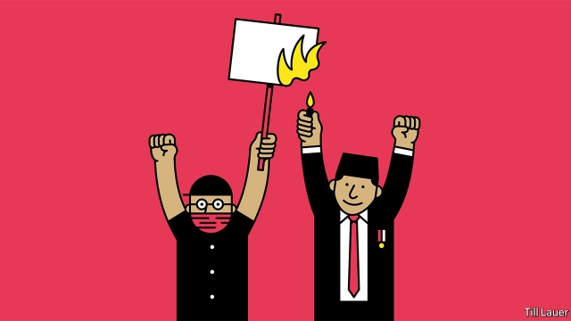

###### Banyan

# Where did the reformist just re-elected as Indonesia’s president go? 

 

> print-edition iconPrint edition | Asia | Sep 28th 2019 

NOT SINCE 1998, when huge crowds demanding reformasi brought down Suharto, Indonesia’s late dictator, have university students taken to the streets in such numbers. In cities across the archipelago and, above all, outside the parliament in Jakarta, tens of thousands have gathered in the past few days. Despite tear-gas, water cannon and beatings, their numbers are growing. Joko Widodo, or Jokowi, the recently re-elected president, faces an unexpected test. 

The protesters carry a rattlebag of demands tied together by attempts by the political elite and the security forces to roll back two decades of democratic change. They call their movement reformasi dikorupsi, or reform corrupted. That Jokowi has come into the movement’s sights is significant. He swept to power in 2014 because Indonesians loved his reputation for clean government and because he was outside the intermarried elites that have long dominated politics, the security services and business. 

Jokowi’s handlers would still have you believe that in some respects he is on the side of protesters, one of whose strongest objections is to proposed revisions to a criminal code that dates back to the Dutch colonial era. The bill’s backers in parliament say it is an essential articulation of Indonesia’s independence. Its detractors point out that it badly undermines the rights of women as well as sexual and religious minorities. It also criminalises all extramarital sex (and therefore gay sex) and censors the dissemination of information about contraception. Given that perhaps two-fifths of unmarried Indonesian adolescents have had sex, you start to understand the depth of student feeling. (Australia has even warned unmarried holidaymakers in Bali to watch out.) The bill would also criminalise criticism of the president. 

The law, promoted by Islamic conservatives, was not the government’s doing, but Jokowi had agreed that it should proceed. This dismayed many: the president is a pragmatist, mild in his moral views to the point that his fiercest Muslim critics see him as un-Islamic. Yet in a striking reversal on September 20th, four days before the bill was expected to pass, he asked on television for its passage to be delayed, on the grounds that all the criticism suggested there was room for improvement. 

That is proof, his defenders say, that he can stand up to Islamist intolerance. Why he left it so late to intervene remains unclear. Perhaps he was preoccupied with another bill, which guts the powerful anti-corruption commission, the KPK. Parliament approved it in mid-September—another of the protesters’ grievances. 

Set up in 2003, the KPK is a reformasi success story. Jokowi himself supported its independence when he came to power. But that was before it began investigating his first choice as police chief, who is close to his patron, Megawati Sukarnoputri, the daughter of Indonesia’s independence leader. Members of parliament, ministers, regional barons, regulators, central bankers and bosses of state enterprises have also been indicted. 

The bill stipulates that members of the KPK must henceforth be civil servants, preventing the recruitment of outside experts. Its new chief will be Firli Bahuri, a senior officer in the police, where the KPK has long hunted for corruption, but which Jokowi has bolstered as a counterweight to the army. MPs cheer Mr Bahuri’s appointment: senior police assiduously cultivate good relations with politicians. Meanwhile, wire taps and searches must in future be authorised by an oversight board picked by the president. That, says Kevin O’Rourke, author of a seminal book on reformasi, will make it easier for errant executive-branch members to cover their tracks. 

So what on earth is Jokowi thinking? He hates the politicking side of his job: perhaps he reckons a KPK at heel will make it easier to placate demanding parties in his coalition. Perhaps he thinks a bit of graft is the price for getting stuff built quickly. His true passion lies in new roads, ports and power stations—anything to boost growth to the 7% a year that remains his obsessive if infeasible target. Deeper institutional reform is clearly off his second-term agenda. 

But it is on the agenda of the protesters. As well as opposing the criminal code and the assault on the KPK, the students are calling for palm-oil giants to be held responsible for forest fires and for an end to the army’s brutal rule in the Indonesian half of New Guinea. By ignoring these pleas, Jokowi no longer looks like a reformer. 

