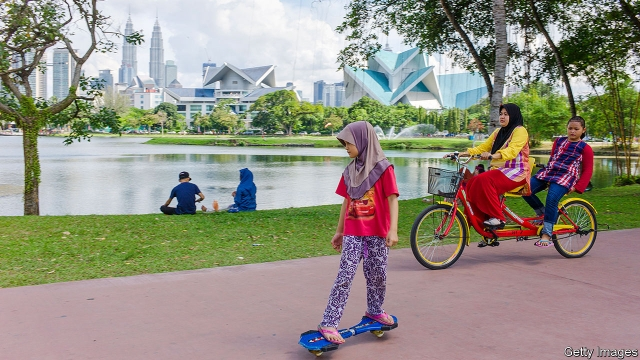

###### It’s the economy, bodoh!

# Young Malaysians have big economic worries—and growing political clout 

 

> print-edition iconPrint edition | Asia | Sep 28th 2019 

SITTING IN THE buzzing plaza at the heart of Sunway University near Kuala Lumpur, Malaysia’s capital, representatives from online job platforms await students. Many are youngsters themselves, ready to dispense friendly advice about buffing up CVs. So far the documents passed to them have been uninspiring. One reckons candidates would fare better if their schooling had taught them more practical skills, such as how to craft a job application. Employers are also looking for fluent English-speakers, he notes. 

Malaysian youths are in need of such advice. The overall unemployment rate is around 3%, but among those aged 15-24 it is over 10%. Young people frequently relocate in the hunt for a job. “The number one export of Perak isn’t pomelos or rice, it’s talent,” laments Howard Lee, a young politician from the relatively sleepy, fast-ageing state. The Muslim Youth Movement of Malaysia estimates that perhaps half of youngsters in rural states leave for the bright lights of big cities. 

Moving is not a guarantee of employment, however. Even those who relocate are often short of work. According to the central bank, more than 173,000 holders of tertiary qualifications entered the workforce between 2010 and 2017. But fewer than 99,000 high-skilled jobs were created during the same period. A sales representative for a telemarketing firm in Kuala Lumpur, who moved there from Perak, complains that he has to work as a driver for a ride-hailing platform at weekends to make ends meet. 

The good news for young Malaysians is that their political clout is growing. In July the government lowered the voting age from 21 to 18. That change, combined with the relative youthfulness of Malaysia’s population and the relatively lengthy period—five years—between elections, means that by the time of the next election, due to be held in 2023, almost 8m people will be eligible to vote for the first time. There were only 15m eligible voters at the most recent election, last year, so the new cohort will constitute well over a third of the electorate. Understanding their concerns will be essential for political success. 

This new cohort may prove a tricky bunch to please. Young people find politics comic, says one teenager. “It isn’t taken seriously and that needs to change.” An ambiguous survey conducted after last year’s election by the Merdeka Centre, a polling outfit, gives an inkling of young voters’ mixed feelings. Only about 65% of those aged between 21 and 30 thought the country was going in the right direction, but 92% were satisfied with the victory of Pakatan Harapan (PH), the coalition that is now in office. 

The government is trying to cater to the concerns of the young. Saddiq Abdul Rahman, the minister of youth and sports, who is in his twenties himself, championed the lowering of the voting age. He has also pushed to raise the minimum monthly wage for interns from 300 ringgit ($72) to 900 ringgit and to streamline the provision of vocational training to youngsters (no fewer than six ministries are currently involved). “If we fail to deliver on the basic needs of the young populace then you’re bound to create a vacuum which will be filled by demagogues,” he argues. 

That is quite possible. Malaysia’s politics has long revolved around racial and religious divisions, as any greying citizen will attest. The country’s three main ethnic groups—Malays, Chinese and Indians—tend to vote for parties which claim to represent their respective interests. “I think the divide is more pronounced among the older generations,” explains one student. Certainly PH, which is not as ethnically minded as the previous ruling coalition, seems to have attracted a disproportionate share of the youth vote. There are vocal campaigns, spearheaded by younger voters, for greater rights for women and greater sexual freedom, which go against the grain of religious and ethnic politics. But such concerns seem to pale in comparison to worries about earning a living. Then again, if economic anxiety begins to trump identity politics, that would also mark a dramatic shift. ■ 

