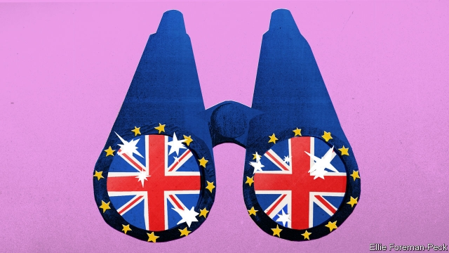

###### Advance, Britannia!

# In praise of British exceptionalism 

 

> print-edition iconPrint edition | Books and arts | Sep 28th 2019 

Die Flucht der Briten aus der europäischen Utopie. By Jochen Buchsteiner. Rohwolt; 144 pages; €15 

Le Brexit va réussir. By Marc Roche. Albin Michel; 240 pages; €18.50 

“THE INVENTORS of modern democracy”, lamented Bernard-Henri Lévy last summer, have confused “the people with the mob, the hatchet of the referendum with the wisdom of the agora, a national rebirth with a plunge into the void.” The French philosopher was in London on a mission: to persuade those democratic inventors, the British, to cancel Brexit. In his one-man play, “Last Exit before Brexit”, Mr Lévy showered his hosts with flattery, pressing Byron, Nelson and Orwell into the service of his argument that Brexit was fundamentally at odds with English liberalism, which in turn had been fundamental to the European project. “The software of Europe is English,” he urged.  

Eccentric as it seemed to some, the performance reflected the continental establishment’s bafflement and dismay at Britain’s divorce from the European Union. Brexit, in this reading, contradicts an old perception of Britain as a pragmatic, undramatic sort of place. For Marc Roche, a longstanding London correspondent for Le Monde, France’s newspaper of record, that establishment view is deeply mistaken. He cites Mr Lévy’s speech in the final chapter of “Le Brexit va réussir” (“Brexit Will Succeed”). “Fundamentally, I’m in total disagreement,” he announces. “There is no need to dream. Brexit will happen.” 

“Die Flucht der Briten aus der europäischen Utopie” (“The Britons’ Flight from the European Utopia”) by Jochen Buchsteiner takes a similar line. Mr Buchsteiner is another veteran London correspondent, for the Frankfurter Allgemeine Zeitung, Germany’s leading conservative broadsheet. Like Mr Roche, he believes that the continental consensus epitomised by Mr Lévy is wrong; that Brexit is true to Britain’s historical and philosophical traditions; and that it could yet prove a success. In their drastic departures from received wisdom on the mainland, both books merit attention by Anglophone readers, too. 

Both are rooted—and sharpest—in their accounts of Britain’s exceptionalism. Mr Roche is preoccupied by the monarchy, beginning each of his chapters with an anecdote about the royal family. The queen’s cameo in the opening ceremony of the Olympic Games in London in 2012 is cited as an example of Britain’s global cultural reach; Prince Charles’s undeserved education at Cambridge University is crowbarred into a chapter extolling the knowledge-based Anglo-Saxon economy. The monarchical conceit wears thin—but the wider observations are acute. More elegantly, Mr Buchsteiner steers readers through Henry VIII’s break from Rome, the English civil war, the psychological legacy of the British empire and the enduring role of the second world war in Britons’ self-image. But the two authors agree about what makes Britain unusual: a strange mix of pragmatism and pride, openness and complacency. 

Both argue that this exceptionalism makes Brexit a natural development. Britain’s empirical tradition and messy state, they argue, sit awkwardly in a club founded on Napoleonic legal precepts and Kantian utopianism. In this analysis, leaving the EU, particularly at a time when storm clouds loom, could be a sort of homecoming to Britain’s peculiarity—and a chance to realise its inherent advantages. 

“The Britons have created a strange sociotope for themselves,” Mr Buchsteiner writes, “with a spaceship-like capital city whose international character overshadows all other European metropolises.” Here, “Openness, revolution and tradition are uniquely entangled…In all their urbanity and exceptionalism [Britons] are a strange people.” He suggests that as America turns away from Europe and Asia rises, Brexit might turn out well, though he acknowledges that only time will tell. Mr Roche is less cautious. Brexit, he says, will mean Britain’s rebirth—albeit as a low-tax, low-regulation Trojan horse for American, Chinese and other intercontinental interests at the doors of Europe. “Far from sinking, England [sic] will be renewed. And Elizabeth II will doubtless celebrate her 100th birthday in her revitalised country, confident of itself and prosperous.” 

All of which is a refreshing change to simplistic continental shock. Britain’s vote to leave the EU was indeed partly a reflection of its “otherness”. A few Brexiteers, particularly among Britain’s elites, are indeed urbane and worldly. Their aim is not to close the country off, but rather to make it more open to the world beyond Europe. Some believe that Britain’s relations with its immediate neighbours will be more harmonious after it extracts itself from a project to which it is ill suited.  

But they are a minority. For more of its adherents, Brexit is a nativist project that is supported by isolationist arguments. Vote Leave, the more “moderate” of the two pro-Brexit campaigns in 2016, fear-mongered about millions of spectral Turkish immigrants. Nigel Farage, the leader of the other, more hardline campaign, was the dominant personality of the referendum. And far from reconciling the country to itself, the vote has left it bitterly divided. To regard Brexit as a sunny liberation, as Mr Roche and Mr Buchsteiner do, and thus that the best of all possible futures awaits, is a fallacy of its own. 

Nor was EU membership remotely as alien to Britain’s traditions as the authors argue. The club has grown organically, and usually in response to crises, not according to a grandly un-British utopian vision. In any case, Britain has shaped the EU in myriad ways, most notably helping to develop the single market that is at the core of the union. Membership does not prevent it cultivating partners further afield; rather it amplifies Britain’s voice in its dealings with them. Above all, exceptionalism is not a get-out from the basic calculus of economics and diplomacy: Britain cannot expect to cut itself off from its biggest market and nearest allies without paying a cost in prosperity and influence.  

Events of recent weeks only emphasise these realities. Mr Roche claims that “Brexit has killed populism”; he evidently did not anticipate Boris Johnson’s illegal prorogation of Parliament. Meanwhile, the residency of many EU nationals who have lived in Britain for years is in jeopardy; carmakers and banks are eyeing the exits. These two books are insightful and worthwhile commentaries on a country both authors love—but it is surely a gloomy reading of Britain’s traditions to see its current predicament as a national self-fulfillment. As Mr Lévy quixotically insisted, Britain is better than Brexit. ■ 

