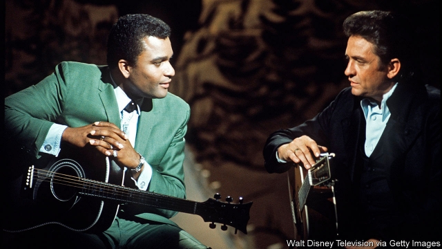

###### Three chords and the truth

# Ken Burns tunes in to country music 

 

> print-edition iconPrint edition | Books and arts | Sep 28th 2019 

THE FIDDLE was imported to America by immigrants from the British Isles. The banjo was played by slaves brought from Africa. The fiddle and the banjo met in the American South. “That’s why the first episode is called ‘The Rub’,” says Ken Burns of “Country Music”, his new 16-hour documentary series. “The rub is that friction caused by blacks and whites.” 

Like his explorations of the civil war, jazz, the Roosevelts and (most recently) the Vietnam war, Mr Burns’s series is meticulously researched and sometimes solemn, featuring grave narration and rare footage. But even the snobbiest viewers will gain a new appreciation of country—along with jazz, among the most American of musical genres, a simple-seeming but complex blend of old world and new, rural and industrial, African-American blues and hillbilly reels, Sunday mornings at church and Saturday nights at honky-tonks. 

Mr Burns mixes oft-told tales with more obscure episodes. Johnny Cash’s performance at San Quentin prison is better known than the fact that Merle Haggard, whose lyrics later immortalised the “Okie from Muskogee”, was an inmate at the time. Fans familiar with the lineaments of the short, turbulent life of Hank Williams, the hillbilly Shakespeare, may have missed his insistence that “there ain’t nobody in this here world that I’d rather have standing next to me in a beer-joint brawl than my Ma, with a broken bottle in her hand.” Despite the occasional black star, such as Charley Pride (pictured with Cash), the influence of African-Americans has been largely forgotten; even some aficionados may be unaware that DeFord Bailey, the grandson of a former slave, was one of country’s biggest radio stars in the 1920s. 

As Mr Burns shows, that was the decade in which the genre was commercialised. An insurance firm in Nashville opened a station, WSM, thinking it a cheap way to sell policies to working folk. Its Saturday night barn-dance slot became the “Grand Ole Opry”, the longest-running show on American radio. As Marty Stuart, a country prodigy, puts it, ever since Nashville has had a “guitar in this hand. Briefcase in this hand”. 

According to Harlan Howard, a songwriter, the music itself trades in “three chords and the truth”—a theme much broader and deeper than the cheatin’ hearts and pick-up trucks of stereotype. Cash, for example, once dedicated an album to Native Americans, but initially country stations wouldn’t play it. In 1975 some banned Loretta Lynn, who had crooned about her hardscrabble life as a coalminer’s daughter, because of her song “The Pill”. “If they’d have had the pill out when I was having kids,” she comments in one of the series’s funniest moments, “I’d have ate ‘em like popcorn.” Kris Kristofferson—a Rhodes scholar who left his job as an instructor at West Point to be a janitor at a studio—dealt directly and beautifully with sex in “Help Me Make It Through The Night”. The suggestive lyrics made record labels queasy. 

The series opens with a shot of a mural at the Country Music Hall of Fame, which depicts a barn dance, the railway, a church choir, river boats, fiddles, cowboys, a blues musician and slaves in the field. “It is the closest thing visually really to what country music sounds like,” reckons Kathy Mattea, a singer. That sound is always evolving—to the ire of traditionalists, who have worried about the influence of rock ‘n‘ roll, foreigners, hip-hop and much else. “It’s been a million different things in a million different ways,” Vince Gill, another singer, tells Mr Burns. “I don’t think I would enjoy country music if it stayed the same.” ■ 

