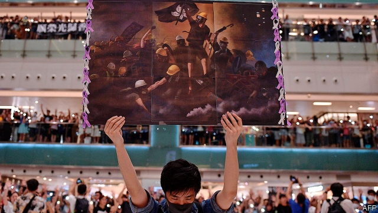

###### Pictures to die for

# The art of protest in Hong Kong 

 

> print-edition iconPrint edition | Books and arts | Sep 28th 2019 

AT THE END of April, when Hong Kong’s pro-democracy demonstrations were small, Kacey Wong, an artist and activist, wheeled his latest work out into the street. The installation was a mock prison, reminiscent of a British telephone box. It was made of bright red bars, and topped with a handsome blue-and-gold shield emblazoned with the letters HK-CN—an inversion of a commonly used code that designates Hong Kong as CN-HK. As part of the performance, Mr Wong and a friend dressed as mainland policemen, sporting aviator glasses, white gloves and truncheons, which they wielded to “arrest” some of the crowd. The protesters found it all hilarious, gathering in groups to take selfies as they were incarcerated. 

Since the demonstrations took off on June 9th artists, cartoonists and graphic designers have produced a torrent of new work, most of it circulating online. Just as with Mr Wong’s installation, at first the mood of this outpouring was lighthearted. Badiucao, a political cartoonist who has a tattoo of a tiny man in front of a huge tank on his upper arm, created a flag of coloured squares. They represent the Post-it notes stuck on the many “Lennon walls” around the city that are taken down by municipal cleaners at night, only to be replaced by activists before sunrise. 

Artists reworked old tourism posters that extolled the virtues of Hong Kong as a resort, and Eugene Delacroix’s “Liberty Leading the People”, replacing the Tricolor with the pro-democracy black bauhinia flag (pictured). A videographer working for Ai Weiwei, an exiled mainland artist, captured a young couple kissing—with their gas masks rather than their lips. Just as the alternative, crowd-sourced anthem, “Glory to Hong Kong”, evokes a 19th-century romantic nationalism, so did much of the imagery created by the pro-democracy movement’s idealistic young artists. It was mostly produced at speed and posted on Telegram, the activists’ favourite app. 

Recently, however, the imagery, like the atmosphere, has darkened. Take, for instance, a pop-up show at the Kong Art Space in Central District. Reminiscent of art produced at the time of the Umbrella Movement in 2014, which was made of debris collected at the protests, the Kong show has elaborate installations made of face masks and empty tear-gas canisters. Mr Wong, meanwhile, has put away his jaunty jail. His latest piece is a yellow cartoon that frames two black masks, one representing civil disobedience, the other what the artist calls “uncivil disobedience”. That is a reference to the rising determination that he senses among Hong Kongers to step up their resistance to the mainland. 

The twin masks imply that the protests will not have a happy ending. So does “Skew”, a new work by Xiao Lu, China’s best-known female performance artist. In her new piece, Ms Xiao is trapped in a perspex prism, up to her ankles in blood-red liquid. Dressed all in black, she writhes and cries out in anguish, unable to escape. In 1989 the Chinese authorities closed a show in Beijing by Ms Xiao after she fired an air pistol at her own work. The incident became known as “the first shot of Tiananmen”. At the opening night of Ms Xiao’s show in Hong Kong on September 12th, one visitor voiced what many may have been thinking: “Let’s hope she doesn’t turn out to be Hong Kong’s Cassandra.” ■ 

