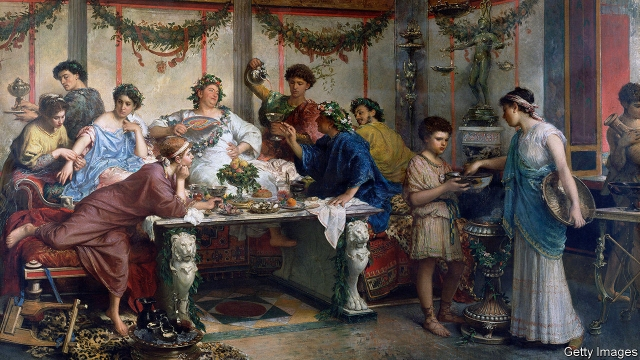

###### Debts to pleasure

# The key to a good life is avoiding pain 

 

> print-edition iconPrint edition | Books and arts | Sep 28th 2019 

How to be an Epicurean. By Catherine Wilson. Basic Books; 304 pages; $17.99. Published in Britain as “The Pleasure Principle”; HarperCollins; £14.99 

IN CATHERINE WILSON’S manual on “the ancient art of living well”, her guide is the Greek philosopher Epicurus, who advocated a calm life of modest pleasure. By explaining how the world was, he thought philosophy could show people how to live. Ms Wilson, an Epicurus specialist, agrees. Her intelligent and readable book lies, she says, somewhere between technical philosophy and “advice columns”. 

To latter-day secularists, Epicurus’s formula for a happy life has obvious appeal. Step one was to see the world for what it was. Everything was made of matter, including mind and spirit. The only life was this one. The gods took no interest in humans and were neither vindictive nor demanding. Life’s aim was happiness, understood as tranquil pleasure and freedom from pain. The pain that most concerned Epicurus was “mental terror”: anxieties rooted in false beliefs about “the nature of things” (the title of the grand philosophical poem by his Roman follower, Lucretius). Step two was applying such knowledge to human existence. That meant not expecting too much, finding simple satisfactions and not agonising about mortality. 

Epicurus opened his school, the Garden, outside Athens early in the 3rd century BCE. Followers, it was said, included women and slaves. None of his 300 or more works survive; his thoughts came down through Lucretius and, later, biographers. 

Christian thinkers considered him an atheist and amoralist. In Jewish tradition, “apikoiros” meant a heretic. Dante put Epicureans in hell for denying the soul’s immortality. In popular lore, Epicurus was patron to gluttons, publicans and brothelkeepers. The “sensualist” slur stuck. Later “epicure” came to mean an aesthete or foodie. Epicurus’s scientific speculations—on atomism and natural selection—sound uncannily modern but rested on brilliant inference, not experiment. Read today, the detail sounds barmy. 

The life-advice, by contrast, sounds like common sense for people thrown onto their own ethical resources without traditional guidance, as is widespread now. Epicureanism spread as the Greek city-state fell into decline, empires emerged and social authority grew distant and impersonal. Although Ms Wilson does not stress it, the parallel with the current disoriented mood is striking. 

In her book’s first part, she sketches Epicurus’s proto-democratic world-view. The senses, which are the source of knowledge, are common to all and reliable. Each knows what pleases or pains them. As people know their own minds, they cannot easily be bossed about by presumed betters. 

“Living well and living justly”, part two, builds on the Epicurean picture of morality as useful rules for reducing harm. Be canny about your pleasures. Don’t stress over worldly success. Be good to friends. Enjoy sex but beware its risks. Don’t expect too much of parenthood. Above all, stop worrying about death. As Dryden put it, when translating Lucretius: 

In her last two parts, Ms Wilson probes the philosophical underpinnings. A handy, schematic table contrasts Epicureans and Stoics. Ms Wilson notes Epicurean contempt for religious superstition, self-serving clergy and faith-based warfare, but sees common ground with believers in the shared conviction that “morality matters”. 

She notes and answers doubts that have dogged Epicureanism, but urges readers to make up their own mind. Is death truly no harm? After all, it cuts short plans, projects and responsibilities which give lives purpose. For his part, Stoic Cicero complained that Epicurus wanted happiness to be both virtuous and pleasant. Yet being fair, firm or a good friend—to take three common-or-garden virtues—need not be pleasant and may be taxing. Can everything today’s liberal-minded Epicureans tend to approve of—human rights, abortion, social justice—really be reconciled with the idea that pleasure is all? 

Floating over Epicureanism, for all its appeal, is a sense of loneliness. Family life is inessential. Friends are merely instrumental. Everything comes back to “How is this for me?” Perhaps not philosophy but an over-defensive temperament is at work. Could it be that in arming themselves so well against life’s anxieties, Epicureans overlook its riches? ■ 

