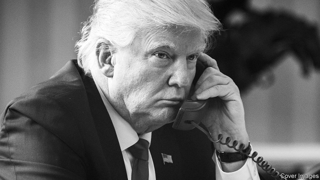
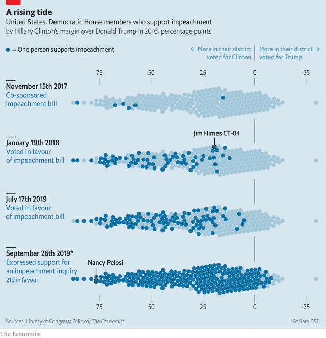
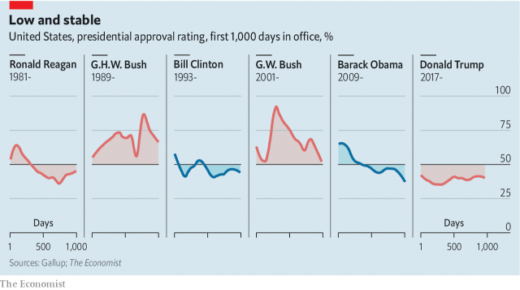
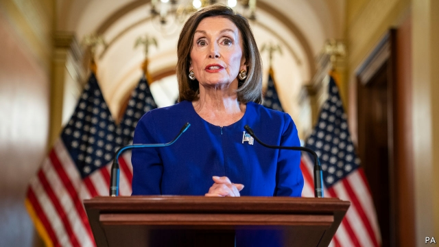

###### Telephone justice

# The move towards impeachment marks a dangerous shift 

 

> print-edition iconPrint edition | Briefing | Sep 26th 2019 

THE PEOPLE of south-western Connecticut are not happy with what they are hearing about President Donald Trump. Jim Himes, who has represented the state’s fourth congressional district since 2008, told The Economist on September 23rd that he had “felt...intensely from my constituents this weekend” a sense of “outrage” over the administration’s “quite clearly lawless behaviour.” 

Mr Himes came to support the impeachment of President Donald Trump partly because such constituents encouraged him to. Until recently, though, he thought it was unlikely to come to pass. Away from Connecticut’s affluent suburbs, the idea has always been a lot less popular. Mr Himes’s campaign manager knocked on hundreds of Democrats’ front doors when trying to win the recent special election in North Carolina’s Ninth District: “They all said to slow down on hating Trump.” Hardly any of the 31 congressional Democrats who represent districts Mr Trump won in the elections of 2016 favoured the idea. 

Nancy Pelosi, the Speaker of the House, understood their concerns. The majority the Democrats won in last year’s mid-term elections meant that they could, in principle, draw up articles of impeachment against Mr Trump. But he could only be found guilty if 20 or more Republican senators voted to uphold them. That is remarkably unlikely. And the pursuit of that unlikelihood might easily backfire; a failed bid to oust Mr Trump with accusations that would surely be branded fake news might energise his support and engender a broader sympathy. When the tribunes of the party’s left wing talked of impeachment, Ms Pelosi dismissed the idea. 

The party’s position changed more-or-less overnight. “I think you’ll see some of those [swing-district Democrats] pull the trigger,” Mr Himes predicted on Monday evening. By the next day, they had. Tuesday morning’s Washington Post carried an op-ed by seven freshman Democrats from swing districts, all but one of them with a background in the armed forces or the intelligence services. They wrote that Mr Trump’s “flagrant disregard for the law cannot stand,” and that it was thus time “to consider the use of all congressional authorities available to us, including the power of ‘inherent contempt’ and impeachment hearings.” 

Ms Pelosi seeks to stand where she believes her caucus’s centre to be: it is one of her strengths. With that op-ed, the centre moved, and the same afternoon Ms Pelosi announced that the House would begin a formal impeachment inquiry. “No one is above the law,” she said. 

By the time The Economist went to press, it appeared that a majority of the House—219 Democrats and Justin Amash, elected as a Republican and sitting as an independent, supported impeachment proceedings (see chart). 

 

Over the next two months—Democrats want to finish the process by year’s end—six House committees will hold hearings into the president. They will send what they see as their best cases for impeachment to the Judiciary Committee, which will vote on whether to bring one or more articles of impeachment to the floor for a vote. If a simple majority votes in favour, the president is impeached, which is analogous to being indicted. He then stands trial in the Senate, where he can be found guilty only by a two-thirds majority. 

Because of the 20 Republican turncoats such a majority requires, it remains very unlikely that impeachment will in fact remove the president. But it seems likely that despite this it will go ahead anyway, dragging America into new and stormy seas. 

At the centre of all this is a telephone call Mr Trump made to Volodymyr Zelensky, the president of Ukraine, on July 25th. A contemporaneous memorandum of what was said, which the White House released on September 25th, shows Mr Zelensky expressing an interest in buying Javelin anti-tank weapons from America. In response, Mr Trump says “I would like you to do us a favour”. Among the things he goes on to talk about is a former Ukrainian prosecutor-general, Viktor Shokin, who in 2015 was in charge of investigating Burisma, Ukraine’s largest private oil and gas firm. 

One of Burisma’s board members was Hunter Biden, son of then Vice-President Joe Biden, who is now campaigning for the Democratic nomination in the 2020 presidential election. “There’s a lot of talk about Biden’s son,” Mr Trump is recorded as having told his Ukrainian counterpart, “that [Joe] Biden stopped the prosecution and a lot of people want to find out about that so whatever you can do with the Attorney General that would be great.” Mr Zelensky assures him that a new prosecutor, “100% my person” will look into the situation; Mr Trump urges him again to talk to his attorney-general, William Barr, and to Rudy Giuliani, the former mayor of New York, who acts as Mr Trump’s personal lawyer. 

At no point does either side mention that, a week before the call, the White House put a stay on $391m in military aid that Congress had voted to send Ukraine, as the Washington Post reported on September 23rd. Nor does Mr Trump say: “If you investigate Biden you can have the arms.” But he would not have needed to. In circles like those of Ukrainian power-brokers or the New York mobsters of Mr Zelensky’s favourite film, “Once Upon a Time in America”, deals do not need to be laid out directly for their substance to be understood. According to one person familiar with the conversation itself, rather than the memorandum, Mr Zelensky and his team were left in no doubt that the main thing Mr Trump was interested in was the Bidens. 

 

On August 12th a whistleblower contacted the Intelligence Community Inspector General with concerns linked to Mr Trump’s conversation. The concerns were passed on to the Office of the Director of National Intelligence (ODNI) on August 26th. The law says that when an “urgent concern” arises in this way the ODNI has seven days to forward it to the House and Senate intelligence committees. Instead it sat on the complaint in a manner that Adam Schiff, who chairs the House Intelligence Committee, describes as “neither permitted nor contemplated under the statute.” On September 13th Mr Schiff announced that he had subpoenaed the report, and other related materials, from Joseph Maguire, the acting Director of National Intelligence. 

The ODNI contends that it did nothing illegal. The complaint did not need to be forwarded to Congress, it says, because it is about “conduct by someone outside the Intelligence Community,” and is thus unrelated to any “intelligence activity” that the Director of National Intelligence supervises. The ODNI did not reveal who “someone” was. The president, being outside the intelligence community, could fit the bill. 

On September 24th Chuck Schumer, the Democratic leader in the Senate, moved that the complaint be provided to the intelligence committees of both houses of Congress; the Republican majority supported the motion, which passed unanimously. On September 25th the administration gave in, sending the complaint to Congress. Admiral Maguire was due to testify before both intelligence committees on September 26th. The whistleblower, too, has tentatively agreed to testify in camera. 

Mr Trump has behaved self-interestedly before—indeed, he hardly has any other mode of behaviour. He has said outrageous things to foreign leaders. He has sought to obstruct justice, as the Mueller report into links between his campaign and Russia showed. So why has this case so raised the stakes that Democrats have set aside their caution when it comes to impeachment? 

One factor is the president apparently undercutting Congress’s wishes in a matter of national security in order to pursue his agenda. On September 23rd Mr Trump said he withheld the military aid because he was worried about corruption in Ukraine. This is a legitimate concern, though presidents tend not to not use their personal lawyers for anti-corruption initiatives. The next day he said he withheld aid because “Europe and other nations” should also contribute to Ukraine’s defence; but Congress had not made that a condition of their appropriation. In the space of two sentences, he first denied putting pressure on Ukraine, then admitted “there was pressure put on with respect to Joe Biden.” 

Mr Trump contends, though, that there was no quid pro quo—and that the pressure was applied to a legitimate end. He claims to believe that Mr Biden improperly induced Ukraine’s then president, Petro Poroshenko, to fire Mr Shokin, the prosecutor, in order to protect his son. It is true that Mr Biden urged Mr Shokin’s sacking. But so did almost everyone with an interest in better government in Ukraine. Anti-corruption organisations claimed that far from aggressively pursuing Burisma, Mr Shokin was sabotaging the investigation. There is no evidence that there was ever, or should have been, an inquiry aimed at Hunter Biden himself. 

Another factor that makes the case stand out is that, if what is alleged is true, Mr Trump attempted to coerce a foreign nation into interfering in an American election. This evokes memories of the Russian connection in the 2016 election. But on that occasion the president could claim he was simply the passive recipient of Russian aid. Here he initiated contact, using the power of his office for his personal benefit. If Mr Trump is happy to seek such advantage, Ms Pelosi’s long-held position that the best way to punish him is by voting him out begins to look perilous. 

The ur-scandal over Russian assistance in 2016 was hard to keep track of; the Mueller report, though damning in its way, was long in coming, long to read and dauntingly complex. This one is much easier. As Chrissy Houlahan, one of the authors of the Washington Post op-ed, puts it, “A sitting president allegedly withheld foreign military expenditures from an ally fighting against a foe of ours in exchange for information on a possible foe of his in an upcoming election.” That’s not so hard to understand. 

There is another link to the Russian scandal; it may have bolstered a sense of impunity. After completing his report, Robert Mueller testified to Congress in July. Some Democrats hoped he might make the case for impeachment, never bluntly stated in his report. He didn’t. The next day Mr Trump phoned Mr Zelensky. If not acting emboldens Mr Trump, that strengthens the case for acting. 

The six House committees that Ms Pelosi has said will operate “under that umbrella of impeachment inquiry”—Financial Services, Foreign Affairs, Intelligence, Judiciary, Oversight and Ways and Means—were already holding hearings into various allegations against Mr Trump. Over the next two months they will have to determine which—if any—of those allegations add up to a high crime or misdemeanour that can be impeached. 

If impeachment is to work politically they must come up with accusations not just of wrongdoing, but of wrongdoing that goes beyond the public’s expectations. Consider the impeachment of Bill Clinton in 1998. Dressed up in terms of obstructing justice, it really revolved around sexual malfeasance. The public had been aware that Mr Clinton, like Mr Trump, had form in such matters. It thus never got behind the impeachment. Indeed it punished the impeachers at the ballot box. 

Mr Trump’s deviance from prior norms raises this bar. During his presidential campaign it was widely reported that he stiffed his contractors. He boasted about minimising the amount he pays in taxes. It may well be that people priced this information into their decision before voting—perhaps, indeed, under the label “smart operator”. Proceedings turning on such things would feel like old news if not fake news, patronising and a bit desperate. If the inquiries uncover evidence of tax or insurance fraud, they would be best advised to refer it to state or federal prosecutors for action after Mr Trump leaves office. 

 

Voters also knew that Mr Trump speaks and acts in racist and sexist ways. This makes his offensive rhetoric, cruel immigration policies and fast and loose funding of his border wall a matter for next year’s voting rather than impeachment. Ditto attacks on the press, harassment of opponents, fondness for dictators. All norm-breaking, alarming and possibly detrimental to America’s long-term security and the health of its democracy. None surprising, or impeachable; all were evident when he was a candidate. 

What the would-be impeachers need is something which contravenes not what Americans expect of a man, either in general or in particular, but what they expect of a president. That was what brought down Richard Nixon. As the Watergate hearings made it clear that he had used his power for personal benefit the public, originally sceptical of the impeachment process, began to get behind it. 

Mr Trump’s avoidance of scrutiny would seem to offer a lot of possibilities here. Mr Mueller’s report detailed his habit of obstructing investigations. His hostility to congressional oversight is evinced by his refusal to surrender his tax returns, his many lawsuits against congressional committees investigating him and his businesses, and his ordering staff not to comply with subpoenas. Neither Mr Clinton nor Nixon were so reflexive, habitual or ambitious in such matters. Yet they formed part of the articles of impeachment against both men. 

But at the moment it is the meat of the Ukraine scandal that seems strongest—a high-stakes story developing under the public eye. Impeachment, like much of politics, is at root an act of persuasion. The drama of discovery helps. The Watergate hearings drew in the public in part because investigators were pulling on strings without knowing where they led; news about the tape recordings made in the Oval Office emerged live during televised hearings. 

That may not be the case in these hearings. The media landscape is transformed. And Messrs Trump and Giuliani have publicly admitted much of what they are accused of. Pulling on strings may reveal more. Those which lead back to Ukraine may muddy the appealing clarity; it is not a feature much found in the country. Though the younger Mr Biden’s position on the board was not illegal it does not look great; that, after all, is why Mr Trump cares about it. Some strings, though, may be closer to home. Why, for example, did Dan Coats cede his job as Director of National Intelligence to Admiral Maguire three days after the call to Ukraine? 

Given that the Senate is likely to let Mr Trump off, one strategy may be to keep things in the House for some time. The lengthy, dramatic Watergate hearings helped shape public opinion; the scant, rushed hearings of 1998 made Mr Clinton’s impeachers look bad. And when the time comes it may be worth a defeat in the Senate to force Republicans in swing states to defend what some voters may have come to think indefensible. If, instead, some of those senators find him guilty, they may fall prey to Mr Trump’s base in primaries. If impeachment loses the Democrats some House seats because people don’t like all the Trump-hating but gains them some Senate seats it could be a good deal for the party—as long as the next president is a Democrat too. 

But the impeachers could just as easily end up egg-faced. Some have already begun grumbling about the lack of direction. The fact that the Mueller report had no long-term effect on the president’s approval is a sobering precedent. Admittedly in that case, Mr Barr got to mastermind the spin surrounding the release, which let him lessen its impact. This time the weapon will be in the hands of those who want to wield it. But with little chance of a mortal blow, they could leave Mr Trump in place, triumphant simply for having survived, just as the presidential campaign starts heating up. ■ 

