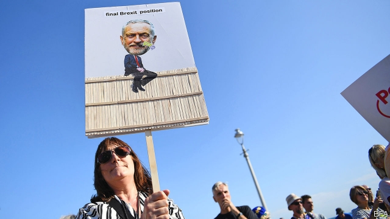
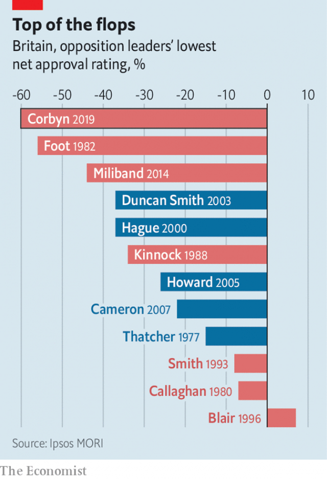

###### Right on in Brighton

# Britain’s Labour Party heads further left 

 

> print-edition iconPrint edition | Britain | Sep 28th 2019 

WHOOPS FILLED the air of a nightclub on the Brighton seafront as John McDonnell, the shadow chancellor, walked on stage on September 22nd. The compères of the Radical Variety Show, a side event at Labour’s annual conference, had a surprise for the man who will be in charge of the world’s sixth-largest economy if Labour wins the next election. “Please may I introduce to you, the wheel of public ownership!” one cried. Out came an assistant carrying a Wheel of Fortune-style spinner. On it was a host of things Labour could nationalise: BAE Systems (a defence company); banks; Greggs (a bakery); Heathrow airport. Chuckling, Mr McDonnell gave it a twirl. 

Labour’s conference was a mix of radical policy, fights about Brexit and internecine civil war. With the party trailing in the polls and at war with itself once again, MPs and activists moped from stall to stall. Things got off to a bad start when left-wingers on Labour’s ruling National Executive Committee launched a botched bureaucratic assassination attempt against Tom Watson, the party’s deputy leader. “It’s the hitman who missed!” shouted Mr Watson at Jon Lansman, the Labour activist who oversaw the attempt, when they bumped into each other. 

Labour sorted out its Brexit position, but not without a fight. Delegates at the conference, which sets party policy, narrowly decided that Labour would not campaign to stay in the EU at the next election. Instead it would support a second referendum, with a viable Leave option set against remaining in the union. Although nearly all its MPs, the vast majority of its members and the bulk of its voters support staying in the EU, about a third of its voters at the last election backed Leave. 

Since 2017, when Labour promised a hard Brexit, taking Britain out of the single market and customs union and ending the free movement of Labour, the party has softened its stance. At last year’s conference, the mere suggestion of a second vote with Remain on the ballot by Sir Keir Starmer, the shadow Brexit secretary, triggered an enormous row. Now it is party policy (albeit after another enormous row). A motion calling for free movement to continue after Brexit was also passed. The result is that, in two years, Labour’s Brexit policy has undergone a slow revolution. Nonetheless, many Remainers are cross that the party will go into the next election without a position on how it would campaign in any referendum. 

Bureaucratic battles and Brexit almost overshadowed the most radical policy platform put forward by any British political leader since Margaret Thatcher. A target to make Britain carbon-neutral by 2030 was agreed on, even though some union bosses gritted their teeth at the idea. Pharmaceutical companies that tried to gouge patients would have their patents snatched, said Mr Corbyn. Mr McDonnell promised a 32-hour (four-day) working week within a decade—much sooner than the end-of-century deadline proposed by trade unions. 

Spending commitments piled up. Labour would dish out 2.5m interest-free loans of up to £33,000 ($40,700) for people to buy an electric car, at a cost of just under £4bn in lost interest. A “People’s Zipcar” was also floated, with Labour promising to introduce a network of pay-as-you-go electric cars across the country. Another £6bn per year would be spent on personal care for the elderly. A scheme to abolish private schools would cost about £4bn per year, if all the pupils were put in state schools. Mr McDonnell casually dropped in a pledge to end in-work poverty within the first term of a Labour government, implying a large rise in in-work benefits. 

 

Whether Labour will have a chance to enact these radical policies is another matter. Mr Corbyn is preposterously unpopular (see chart). Self-inflicted blows left a miserable mood at the conference, which contrasted sharply with previous years. The event in 2017, coming after Labour’s surprisingly strong performance at the general election, was a carnival. In 2018 the party strode left in its policy line-up. This time, the optimism had ebbed, even if the policies kept coming. “Are we going to get bollocked in the next election?” wondered one prominent supporter of Mr Corbyn. 

It took the judgment of the Supreme Court on September 24th and the humiliation of Boris Johnson to lift spirits. The same conference hall that was a sea of discontent when the Brexit policy was announced turned into an adoring mass when Mr Corbyn marched out and called for the prime minister to quit. “Boris Johnson has been found to have misled the country,” he declared. “This unelected prime minister should now resign.” Delegates erupted in cheers, their fights forgotten. For now. ■ 

