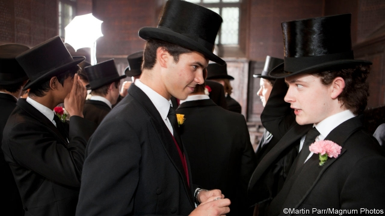

###### New school ties

# Britain’s old-boy networks go online 

 

> print-edition iconPrint edition | Britain | Sep 28th 2019 

IN A BOARDROOM 23 years ago, Gareth Lloyd-Jones was feeling the heat. After nearly 100 meetings around the City, he was no closer to floating his company on the stock exchange. Then, from among the steely faces, a young man stood up and announced that he would invest. “When you were at Rugby you were a great runner, and anyone who has that level of fitness I’m going to gamble on,” he declared. Mr Lloyd-Jones was taken aback. “I didn’t even know who he was,” he admits. “But I thought, ‘Well, this is interesting.’” 

Today, as president of the Rugbeian Society, he is overseeing a technological upgrade aimed at making such connections less coincidental. In July the club launched an app that allows alumni to seek everything from interns to fellow wine-enthusiasts. It has already been downloaded by more than 800 old boys and girls. 

The Rugbeians aren’t the only ones going online. Of the 30 public schools in the Eton and Rugby groups, two clusters of swanky institutions that co-operate on curriculum-planning, sporting fixtures and so on, half have LinkedIn pages advertising internships. Nearly as many use a platform run by Graduway, which makes alumni-relations software that costs up to £10,000 ($12,360). Almost half run their own digital alumni networks. 

Such clubs are part of a counter-offensive by private schools in a job market that has become saturated with graduates. Some 777,000 people left higher education last year, two-thirds more than two decades ago. Guy Beresford, a headhunter and self-described “careers bod” for the Old Oundelian Society, says that when he graduated in 1981 the club was mainly “black-tie dinners and going to golf”. Now, companies’ desire for diversity means it is “becoming tougher for private-school leavers to walk into top jobs and top universities, and we thought that any help we could give them would be valuable.” 

The Rugbeian Society runs 19 summer internships in 14 companies that are managed by alumni and organised on its various platforms by a full-time staff. School ties outweigh connections made later, believes Richard Brumpton, who got his job as a financial analyst through Rugby’s online platforms. “University is a much bigger operation where you have intimate relationships with less people, so you just fit into school networks a bit more.” As public schools have admitted more foreign pupils (and in some cases set up branches abroad), online networks have helped to connect far-flung old boys and girls. 

“I’m torn between ‘is it good?’ or ‘is it nepotism?’,” says Nick Mills, who used Old Rugbeian get-togethers to attract funding when he was setting up TicketText, a ticketing company, in 2012. “But I’m not going to go and bury my head in the sand, because it’s stupid not to use it.” Mr Mills is repaying the favour by mentoring young Rugbeians and letting the club use his London venue. Others are more cynical. Schools have invested in alumni societies “because they are interested in having enough people donating each month to fundraise for leaky roofs and new sports halls,” reckons one Old Harrovian. 

State schools are getting more interested in alumni networks, too. Future First, a charity, has helped more than a thousand comprehensives in poor areas to build networks, encouraging alumni to return to the schools to provide careers information. Future First’s Amy Cuffley says the aim is to “capitalise on the wealth of role models and volunteers these schools have—in the same way private schools already do.” ■ 

