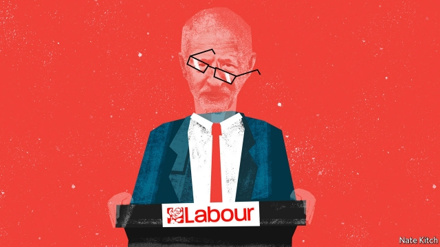

###### Bagehot

# Labour contemplates life after Jeremy Corbyn 

 

> print-edition iconPrint edition | Britain | Sep 28th 2019 

THE SUPREME COURT’S thunderclap of a ruling against the government on September 24th was a godsend for Jeremy Corbyn. It not only gave him an excuse to bring his Labour Party conference to a premature end by giving his speech a day early. It also allowed the party to dispense with a speech by Tom Watson, the deputy leader, that might have resulted in mass walkouts. There is nevertheless no doubt that this year’s conference, held in a rainy Brighton, was a miserable affair. An event that is designed to showcase the leader’s preparedness for power was overshadowed by the question of whether he should be preparing for retirement. 

The first sign of trouble was a failed attempt to remove Mr Watson from his job by Jon Lansman, the head of Mr Corbyn’s praetorian guard, Momentum. It is no secret that the left covets Mr Watson’s head. But Mr Lansman’s timing was odd given that his plot was guaranteed to ignite an internal war and send the media into a blood-frenzy. The only explanation is panic about the succession. Under current rules the deputy leader takes over temporarily if the leader resigns and therefore plays a role in choosing the next one. 

The second sign of trouble was a leaked memo by Andrew Fisher, a member of Mr Corbyn’s inner circle and an author of Labour’s 2017 manifesto. Mr Fisher lambasted Mr Corbyn’s office for its “blizzard of lies” and “lack of competence, professionalism and human decency”. The last two words were particularly cutting. He also warned that the party would not be able to win the next election with the current leadership. 

The succession crisis is being driven by two numbers: 70 and 25. At 70, Mr Corbyn is on the old side for somebody who aspires to the most demanding job in British politics. And at 25, Labour’s average poll rating is much too low for a party that aspires to power. Labour should be well ahead of a government that blunders from crisis to crisis. Instead it is behind in every poll, sometimes by some distance. In this year’s European election Labour finished third, behind the Liberal Democrats. In two subsequent by-elections it has suffered double-digit declines in its vote share. Labour MPs from the Midlands and the north report that voters constantly tell them they will not back Labour so long as it is led by Mr Corbyn. 

Labour Remainers (who make up the bulk of party members) are furious with Mr Corbyn’s fence-sitting over Brexit. Matthew Pennycook, a shadow Brexit minister, stepped down on September 25th to campaign for Remain. People across the party are disheartened by Mr Corbyn’s faltering performance. Though he bought himself a period of grace with his almost successful election campaign in 2017, that has now ended. He has made a succession of unforced errors that hurt deeply, not least asking for the Russians to be called in to help investigate the poisonings in Salisbury, and dragging his feet over investigating anti-Semitism in the party. It is a measure of Mr Corbyn’s leadership ability that he has managed to take a moderate position on the one subject, Brexit, where extreme positions are popular, and extreme positions on everything else. 

Mr Corbyn insists that he will not only lead his party into the next general election but also serve a full term as prime minister. He is probably right about the first, given that the next election could be a matter of weeks away. But he is almost certainly wrong about the second. A year in Downing Street is equivalent to several years of ordinary life. The more interesting question is not whether Mr Corbyn can survive for the next few months, but whether the “Corbyn project”, as Labour delegates call it, can survive his departure, be it the result of an election defeat or the toll of high office. 

For all his many faults Mr Corbyn is a consummate machine politician. His supporters control all the party’s great organs of power, from the National Executive Committee to the biggest trade union to the local parties. Mr Corbyn demonstrated his grip at the conference by engineering the defeat of a motion to throw the party’s weight behind Remain. Two big unions, Unite and the GMB, voted as a bloc against the motion, the left-wing pressure group Momentum whipped its delegates to oppose it and, in a Soviet moment, Wendy Nichols, the chairwoman of the session, reversed her decision that the vote had passed after an intervention from Jennie Formby, the party’s general secretary. What’s more, the Corbyn project is driven by two men rather than one. John McDonnell, the shadow chancellor, remains as bright and omnipresent as ever despite his 68 years. 

Against that, the party’s middle ranks are much less supportive of the project. The Corbynites’ preferred successor, Rebecca Long-Bailey, the party’s energy spokeswoman, is a thin reed. A poor performer in Parliament and on television, she lacks both Mr Corbyn’s intermittent charm and Mr McDonnell’s iron grip on detail. By contrast, the party’s moderate wing has a plethora of more impressive figures. Emily Thornberry is a good parliamentary debater (and outshines Mr Corbyn when she stands in for him at prime minister’s questions); Sir Keir Starmer has transformed himself from a lawyer who happens to be in the politics business to an accomplished politician who happens to know a lot about the law; Hilary Benn and Yvette Cooper have a rare ability to articulate a moderate position in an age of polarisation. The most impressive members of the party’s next generation—Jess Philips, Angela Rayner and Lisa Nandy—have kept their distance from Corbynism. 

Labour’s ascendant left wing likes to think in terms of vast, impersonal, historical forces: the crisis of neo-liberalism, the death-agonies of imperialism and the rest of it. But the fate of Mr Corbyn’s great project to build socialism in Britain depends on the political machinations of a handful of individuals. The fact that the balance of power is so delicate means that the struggle can only become more bitter in the months to come. Mr Corbyn’s rise divided the party like nothing since the second world war. His eventual departure will divide it even further. ■ 

