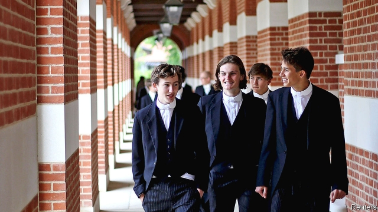

###### A row going on down near Slough

# Labour votes to abolish Britain’s private schools 

 

> print-edition iconPrint edition | Britain | Sep 28th 2019 

BOTH THE first prime minister (Robert Walpole) and the current one (Boris Johnson) were educated at Eton College. So were 18 others in between. Annual fees are £42,501 ($52,508), which cushion an endowment of £436m. One in five pupils is the son of an Old Etonian. Around one in four will go to Oxford or Cambridge. Founded in 1440, the school has three theatres and three museums, as well as a rowing centre. When a campaign within the Labour Party to shut down private schools came to choose a slogan, there was an obvious choice: “Abolish Eton”. 

On September 22nd Labour Party conference attendees united around the rallying cry, passing a motion proposed by the campaign. It commits the party to three policies. First, it will withdraw charitable status and other tax privileges from private schools. Second, it will ensure that universities admit the same proportion of private-school pupils as exists in the wider population. Third, private-school assets will be “redistributed democratically and fairly across the country’s educational institutions”. Sol Gamsu, a sociologist at Durham University and an activist behind the campaign, hopes that a Labour government would enact the policies in sequence over two to three years. 

Private schools may be unusually vulnerable now. At a time of political crisis, “the fact that those responsible were educated at Eton is a great help for us,” says Mr Gamsu. Long beyond the reach of most, in recent years private schools have become still more of a luxury. According to Lloyds Private Banking, the average annual fee for day pupils last year was £14,289, up from £9,579 a decade earlier, an increase 19% above inflation. Less than 7% of children in England attend a private school, although a slightly higher proportion do at some point in their education. Research suggests the fees buy only a small boost to exam results: an upper estimate, which controls for things like family income, is 0.6 of a grade at GCSE, the exams sat at 16. But there is some evidence that they have a bigger impact on outcomes in the job market. Old-boy networks help (see article). 

The campaign was supported by senior figures in the party, including John McDonnell, the shadow chancellor, Angela Rayner, the shadow education secretary, and Ed Miliband, a former leader. The Labour manifesto in 2017 had already committed to charging VAT on fees, which would raise them by up to a fifth. That idea has fairly wide backing. Michael Gove, a Conservative cabinet minister, has complained that the current system “allows the wealthiest in this country…to buy a prestige service that secures their children a permanent positional edge in society at an effective 20% discount.” The motion also commits Labour to making schools pay business rates. 

To make these tax changes, Labour would have to strip private schools of their charitable status, which more than half currently enjoy. Doing so would require primary legislation, and could get messy, since the government would want to find a way to exempt those that provide specialist education, such as to disabled children. Barnaby Lenon, chairman of the Independent Schools Council, notes that even if the tax plans went ahead they would amount to a survivable inconvenience to the bigger, better-known schools, including Eton. Still, the number of private-school pupils would fall, and some schools, mostly preparatory ones (which take pupils until age 13), would probably go under. 

This would nevertheless be a long way short of the schools’ abolition. Ms Rayner said she would set up a review into how to integrate private schools into the state system, but stopped short of explicitly backing the other two proposals—university quotas and redistribution of schools’ assets—required by the conference motion. Universities would be furious about the imposition of limits on the number of private-school pupils they could recruit, and might find ways to get around it, including rejecting state funding. The wording of the motion is sufficiently vague that some Labour policy types think Ms Rayner could get away with pushing universities to make more use of “contextual admissions” (ie, requiring lower entry grades of children from state schools). 

Then there is the nuclear option. Nationalising private schools would be expensive, both in purchasing the schools’ assets and in educating 600,000 or so extra pupils. The Headmasters’ and Headmistresses’ Conference, a group of elite private schools, has vowed to fight in court any attempt to do so, with the sector arguing that nationalisation would contravene the European Convention on Human Rights, which guarantees a parent’s right to choose their child’s education. 

Nor is it clear this is a fight the party’s leadership wants to have. Despite his support for the campaign, in a private meeting Mr McDonnell opposed plans to nationalise private schools, and a number of unions are worried by the proposal. A poll by YouGov found that the public opposed abolition by two to one. So a less radical approach may emerge when Labour’s manifesto for the next election is drawn up. But, as the schools are aware, Labour would not need to nationalise them to make their life a lot more difficult. ■ 

