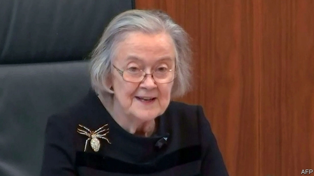

###### Along came a spider

# The Supreme Court puts more obstacles before Boris Johnson’s Brexit plan 

 

> print-edition iconPrint edition | Britain | Sep 26th 2019 

IT IS RARE for the Supreme Court to give a unanimous judgment on a contentious appeal. But that is what happened on September 24th when it ruled that Boris Johnson’s prorogation of Parliament for five weeks until October 14th had been unlawful. The 11 justices upheld and even strengthened a Scottish lower-court judgment against the suspension, while overturning an English high-court finding that the issue was political and accordingly not suitable for judicial determination. In doing this, the court delivered a powerful blow to the prime minister’s authority. 

The blow was the more effective for the manner of its delivery. In a calm but mellifluous voice, the court’s president, Lady Hale, sporting a glittering spider brooch, read out a damning judgment against Mr Johnson. If there were no limit to the government’s ability to prorogue, that would be incompatible with parliamentary sovereignty. She cited a 1611 court ruling that “the King hath no prerogative, but that which the law of the land allows him.” She dismissed the government’s argument that a long suspension was needed to prepare a Queen’s Speech and new legislative agenda. She noted that it would limit parliamentary scrutiny. This mattered, she said, because of the exceptional circumstance that Brexit is due to happen on October 31st. 

Although the Supreme Court did not say so explicitly, its ruling implied that Mr Johnson had misled the queen when advising her in August to prorogue Parliament. Not surprisingly, the opposition Labour leader, Jeremy Corbyn, interrupted his party conference in Brighton to call on the prime minister to resign. T-shirts with spider motifs quickly popped up on eBay, where they sold in their thousands. Coming after six successive defeats in the House of Commons, the passage of an act designed to prevent a no-deal Brexit, the resignation of two ministers and the removal of the Tory whip from 21 rebellious MPs, even the ebullient Mr Johnson might have been expected to feel some embarrassment or, just possibly, shame. 

Instead he doubled down. He said he profoundly disagreed with the court’s judgment. He offered no apology for his actions, even though they had been found unlawful. Although neither the government’s defence nor the court’s judgment suggested that prorogation was directly connected to Brexit, he declared ominously that a lot of people were seeking to frustrate it. And he continued to insist that Britain must leave the EU on October 31st, deal or no deal. 

As has happened before, some of his noisier supporters attacked the judges as part of an anti-Brexit establishment bent on thwarting the will of the people. Jacob Rees-Mogg, the leader of the Commons, reportedly spoke of a constitutional coup. A few Brexiteers suggested that justices should be subject to political vetting before appointment. Yet Geoffrey Cox, the attorney-general, declared that, although disagreeing with the judges was acceptable, impugning their motives was not. Indeed, the court ruling points to a constitution that is working, not to one that is broken. 

What next? The court declared that, because the prorogation was unlawful, it had not happened at all. John Bercow, the Speaker, duly recalled MPs to Westminster on September 25th. They asked about the attorney-general’s advice on prorogation, Mr Johnson’s relationship with an American entrepreneur (see article) and no-deal preparations. They subjected the prime minister to two hours of questioning, in which the Tory benches roared their approval for his bombast. But he shocked many by claiming that the way to honour the memory of Jo Cox, a pro-Remain Labour MP murdered in 2016 by a far-right fanatic, was to get Brexit done. Nicky Morgan, a cabinet minister, was among those who criticised his language. 

Mr Johnson repeated his demand for an early election. But under the 2011 Fixed-term Parliaments Act, two-thirds of MPs must vote for dissolution, so it needs Labour as well as Tory backing. Although Mr Corbyn said he too favoured an early election, he insisted that it was vital first to stop a no-deal Brexit happening on October 31st. That means ensuring that the so-called Benn act, which requires the government to seek an extension of that deadline if it has not agreed a Brexit deal by October 19th, works as planned before any dissolution. 

A final question is what effect all this may have on Mr Johnson’s negotiations for a new Brexit deal. He claimed again that these were making progress. Yet the EU still wants a legally binding, written alternative to the backstop (a mechanism to avert a hard border in Ireland), which Mr Johnson wants to excise from the withdrawal agreement. Brussels has dismissed four ideas recently put on the table by the British team. A 30-day deadline for a new plan hinted at by Angela Merkel, the German chancellor, in late August has been and gone. Suggestions by Mr Johnson’s team that he also wants to ditch earlier promises to avoid any border checks in Ireland by sticking closely to EU regulations are making it even harder to reach agreement. 

Mr Johnson’s lost authority after the Supreme Court judgment will serve further to emphasise his weak position in Brussels. His loss of parliamentary control was anyway making his negotiating partners nervous about offering concessions. The EU side fears that, just as Westminster rejected the deal struck last year with Theresa May three times, so it could do the same to any deal done with Mr Johnson. The Supreme Court ruling will make it harder for the prime minister to find some clever way round the Benn act. So the EU is assuming that, if no deal is reached at the European Council on October 17th-18th, Mr Johnson will be forced to ask for more time. 

Weary though it is of the whole issue, Brussels is likely to say yes to a further extension of at least a few months. The expectation is that Mr Johnson will then secure an election. He wants to run by standing up for the people, who voted to leave the EU, against an establishment blocking the way. His humiliation by the court this week may do that populist strategy no harm.■ 

