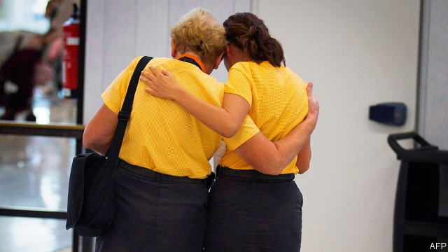

###### Checking out

# Thomas Cook, the world’s oldest travel firm, collapses 

 

> print-edition iconPrint edition | Britain | Sep 26th 2019 

THOMAS COOK began life in July 1841, offering day-trips between Leicester and Loughborough to teetotallers. It counted Mark Twain, Rudyard Kipling and Winston Churchill among its customers, before evolving into a leading modern package-holiday firm. But its story ended ignominiously this week, with some holidaymakers locked in hotels by security guards demanding that they pay again for their rooms. Some 600,000 tourists, a quarter British, were left stranded when the world’s oldest holiday firm collapsed into liquidation on September 23rd after a decade of financial trouble. It leaves behind big questions over who should pay to rescue stranded holidaymakers in future. 

Until recently Thomas Cook seemed likely to escape bankruptcy. Fosun, a Chinese conglomerate keen to deploy the Cook brand in Asia, and the firm’s lenders had agreed to rescue the company with a cash injection of £900m ($1.1bn). But on September 20th its main banks threatened to withdraw their support if the group was not able to find an additional £200m, which they calculated it would need to survive the lean winter months. None of its backers was prepared to cough up. A last-minute appeal to Britain’s government for a bail-out fell on deaf ears. Grant Shapps, the transport secretary, later said the company was in such a bad state that bailing it out would involve “throwing good money after bad”. 

What went wrong? Thomas Cook has earned most of its money since the 1990s selling package holidays, which include some combination of flights, accommodation and food. Since then the industry has often been presented as in decline, in part because of Thomas Cook’s woes. Monarch Airlines, which specialised in package deals, collapsed two years ago. 

Yet package holidays are not in decline; if anything, the industry is enjoying a resurgence. In the past decade their market share against trips booked as separate components has grown. The number of Britons going on “inclusive tours” rose from 14.3m to 18.2m in 2010-18. Half of Britons’ trips abroad are package holidays, reckons the Association of British Travel Agents. They are often cheaper, as firms like Thomas Cook can use their scale to negotiate lower prices on rooms and flights. The popularity of “Love Island”, a reality-TV show featuring buff bodies and plenty of snogging in a holiday villa in Mallorca, has also boosted their street cred among youngsters. 

Thus it is mainly Thomas Cook’s business decisions that are to blame for its demise. The company took on a mountain of debt when it merged with MyTravel Group, a rival, in 2007. An ill-judged series of takeovers added to it. It could never shake off this debt; the hole in its balance-sheet was £3.1bn by its collapse. Its 550 branches in Britain also swelled its overheads. 

New online-only travel agents, such as On the Beach and We Love Holidays, now Britain’s fourth- and fifth-biggest package-holiday operators, easily undercut Thomas Cook on price. Cook’s big bets on Tunisia and Turkey just before they were hit by a series of terrorist attacks in 2015 did not pay off. Good weather at home last year and uncertainty around Brexit this year also depressed its bookings. The £1.5bn in losses it made in the six months to March fatally wounded its balance-sheet. 

Britain is now repatriating over 150,000 of its nationals—its biggest evacuation since the second world war—at a cost of around £100m. ATOL, a government-backed scheme that insures package holidays against bankruptcy, will pay for the 60% of passengers travelling on such deals, while the government will bail out the rest. That is a sore point for package-holiday firms, who feel that they are paying £2.50 per passenger into ATOL for a service that non-package holidaymakers get for free. The government, meanwhile, worries that the scheme incentivises travel firms to take financial risks, knowing that they will not pick up the tab if they fail. 

In May a government review, set up after Monarch’s collapse, recommended adding a 50p levy to every air fare to help pay for future repatriations. That would shift the burden away from the state, but do little to help prevent another collapse of Thomas Cook’s size. ■ 

