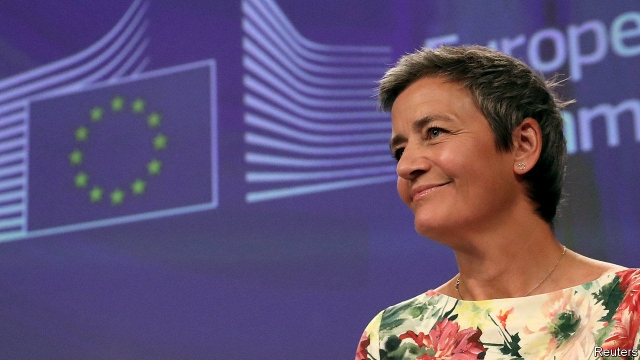

###### Mixed brew

# A victory for Starbucks clarifies EU rules on sweetheart tax deals 

 

> print-edition iconPrint edition | Business | Sep 28th 2019 

MARGRETHE VESTAGER, the steely Dane who forged her global reputation by waging war on Silicon Valley tech firms and corporate tax dodgers, was offered a rare second term as the European Commission’s competition tsar earlier this month. However part of her legacy is now under intense scrutiny as tax-shy multinational companies try to contest her tough-minded tax-rulings. 

The most well-known of these is her demand that Apple repay a huge €13bn ($14bn) sum to Ireland, which the EU’s General Court is still chewing over. But two other judgments offer a sense of whether the courts will back up her mission to revolutionise the taxation of multinational companies in Europe. The cases are complex, but the overall message from the judiciary to Ms Vestager is “proceed—but with caution, because the court is watching,” says Pablo Ibáñez Colomo at the London School of Economics. 

The first case involves Starbucks, which Ms Vestager ordered in 2015 to cough-up some €30m ($33m) in unpaid taxes in the Netherlands. She had argued that the existing tax arrangements the coffee-seller had set up with the Dutch government’s approval involved transactions between the firm’s subsidiaries that did not take place at arm’s length using market prices. 

The General Court upheld the principle that Ms Vestager was entitled to insist on arm’s length treatment. But it found that she was not entitled to stipulate the precise methodology that countries use. As a result it overturned Ms Vestager’s ruling. Starbucks was able to raise a Pumpkin Spice Latte in victory and low-tax states fearing a stealthy attempt to harmonise European tax policy heaved half a sigh of relief. But the big picture is that the ruling actually helps establish the EU’s right to insist on market-based tax arrangements, which big firms will hate. 

The second case was a straight win for Ms Vestager. In 2015 she ruled that Fiat Chrysler (whose chairman, John Elkann, sits on the board of The Economist’s parent company) should pay up to €30m in Luxembourg, because its arrangements did not match economic reality. The General Court upheld this decision. The carmaker may now appeal to the European Court of Justice. Mr Ibáñez Colomo reckons its odds of success are less than 50%. 

Brussels-watchers and executives in Cupertino, California will inevitably wonder what clues the judgments might give about the General Court’s deliberations on Apple. The technical answer is not many. The Starbucks and Fiat cases were about transfer prices between firms’ subsidiaries, whereas the iPhone maker’s case is about how its vast profits are allocated between its subsidiaries. 

Nonetheless the mood music now is that while Ms Vestager may lose some battles in the courts there is little sign so far that she is about to lose the war. Indeed she continues to open up new cases—in January, for example, she announced an investigation into the tax treatment of Nike in the Netherlands. In the confrontation over tax between big business and Ms Vestager, neither side is likely to roll over any time soon. The stakes are too high.■ 

