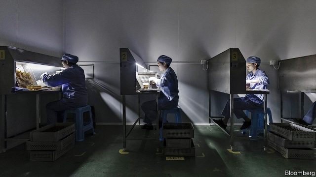

###### A rising star

# China’s pharmaceuticals industry is growing up 

 

> print-edition iconPrint edition | Business | Sep 28th 2019 

THE GLEAMING campus of BeiGene, a biotechnology company in Beijing, has all the trappings of a well-heeled research laboratory. They include screening machines to test the 500,000 compounds in BeiGene’s library, its animal-testing quarters with 10,000 creatures—and Wu Xiaobin, who last year left a job as Pfizer’s head for China to run the Chinese firm’s domestic operations. Signs of expansion are all around—especially for research on cutting-edge treatments that include gene and cell therapies. The number of scientists working on such drugs has almost doubled since last year; more are being hired. Fresh lab space has replaced old offices. 

BeiGene, founded in 2010, is emblematic of China’s fast-changing pharmaceuticals industry—in more ways than one. On September 5th a New York asset manager alleged that it had inflated its sales figures—a sign of distrust of an industry with a historically well-earned reputation for shoddy quality and shady business practices. The company, which is listed on America’s Nasdaq stock exchange, denies wrongdoing. Investors seem to believe it: its share price has recouped half of the 17% drop precipitated by the accusations. 

Markets’ optimism is doubtless fuelled by the huge promise of China’s pharmaceutical industry. In 2016 the country became the world’s second-biggest drug market. In 2018 sales reached $137bn, doubling in just six years. They are projected to be worth half of America’s by 2030, up from a quarter now. Much of this will come not from foreign drugmakers but domestic ones. At the same time, Chinese firms, which have historically produced copycat drugs for domestic use, will increasingly sell innovative treatments for everyone, like those being developed by BeiGene. 

The industry’s makeover was set off by growing alignment of China’s drug regulation with international standards. Speedier drug-approval processes rolled out in 2015 are modelled on America’s. Regulatory oversight of clinical trials is converging with Western norms. About 3,000 applications for me-too drug approvals were withdrawn when the government announced the new rules, winnowing out many flaky firms. Starting in 2017 medicines have been able to get approved in China on the strength of clinical trials abroad. 

At the same time, consolidation of drug procurement by state hospitals that began in 2015 squeezed the bloated prices of generic drugs. By one estimate, this freed up $30bn a year for pricier medicines such as the newest cancer drugs. Some 400m Chinese now have health-insurance plans that cover these. 

Chinese drug companies are pouring money into research—and researchers. China’s legions of science graduates, including returnees from top foreign universities and Big Pharma labs, where they discern a glass ceiling, are sharpening its edge in medical innovation. Around 250,000 Chinese returnees who have come back since 2013 work in life sciences. 

The booming domestic market for high-end drugs has created a similarly frothy one for their makers. Franck Le Deu of McKinsey, a consulting firm, calls it a “Cambrian explosion”. In 2018 venture-capital and private-equity investments in China’s biotechnology firms reached $17bn, according to ChinaBio, a consultancy. Most of it came from local sources. The medical zone of Shanghai’s Zhangjiang Hi-tech Park, one of China’s biggest, houses more than 1,000 companies—about ten times the number a decade ago. 

China’s biotech sector is just 12% of its overall drug market, half the global average of 25%. Most Chinese firms are young, and yet to turn a profit. But they are growing fast. Five of the world’s ten biggest biotech initial public offerings in the first half of this year were of Chinese companies, which collectively raised $1.6bn. To lure star startups away from New York and London listings, last year Hong Kong’s stock exchange relaxed its rules to allow pre-revenue biotech firms to go public there. 

Although they often started out licensing foreign drugs, either approved or in late-stage development, for the domestic market, Chinese firms soon set up their own drug-discovery programmes. These days they have global ambitions from the start, says Mr Le Deu—with eyes on the lucrative American market. Several are running late-stage clinical trials there and in Europe. In 2018 Chinese companies started 26 multiregional clinical trials, up from four in 2013. BeiGene is running over 60 international ones. China’s first home-grown cancer drug, discovered by Chi-Med, is in clinical trials in America. In 2017 China overtook America in clinical trials of novel treatments that reprogramme patients’ immune cells to fight cancer. 

For now, most high-end drugs germinating in China are “me too” or “me better” ones that mimic existing therapies. Breakthroughs that yield drugs with a novel mechanism of action remain sporadic. Translating Chinese basic science into treatments at university research laboratories—the incubators for biotech start-ups in Western countries—is in its infancy, says Shan He from Sanford C. Bernstein, a research firm. But it is only a matter of time before China begins to rival America and Europe in this area. Chang Lee of Parexel, an American clinical-research contractor, reckons it could happen before 2030. 

Chinese drug innovation may put pressure on the exorbitant prices of new medicines in the West. Some biotech firms sell advanced drugs for 70% less than Western equivalents. Marc Funk, chief executive of Lonza, a Swiss contract manufacturer of drugs which is opening a new facility in Shanghai, insists this is happening “without compromising quality”. 

President Xi Jinping wants the overhaul of Chinese pharma to proceed apace. It is part of his “Made in China 2025” strategy for global leadership. One drugs executive in China says that the government’s main motive for overhaul, as with many reforms, is to preserve social stability as more patients ask why highly effective drugs for their illnesses that are used in America are not available in China. Two weeks after the release last year of “Dying to Survive”, a hit movie inspired by the real-life story of a leukaemia patient, China’s prime minister, Li Keqiang, urged regulators to get cheaper cancer drugs on sale more quickly. 

Progress may hit several obstacles. One worry is the sheer number of Chinese biotech firms that have piled into cancer treatments. A shakeout is imminent once they start releasing results from late-stage trials. Some drugs will flop once they start selling, as happens in a competitive market. The big worry is that Chinese investors may flee biotech altogether when things go awry for one or two firms. They still have a lot to learn about how the biotech business works, says Nisa Leung of Qiming Venture Partners, a big investor in Chinese healthcare. They overvalued some of the first biotech startups that went public in Hong Kong—only to see their share prices fall. Leading Chinese firms like Chi-Med and Zai Lab, as well as BeiGene, have listed their shares in New York or London, with their veteran biotech investors. But not all firms have that option. 

The second big risk is China’s fragile drugmaking infrastructure. Although many clinical-trial sites are up to global standards, some are not. Immunotherapies are more difficult to make than the small-molecule compounds in traditional pills and injections, so the risk of faulty batches is greater. Political pressure like that from Mr Xi or Mr Li could make companies and regulators cut corners. Unlike in mature Western markets, a single quality scandal could shatter the credibility of the country’s entire biotech industry, says Mr Le Deu. 

Such teething pains are unavoidable in a complex industry taking hold in a developing economy. If their makers can withstand them, drugs will move from being “Made in China” to being invented there.■ 

