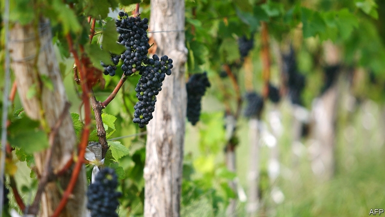

###### In the vinguard

# Château Lafite cracks open its first Chinese vintage 

 

> print-edition iconPrint edition | Business | Sep 28th 2019 

SEA BREEZES, blue skies and sun-soaked vines: springing to the reader’s mind may not be the northern Chinese province of Shandong, an industrial heartland of shipbuilders and oil refineries. Yet it pumps out two-fifths of China’s wine, too. Yes, much of it is state-produced and lousy—but there are a few glowing exceptions. Among the 63 wineries of the Penglai valley is that of Château Lafite Rothschild, a world-famous Bordeaux beloved of rich Chinese. On September 19th it uncorked its first local bottles. 

Scepticism abounded when its owner, Domaines Barons de Rothschild, put down roots a decade ago. (A branch of the Rothschilds owns shares in The Economist’s parent company.) “Lafite in lala land?” wondered Grape Wall of China, a wine site. Midsummer monsoons drench the region, a no-no for sophisticated growers. 

Lafite confounded the naysayers, as a tough reporting trip undertaken by this correspondent, for a tasting and tour with the Rothschilds at la propriété, confirmed. Priced at 2,388 yuan ($335) a bottle, the Domaine de Long Dai 2017 was rated as “outstanding” by James Suckling, a wine critic who says that Lafite has built “what must be the best winery in China”. It contains cabernet sauvignon, cabernet franc and marselan. The range of soils and microclimates across 360 hillside terraces makes it one of Lafite’s “haute-couture” vineyards, says Olivier Trégoat, who oversees its plantations outside Bordeaux. 

Saskia de Rothschild, who runs the family’s wine business, says that they are “planting for a century”. It lost its local partner, CITIC, an investment giant that, under state direction, has pruned what Mr Trégoat calls its “exotic divisions”. Lafite flew 250,000 vine stocks over from France and planted them on 30 hectares. It says that it has acquired land-usage rights for 50 years. 

The vintners of Moët Hennessy Louis Vuitton, another French producer, launched “Ao Yun” two years ago for a splashy 2,800 yuan, produced on their Yunnanese terroir. They export most of it. But Lafite wants to sell four-fifths of its 30,000 bottles domestically. Ms de Rothschild points to “rising pride” in home-grown produce. Lafite is among the most faked wines in China, so the capsules on its Long Dai bottles conceal chips to allow buyers to authenticate a bottle using their smartphones. 

A local foothold may also help sustain a label that no longer sends Chinese into bacchanalian frenzies. Imports of Bordeaux last year fell 31% by volume compared to 2017. Australian wines are now neck-and-neck with French ones for the first time. At a bar in Shanghai, a lifestyle blogger says between sips of Australian shiraz that as more Chinese travel overseas they have come to love plenty of other foreign wines. At a nearby table, businessmen quaff Bordeaux—though none is tempted to buy chinois Lafite. 

Will rivals follow it? Aurélien Valance of Château Margaux says charitably that the idea is “interesting”, but that Margaux wants to “maintain integrity” by producing in France. Chinese collectors tend to open and enjoy their bottles, he adds, so their cellars are still fairly empty. As Lafite knows, plenty are jostling to fill them.■ 

