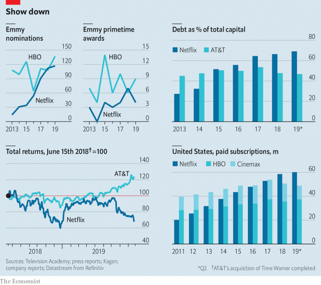

###### Enthusiasm curbed

# Despite producing quality shows, Netflix and HBO face headwinds 

 

> print-edition iconPrint edition | Business | Sep 28th 2019 

IF CRITICAL ACCOLADES were the sole measure of well-being, Netflix and HBO would be in great shape. At the 71st annual Emmy Awards, held on September 22nd, the two accounted for three of the eight nominees for Outstanding Drama series, and two of the seven for Outstanding Comedy. Yet though content may be king, both companies are facing angry crowds wielding pitchforks. 

Netflix has long framed its aggressive spending as part of a strategy to dominate people’s leisure time, but investors’ patience is being tested (see chart). Total returns have tumbled. Subscriber numbers in America fell earlier this year for the first time since 2011. Undeterred, Netflix keeps splurging on original and licensed content. It reportedly paid over $500m for the rights to “Seinfeld”.  

Though HBO is widely considered to be the most profitable boutique network in America, its parent company, AT&T, is under fire. Elliott, an activist fund with a $3.2bn stake in the conglomerate, has taken aim at AT&T’s strategy, including a recent acquisition spree. After splashing out on DirecTV, Time Warner (which owns HBO) and other assets, AT&T sits on over $170bn of debt, far more than any other company in its industry. 

Both Netflix and HBO face stiffer competition. Disney, Comcast (via its NBC subsidiary) and Apple plan to launch streaming services within the next year. “Fleabag”, co-produced by Amazon, bagged the Emmy for best comedy series. With over 500 scripted series being released each year, this battle for leisure time will make for gripping viewing. 

