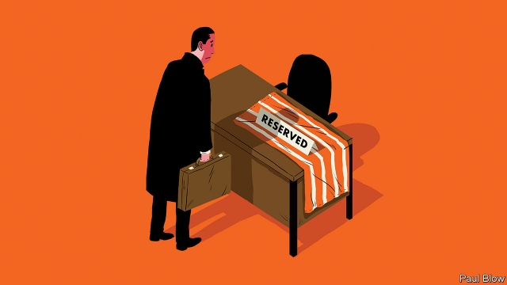

###### Bartleby

# Hot desk, cold comfort 

 

> print-edition iconPrint edition | Business | Sep 26th 2019 

THE HERO of “The Prisoner”, a cult British TV show, wakes up one day in a mysterious village. His possessions have vanished and he is not referred to by his real name but as “number six”. His every attempt at escape is frustrated and each episode ends with a set of iron bars superimposed on his face. 

The experience of the Prisoner will be wearily familiar to one class of office worker: those who undergo the daily trial of “hot-desking”. Every day, they may wind up in a new location, with only the possessions they can carry to sustain them. At the end of each day, all trace of their personality is erased, in the way that the Soviet Union removed pictures of Leon Trotsky from the historical record. It is hard to think of a clearer indication that the individual worker is being treated as an anonymous drone. 

At one leading financial institution, any employee who accidentally leaves a possession on their desk overnight must try to retrieve it from Lost Property in the morning. That makes the end of each working day feel like the last frenetic minutes before you leave the house for a holiday, frantically checking that you haven’t left anything behind. 

The start of the day can be stressful, too. A survey of British workers, published in June, found that those in a hot-desking office took an average of 18 minutes to find a seat. That translates into 66 wasted hours a year. In some offices the temptation must be to get in early to grab the best places, like holidaymakers placing towels on the poolside chairs before breakfast. In other workplaces some seats will be tacitly reserved for those with seniority; who would dare sit in the seat of the person who decides your work rota? 

It is hard to see how anyone will be well-motivated by such an arrangement. If companies want employees to have bright ideas, it helps if they feel comfortable at their desks. And people are likely to feel most comfortable in familiar surroundings. Hot-desking is usually linked to another design feature: the open-plan office. The professed aim may be to promote team working, but it does not necessarily work. A study published last year found that face-to-face interactions declined in open-plan offices and the use of emails rose after companies had switched from more traditional layouts. 

Bartleby will admit that his own desk is a byword for clutter. Along with the surrounding area, it is covered with books he has enjoyed and wants to keep; books he has started to read and ought to finish; books that he genuinely means to read soon; and books he will probably never read but feels too guilty to throw away. In addition, there are academic papers and magazines that fit in the same categories. Arnold Schwarzenegger would struggle to carry all this home and back every day. 

 

Were The Economist to become a hot-desking hub, all this stuff would be kept at home or thrown away. And with it would go those moments of serendipity, when a news story or press release sparks the memory of a similar tale in a book or magazine that is close at hand. 

Of course, a lot of people find it impossible to work in the midst of such clutter. And there is nothing to stop them from keeping their own desks as tidy as they like. But hot-desking is not becoming more common because it is popular with workers. A survey by Workplace Unlimited of employees who worked in a range of office types found hot-desking was ranked fifth out of six office designs (perhaps surprisingly, private offices were ranked last). 

The growth of hot-desking flows from the growing number of businesses that use hordes of freelance workers and contractors. Assigning them a permanent desk is not practical. The same may be true for those who work from home two or three days a week or are constantly on the road, visiting clients. By reducing office space, hot-desking saves employers money; the average annual property cost for a British office worker is £4,800 ($6,000), according to Investment Property Databank. 

But freelancing and part-time work are not yet the norm. The risk is that, in the name of cost-cutting, hot-desking is imposed on full-time employees, who would prefer the certainty of a permanent work station. Your cosy desk will become as spartan as a monastic cell. Workers should echo the Prisoner and bellow: “I’m not a number. I’m a free man. And here is a pot plant, a novelty coffee mug and a framed picture of my kids to prove it.” 

