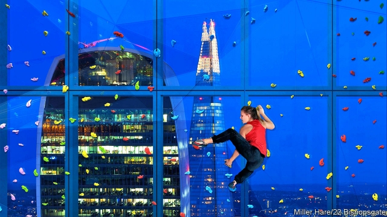

###### Future of the workplace

# Redesigning the corporate office 

 

> print-edition iconPrint edition | Business | Sep 28th 2019 

FOR CENTURIES businesses have settled inside the old walls of the City of London. Its geography is the same. But inside the Square Mile’s temples of commerce the changes have been profound. At the start of the 20th century offices aimed to maximise efficiency by mimicking the factory layout with rows of supervised typists and clerks, as promoted by Frederick Taylor, an early American management consultant. In the 1960s less rigid Bürolandschaft (“office landscaping”) made its way across the Channel from Germany. The 1980s ushered in “cubicle farms”. Today open-plan offices and unassigned “hot desks” aim to flatten hierarchies and increase informality for many of the City’s 400,000-odd whitecollar workers. 

A tour of three new offices in London illustrates the latest trends. Around 7,000 investment bankers are moving into the eight-floor, purpose-built European headquarters of Goldman Sachs, which has taken 18 years and £1bn ($1.25bn) to develop. Nearby, a branch of WeWork, a troubled startup (see article), rents out co-working space in an old City pile to 2,300 “members”, each of whom enjoys half the space that Goldman affords, and at a third of the price. Down Threadneedle Street the finishing touches are being put on 22 Bishopsgate, a 62-storey “vertical village” where 12,000 workers will soon reside. 

What happens in buildings like these matters far beyond their walls. The corporate office is an engine of global growth. Across 40 developed countries some 200m people, one-third of the workforce, toil at a desk. Britain’s desk-bound workers take home 55% of all earnings. Technology and changing work habits are reshaping the life of desk-jockeys in the City and beyond—as well as that of their employers, who manage offices, and landlords, who own them. 

Start with the landlords. Modern engineering allows developers to create better, more flexible spaces that tenants increasingly demand. Like everything else these days, buildings brim with technology. The Bishopsgate skyscraper will harvest 1m data points a day, to optimise use of resources such as air-conditioning, and offer glass that dims noise in open-plan offices. Now that lifts and toilets can be located on a building’s periphery rather than its central shaft, entire unobstructed floors are being built. Architects are told to enable staff to mix on floors and between them to foster creative thinking; staircases are now places to meet, not just something you walk down in a fire drill. 

This allows developers to offer flexible spaces that tenants can adapt over the course of a 15-year lease. Goldman’s London home—which it developed and then sold and leased back for 25 years—is designed so that some outside walls can be removed and half the space sub-let should it reduce headcount in the event, say, of a chaotic Brexit. At 22 Bishopsgate tenants will have access to 100,000 square feet of flexible space run by Convene, a rival of WeWork. 

All this means that landlords should expect to spend more keeping their buildings up to scratch, says Peter Papadakos of Green Street Advisors, a real-estate research firm. This may reduce the rental yield on offices from 5% today to perhaps 4%. More companies are fearful of being locked into new 10-15-year leases at a time when automation and the rise of temporary jobs make it hard to forecast future headcount. Some firms are opting for co-working spaces rather than leasing directly from traditional landlords. Co-working firms now account for about 5% of office space in London and New York. Most of their clients are small businesses. But HSBC, a big bank, will occupy 1,100 desks in WeWork’s new 6,300-desk London branch. 

The landlords can still count on the co-working companies themselves to sign long-term leases. But they worry about the prospects for these leaseholders. Trouble at WeWork, which has lost over $2bn since the start of 2018 and is struggling to show it has a viable business model, is adding to the uncertainty. Either way, observes Nick Wright of CBRE, a consultancy, the old landlord-tenant model is being shaken up. 

Life is changing for corporate tenants, too. Typically, companies with tens of thousands of employees will own their headquarters and take out leases for branch offices. Over time these obligations are substantial. Among 75 big listed service-sector companies in America and Britain, lease commitments over the next decade or so amount to $146bn. Annual rental costs amount to $5,000 per employee. Absenteeism and the constant flow of people mean that just 40-50% of desks are actively used during working hours. This inefficiency constantly draws bosses to try to save office costs, especially in a downturn, although the reality is that office spending makes up only a tenth of property and headcount costs, with the rest going on workers’ wages. Despina Katsikakis of Cushman & Wakefield, a property consultancy, warns that such stinting by firms can have an adverse effect on the wellbeing of their employees. 

To optimise office use without killing morale, Goldman is therefore giving staff at its new London building options about where they work—at unassigned desks, private rooms and informal hangouts. Even the bank’s 100 or so partners now occupy offices that transform into meeting rooms when they are away. Such manoeuvres, the company says, have increased desk occupancy by about 20%. Even in places without 22 Bishopsgate’s anti-din technology, open-plan offices are easier to bear for distractible employees thanks to noise-cancelling headphones. As a result, companies need less space to accommodate the same number of workers. 

According to the British Council for Offices, an industry body, space per desk in Britain has fallen by 10% over the past nine years, to ten square metres. “We don’t like the idea of animals in pens, but we’ve been happy to have people in them”, says Sir Stuart Lipton, the developer of 22 Bishopsgate. As companies reach the limits of densification, they must compensate cramped staff—the final group affected by the changing workplace—in other ways. WeWork, whose desks are a third smaller than a typical office worker’s, provides renters with ample space to drink nitro coffee, conduct impromptu meetings or play ping-pong. Offices have traditionally set aside just 3-4% of floor space for such fripperies. Occupiers now expect developers to provide at least double that amount of space. Staff in Bishopsgate have access to a climbing wall on the 25th floor (see picture). Goldman employs “workplace ambassadors” on each floor, who are responsible for staff welfare. 

Office improvements are designed to make white-collar employees—and prospective recruits, many of whom expect to be coddled—feel fitter, happier and, employers hope, more productive. About 10% of a firm’s wage bill is lost to sick pay. A Harvard University study demonstrated that improving the quality of air, as Goldman and 22 Bishopsgate do, can boost occupants’ cognitive function. Access to natural light has also been shown to improve productivity. While a study by Andrew Oswald of the University of Warwick finds that productivity increases by 12% when people are happier. Unilever, a consumer-goods company, estimates that $1 invested in its “wellness programmes” returns $2.50 to the company. Goldman says that moving staff into new offices in other countries has improved their employees’ perception of their own productivity (it did not measure actual output). 

There is work to be done. A recent worldwide survey of 600,000 office staff by Leesman, a data provider, found that 40% thought their office prevents them from working productively. Hot desks can be a curse (see Bartleby). London’s three new offices are not the last word in workplace management and architecture. But they offer a glimpse of the foreseeable future.■ 

