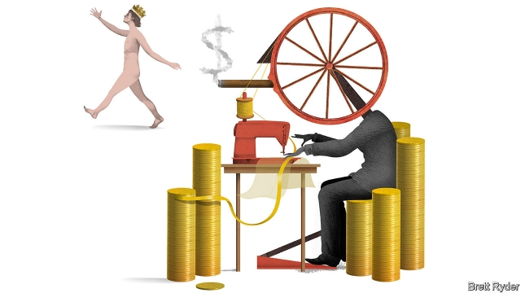

###### Schumpeter

# WeWork shows why some venture capitalists are in a world of make-believe 

 

> print-edition iconPrint edition | Business | Sep 28th 2019 

UNTIL RECENTLY the image of an entrepreneur was of a thrifty workaholic toiling away in a garage. Then came the “founder”, as epitomised by the flowing-haired Adam Neumann of WeWork, an office-subleasing firm dressed up as a tech giant. More emperor than entrepreneur, he wanted not merely to start a business but “elevate the world’s consciousness”. He sought limitless funds. He broke norms. And he generated losses as fast as he raised revenues. 

He was not unique. Like other charismatic founders, such as Travis Kalanick, co-creator of Uber, a ride-hailing service, he tripped over his own billion-dollar ego. On September 24th Mr Neumann was ousted as chief executive of WeWork’s parent company, by his board, including his backers at SoftBank, the Japanese group, and its $100bn Vision Fund, which together own 29% of its shares. Days earlier the company’s initial public offering (IPO) was postponed because of weak demand for its shares and the Wall Street Journal reported that he smoked pot on private jets. He will be replaced by two co-chief executives. 

In such cases, attention invariably focuses on the founders’ hubris. Their rise and fall is the stuff of bestsellers. But it is the venture-capital industry that helps spin the invisible yarn that creates the legends. Some of its biggest names, such as SoftBank, have been peddling valuations of companies like WeWork that border on the absurd. In their competition to fund the biggest deals, they have been in thrall to founders’ excesses, rather than providing sober adult supervision. Good, then, that exposure to the dowdy stockmarket is at last knocking sense into Silicon Valley’s moneymen (for they are mostly male). 

The folly begins with a sound idea. Startups need scale to become global champions. Thanks to the internet, ideas spread quickly. Because of network effects, the more people use a service, the better it gets. The fastest-growing firms, like WeWork and Uber, “blitzscale”, meaning they attempt to disrupt a whole industry before anyone can stop them, raising fortunes to acquire users. The pioneers of this, such as Facebook in America and Tencent in China, have become so valuable that everyone wants to emulate their success. At its height this year, WeWork was valued at $47bn, a staggering amount for a company which last year lost $1.9bn on revenues of $1.8bn. That is more than ten times the market capitalisation of IWG, a rival with bigger sales—and a profit to boot. 

When venture capitalists jostle with each other to write cheques of $100m or more on a daily basis, it goes to a founder’s head. As is now common in Silicon Valley, Mr Neumann demanded more power for himself and his heirs via supervoting rights. He engaged in potential conflicts of interest, listed in the firm’s IPO prospectus. The mountain of venture money available, including from mutual funds, enabled his firm to stay private for nine years, almost three times longer than the average tech startup in 2001. It entrenched bad habits. 

When the firm tried to go ahead with an IPO, it ignored the implicit bargain of the stockmarket: that investors give companies capital in exchange for some influence. Mr Neumann sought to keep absolute control by having shares with ten times the voting rights of other shareholders. Rather than buying into a company run by a messianic overlord with an insatiable demand for cash, investors balked. A red-faced SoftBank lost faith in Mr Neumann. He will lose his majority control (but remain co-chairman). 

The saga will have three ripple effects: on fundraising, governance and the wider economy. Startups with no recognisable route to profitability will find it harder to get cash. Even before WeWork’s fiasco the taps were being tightened. In China the average volume of venture-capital deals has fallen from $28bn a quarter last year to $11bn a quarter this year, according to Prequin, a data provider. In America they fell from $32bn in the second quarter to $23bn in the third. Blitzscaling may become a dirty word. Cash-burning firms yet to join the rush to IPOs, such as micro-mobility ventures Bird and Lime, may find themselves stranded like their ubiquitous e-scooters. As regulators look increasingly askance at Big Tech, the very notion of blitzscaling raises competition and other concerns, which will make public investors yet more queasy. California’s recent efforts to categorise drivers for gig-economy firms as employees rather than contractors has added to the post-IPO sell-off of Uber and its rival, Lyft. 

Second, as money dries up, the balance of power may shift from the founders to investors, reducing the tolerance for supervoting shares and crony boards. It will be tough. Governance remains dull as ditchwater in Silicon Valley—until something goes wrong. No one wants to crush a creator’s zeal. 

Lastly, business at large will feel the impact. It may doom Softbank’s efforts to raise a second $100bn-plus Vision Fund to replicate its earlier one, which invested in companies like Uber and WeWork. Bulge-bracket banks like JPMorgan Chase and Goldman Sachs, which were to lead WeWork’s abortive IPO, may end up looking gullible. Commercial-property markets may wobble as WeWork curbs its appetite for office space. For a while at least, there could be fewer of the breathtaking innovations such as ride-hailing that have transformed cities around the world. 

That is not to say entrepreneurs or IPOs are gone for good. Shares of newly listed software firms that crank out at least some cash, such as Zoom Video Communications and Datadog, have rocketed this year. Airbnb, a lodging site with positive EBITDA, still makes investors swoon. The salutary lesson is that the public markets are doing their job, rewarding firms that generate cash or profits, shunning those that do not. After years in which venture capitalists have cast themselves as infallible arbiters of value, it is good to see public investors shouting when an entrepreneur, for all his chutzpah, has no clothes. ■ 

