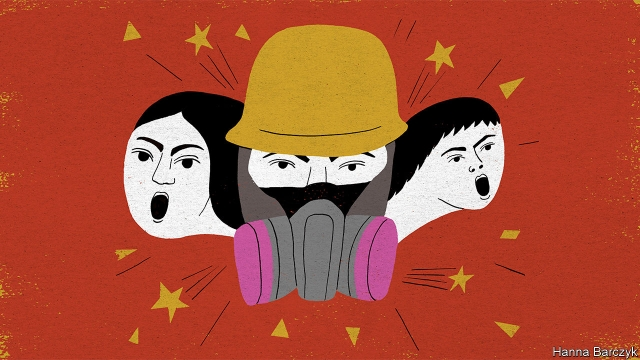

###### Chaguan

# China’s demand for undivided loyalty is causing tragedy in Hong Kong 

 

> print-edition iconPrint edition | China | Sep 28th 2019 

OVER THE past four months as many as 2m Hong Kongers—or more than a quarter of the city’s residents—have marched to demand the scrapping of a bill that would have exposed criminal suspects to the mainland’s courts. Those protests were a stunning vote of no confidence in China’s Communist-controlled legal system. They worked: the extradition bill is being withdrawn. 

It is hard to imagine a clearer rallying cry for the many mainlanders who distrust their own justice system. Their cousins in Hong Kong, guaranteed access to independent courts and uncensored news under the rubric of “one country, two systems”, could not bear to live as mainlanders must every day. But dissent in Hong Kong has not proved contagious. 

Not all 1.4bn mainlanders think alike, but there are no reports of any of them marching in sympathy. That may be in part because, thanks to the unsleeping censors who guard the Great Firewall of China, many know nothing of the extradition debate. But it is also because an unknowable but significant number accept the narrative of China’s media that treacherous radicals in Hong Kong, perhaps funded by the CIA, are trying to split the motherland. The widespread acceptance of this narrative is a testament to the government’s success in shaping the way its citizens see the world. 

Yet China’s propaganda machine, so effective at home, is making a fool of itself in Hong Kong. When officials try to peddle the idea that a silent majority in Hong Kong loves China, their efforts strike many people in the territory as laughable. Communist-controlled outfits in Hong Kong have often simply copied successful stunts by protesters. In mid-September pro-democracy marchers hiked up a local peak, Lion Rock, creating a chain of lights with smartphones, torches and laser pointers as dusk fell. The next day a smaller group of red-clad patriots puffed up the same hill to wave a giant national flag, in images heavily promoted by the mainland’s media. When youngsters in Hong Kong packed shopping centres to sing a new protest anthem, small bands of the party faithful were mobilised to belt out China’s national anthem in the territory’s malls. 

On the eve of a spectacular parade in Beijing on October 1st, when tanks and nuclear missiles will trundle past President Xi Jinping to mark 70 years of the People’s Republic, it is worth pondering the domestic success of China’s propaganda apparatus, and its external cluelessness. That machine is best understood as a giant, state-directed monopoly. Within China, it has grown strong. But in free markets fizzing with ideas and arguments from around the world, China’s patriotic sloganeering falls flat. 

In Hong Kong the city’s former colonial master, Britain, left behind an awkward hybrid. The territory has the political culture and education system of a liberal democracy. But its leaders are mostly appointed, with only a minority of political offices opened to direct election. Since Mr Xi became the Communist Party’s boss, China has betrayed its impatience with even that limited accountability, and the central government’s agents have worked to marginalise competing voices. 

In 2012, the year Mr Xi took over, the Hong Kong government tried to impose “national education” on schools, but retreated in the face of mass protests. Politicians seeking greater autonomy or even independence (a minority view) have been barred from office or from running for office. A national-anthem law demanded by Beijing, if passed, would make criminals of Hong Kongers who boo the tune at football games. 

The results may be heard in Hong Kong’s shopping centres almost every night. Strolling this week through Kowloon, Chaguan chanced upon a few dozen youngsters who had been summoned by Telegram, an encrypted social-media app, to sing the protest anthem in the atrium of a shopping complex. 

Nic, a 25-year-old protester, described his mixed identity. He does not imagine that Hong Kong can be independent, noting that 50 years after the handover from Britain the promise of one country, two systems will expire. “In 2047 we will return to China fully, we understand that,” he says. “But we are trying to protect what we have until the last day.” When he travels, his passport says “Hong Kong, China”. But when asked who he is, he replies: a Hong Konger. “China is not what we are proud of,” he explains. “The Chinese government sucks.” 

Politics in Hong Kong is turning dangerously tribal. Rather than a debate about policies, it is becoming an argument about who is good and who is bad, who is bent on saving Hong Kong or on destroying it. In that culture war politicians who sympathise with the party conflate flag-waving patriotism with legitimacy. That has led them to endorse “patriotic” thugs and alleged gang members, including when they assaulted protesters in the far-northern district of Yuen Long in July. That single incident changed the nature of the demonstrations, says Cheng Chung-Tai, chairman of Civic Passion, a party that wants more autonomy for Hong Kong. After Yuen Long, showing resistance and defiance to authority became a badge of belonging to the group that sees itself as defending the territory. “Last Sunday Tseung Kwan O got tear-gas for the first time. They celebrated,” notes Mr Cheng, referring to an operation by police to quell protests in an eastern district. 

Little in Mr Xi’s record suggests that he will respond generously and imaginatively to Hong Kong’s identity crisis. In other peripheral territories, such as Tibet and Xinjiang, he has authorised brute force backed by high-tech surveillance and a pounding drumbeat of propaganda to crush hybrid identities. Hong Kong, a still-vibrant if troubled world city, will be harder to bring to heel. Alas, 70 years after its founding, China is hostile even to constrained forms of pluralism. That is why, wherever people have choices, it inspires fear or awe, but not love. ■ 

