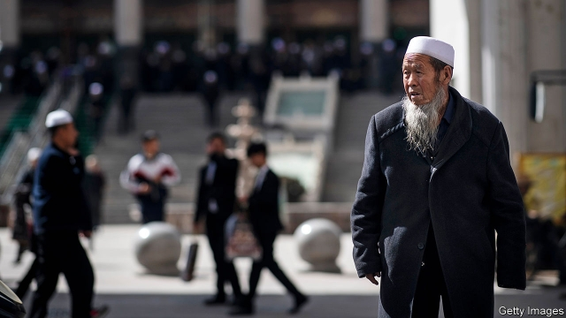
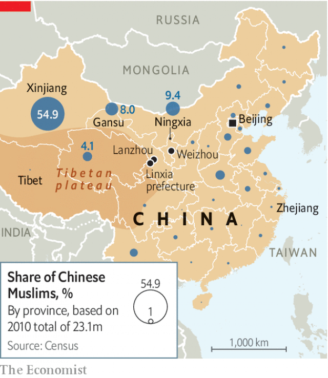
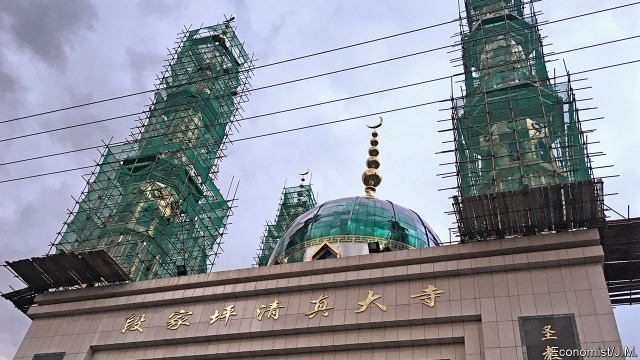

###### Out with the Arab-style

# China’s repression of Islam is spreading beyond Xinjiang 

 

> print-edition iconPrint edition | China | Sep 26th 2019 

AS DARKNESS BEGINS to settle on Duanjiaping village, a few men in white skullcaps head towards a large mosque. It is time for the Maghrib, the fourth of the five daily prayers of devout Muslims. It is clear even before they reach the building’s high yellow walls that all is not right. The prayer-hall’s four minarets, topped by golden crescent moons, are still a towering landmark. But they are covered in scaffolding and green netting and they are not due for repair. 

It is less than six years since hundreds of Muslim men gathered in the mosque’s courtyard to celebrate the completion of its new Arab-style prayer hall. It had cost 9.8m yuan ($1.37m)—a tidy sum in a county that is officially classified as impoverished. The festivities had official blessing. The imam of one of the most important mosques in Lanzhou, the provincial capital, was there. So, too, was a senior leader of the government-backed Islamic Association of China. 

Much has changed. A chill political wind has been blowing over Duanjiaping and hundreds of other villages and towns in Linxia, a majority-Muslim prefecture in Gansu province, which borders on the Tibetan plateau and the far-western region of Xinjiang. Many villages in Linxia have at least one mosque, with minarets visible far and wide. The one with the scaffolding in Duanjiaping can accommodate 3,000 worshippers. Its grandeur is not unusual. In recent decades rural communities in Linxia—China’s “little Mecca”, as it is often called—have vied to outdo each other in mosque-building. Now the government is not only reining them in, it is tightening controls on their faith as well. 

 

The horrors of China’s campaign against Islam in Xinjiang are well known. About two years ago reports began to emerge of the building of a vast gulag there. Hundreds of thousands of ethnic Uighurs have been thrown into it—many simply for seeming too pious. There are about 10m Uighurs in China. But they form only about half of the country’s Muslim population. Linxia is home to more than 1.1m Muslims, mainly belonging to two ethnic groups: the Hui and the Dongxiang. There are Muslim communities scattered widely across the rest of China (see map). Most are made up of Huis. Because of Xinjiang’s history of separatism and terrorism, Uighurs are suffering by far the harshest clampdown experienced by any of these Muslim groups. Outside Xinjiang, however, other believers are starting to feel the effects, too. 

The government’s attitude towards Muslims in the interior began to change in 2016 after China’s leader, Xi Jinping, set out plans for the “sinicisation” of the country’s religions. Christianity and Islam, having strong overseas connections, became the main targets. Officials set out to purge them of foreign influences deemed threatening to the Communist Party. In the case of Islam the aim was partly to prevent the spread of radicalism and with it, terrorism. 

Among Muslims elsewhere in China, however, there have been no reports of terrorist links. The Huis were once China’s model Muslims, quite unlike the Uighurs in Xinjiang who have chafed at Chinese rule for decades. A few Uighurs have occasionally used violence to vent their grievances. The Huis have no separatist ambitions. They claim descendancy from Arab and Persian traders who settled more than a millennium ago. After centuries of intermarriage they have become ethnically assimilated with Han Chinese, who make up more than 90% of the population. Huis in Linxia have historically played an important role as middlemen in trade between Tibetan and Han communities. Many have grown rich by trading a Chinese medicine that is often used as an aphrodisiac, known as caterpillar fungus. It is harvested from the Tibetan hills. Linxia is home to one of the country’s biggest caterpillar-fungus wholesale markets; its traders are mostly Muslims. 

 

But as the scaffolding in Duanjiaping shows, the government worries that Muslims in Linxia are absorbing the same influences from Islam abroad that it says have fuelled strife in Xinjiang. “Right now, work related to Islam is even more complicated than it has ever been before,” Gansu’s party chief, Lin Duo, told a meeting of senior officials in July last year. 

One aim of the sinicisation campaign is to reduce visible links between Islam in China and that in the Arab world. China fears that Saudi Arabia in particular—as much a draw to Muslim pilgrims in China as to those elsewhere—will poison Chinese Islam with Wahhabism, a puritanical strain that is often linked with extremism. But its efforts to prevent this are affecting many Muslims who have no truck with militancy. In March officials in the southern city of Guangzhou announced rewards of up to 10,000 yuan ($1,405) for reporting on “illegal religious activities”, including organising private trips to Mecca. China’s Muslims can join only officially arranged ones. 

The mosque in Duanjiaping is a casualty. Officials have ordered it to remove its Arab-style minarets and replace them with Chinese-looking ones. A picture of what the mosque will eventually look like is displayed in the entrance. The minarets will have green-tiled upturned eaves in Chinese style. The central bulbous dome will be replaced by a pavilion-like structure, also classically Chinese. 

“The government says we have to do it, so we’re doing it,” says a caretaker. The work will not offend religious sensibilities and will be done at the government’s expense, he claims. That contrasts with reports from other places where similar work is being carried out. In a nearby town, Kangle, a nervous Hui surveys another mosque with scaffolding on its minarets. He says “trouble” broke out there a few days earlier when local religious-affairs officials ordered their demolition. They were erected in 2014. The following year the mosque was named a “model religious site” by Linxia’s government. No longer, it seems. 

In August last year there was trouble on a much bigger scale in Ningxia Hui Autonomous Region, a province bordering on Gansu that is home to about one-fifth of China’s Hui people. For three days thousands of Muslims in the town of Weizhou staged protests at a massive mosque—initially over a government order that the entire building be knocked down because it had not received planning permission, and subsequently over a revised proposal that only the domes be removed. Remarkably, the local government backed down. But it was clearly worried about the turmoil. In November the party chief of Ningxia visited Xinjiang, where he signed counter-terrorism “co-operation agreements”. He noted religious similarities between the two provinces and said, ominously: “That’s why Ningxia went to learn from Xinjiang.” 

In Gansu the official Islamic Association has circulated 20 recommended designs for mosque roofs “with Chinese characteristics”. Officials say they want no more “Saudi-isation” or “Arab-isation” of buildings. The association has instructed Muslims to forsake the common practice of building or expanding mosques without government permission and to make them less “vast and extravagant”. It has also tried to tighten its control over the religion itself. It has ordered Gansu’s teachers of Islam to reject any new doctrine from outsiders. “Anything that does not already exist at home should not be accepted from abroad,” said the association’s annual report, published in March. “If something does not exist locally then it should not be approved if it is introduced from elsewhere.” 

 

Part of the sinicisation effort is called the “four-enter” campaign. This means ensuring that four things are introduced into every mosque: the Chinese flag, propaganda concerning China’s laws on religion, “core socialist values” and the country’s “outstanding traditional culture”. In Linxia, the impact is clear. The flag flies over many mosques. Billboards proclaiming socialism’s importance to Islam fill their courtyards. Preachers have been told to incorporate these values in their scriptural teachings. And they must undergo regular testing on such matters to retain their permits to teach. Linxia’s party chief, Guo Heli, tried to put a positive spin on the clampdown during a visit to local mosques in June. “We must reduce the frequency, duration and scale of religious activities,” he said, suggesting this would “lessen the burden” on the faithful. 

The authorities are also trying to reduce Islam’s influence in society. In Linxia this involves curbing the “proliferation” of the use of the term “halal”. Provincial officials have accused Linxia’s main city of “giving too much prominence to religious aspects” in its plans to expand the local halal-products industry. As part of the de-Arabisation campaign, officials have ordered restaurants to stop using the word “halal” in Arabic on their signs, as many once did. Only traces now remain. On many Muslim restaurants across China, including recently in Beijing, such lettering has been painted over or prised out. 

By changing the design of Duanjiaping’s mosque officials may hope to reduce Islam’s profile, just as officials on the coast have been trying to make Christianity less visible by removing hundreds of large crosses from the tops of churches. In line with regulations issued last year forbidding the building of mosques that are “overly tall”, the new minarets in Duanjiaping will be much lower. Mosques have also been ordered to install less-powerful loudspeakers. Officials have stepped up efforts to keep children out of them and bar minors from religious instruction. 

The government’s controls over Islam are still relatively relaxed in Linxia compared with those in Xinjiang, where Muslims, if they are not thrown into “vocational training centres” (ie, prison camps), are subject to intense digital surveillance, a heavy police presence and intrusions into their homes by prying officials. Many of Linxia’s mosques retain their Arab-style minarets (locals say they are cheaper to build than Chinese-style ones, which require skilled carpenters and expensive wood). Only a handful of mosques have so far been told to rebuild theirs, says a local Hui-culture expert. Extremism, he says, “has not become a trend” locally. 

But the authorities insist it is spreading. In July the leader of a central-government inspection team said that in some parts of Gansu “religious extremist forces” were already “dominating and corroding” grassroots political bodies. This was, she said, “a problem worth attention”. Extremist is a word that trips lightly off officials’ tongues. It is often used to describe behaviour that in many other countries would be regarded simply as devout. Muslims in the rest of China may not suffer the Uighurs’ terrible fate, but they have reason to be nervous. ■ 

