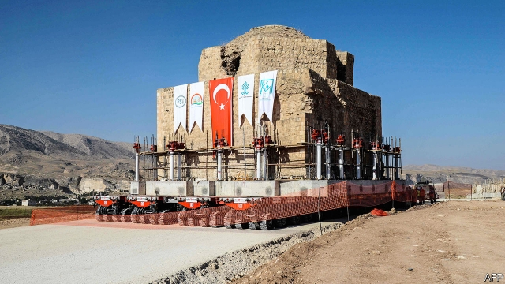

###### Submerging history

# A dam threatens one of the world’s oldest settlements 

 

> print-edition iconPrint edition | Europe | Sep 28th 2019 

IT IS QUITE a sight to behold. The piles of a medieval bridge, each the size of a large building, rise from the waters of the Tigris river. Cliffs riddled with thousands of neolithic caves, some still used as homes or animal sheds, some once used as churches, hover above. Farther up, an ancient citadel, home to Byzantine ruins, an Ayyubid mosque and rows of ancient tombstones, watches over the site from a steep hilltop. Countless other archaeological wonders are assumed to be buried beneath. 

Hasankeyf, a town of some 3,000 souls in Turkey’s south-east, has cradled one civilisation after another for 12,000 years, making it one of the longest continuously inhabited places on Earth. In as little as a few months, it will be no more. A hydroelectric dam constructed downstream will soon cut off the Tigris, sending billions of cubic metres of water flooding into the valley. Other than the old citadel, all of Hasankeyf, as well as scores of villages close to the river, will disappear underwater, part of a reservoir stretching for 136km (85 miles). Experts warn the whole project will displace up to 100,000 people. The local governor has given Hasankeyf residents until October 8th to evacuate. 

An uncertain future awaits them on higher ground, on the opposite bank of the river, in a colourless settlement known as New Hasankeyf. Some locals have already moved into their replacement homes. In the meantime, the authorities have hauled a few monuments from the ancient city, including a minaret, a tomb, a Roman gate and a bathhouse, to the new town, saving them from the floodwaters. In their old home, the antiquities overlooked limestone cliffs packed with human history and alive with the sound of wild birds. In the new one, they are surrounded by rows of matching houses and mountain slopes ravaged by dynamite. 

Most people in Hasankeyf live off tourism, and some off animal husbandry. The new project threatens to wipe out both, says Ridvan Ayhan, a local activist, taking his tea outside one of the caves, watching the Tigris below. “Most of the people here will end up having to migrate to the big cities,” he says. “Their ancestors settled here because of the water, and now they will have to leave because of the water.” 

Hasankeyf’s extinction has been in the making for decades. Plans for a regional dam, part of a vast development scheme for the restive, poverty-stricken Kurdish south-east, were first drawn up in the 1950s. Construction began in 2006. Undeterred by protests at home and from abroad, by a decision by three European banks to withdraw from the project, and by opposition from Iraq, which fears that the new dam will cause water shortages downstream, President Recep Tayyip Erdogan’s government has pushed ahead. Turkey expects that the 1,200-megawatt project will contribute $412m annually to the country’s economy. 

In theory, Hasankeyf could easily be classed as a UNESCO world heritage site, which might make Turkey think twice before flooding the town. But there is a catch. Only national governments can nominate places for UNESCO status. Mr Erdogan and his ministers are hardly likely to seek protection for a monument they have already doomed to extinction. ■ 

