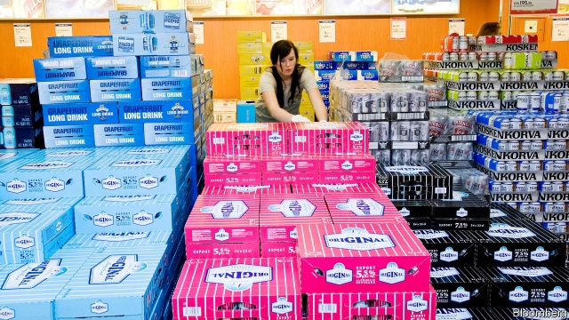

###### Sober calculation

# A populist party in Estonia pushes for cheaper booze 

 

> print-edition iconPrint edition | Europe | Sep 28th 2019 

THE FERRIES that ply the waters between Helsinki and Tallinn resemble floating shopping malls, equipped with fast-food franchises, clothing outlets and supermarkets. For many Finnish passengers the main attraction is the booze. Like other Nordic countries, Finland levies punishing taxes on alcohol: for hard liquor, €48.80 ($53.61) per litre of pure alcohol content, or €19.52 in tax for a litre of vodka. The intent is to suppress the high alcoholism rates that plague the land of endless winter nights. Estonia’s alcohol taxes are far lower, so for years Finns have crossed the gulf to stock up, imbibing heartily along the way. 

This pie-eyed pilgrimage shrank after 2016, when a reformist government launched a series of increases in Estonia’s alcohol taxes. By the start of this year Estonia was charging a bit over half the Finnish rate on hard liquor, making it hardly worth the trip. The government hoped to raise revenue, cut down on the less desirable sorts of tourism and improve public health through lower consumption. But Estonia’s neighbour, Latvia, failed to match the rise. Soon it was Estonians who were crossing the border and returning laden with booze. 

The public-health stakes are high. Estonia’s domestic alcohol consumption fell as taxes rose, but still rivalled that in Nordic countries. As of 2018 the typical Estonian was quaffing 10.1 litres of pure alcohol per year—a bit below the Finns, who averaged 10.4. Swedes and Norwegians drink much less. Estonia’s previous government had committed to raising liquor taxes still further. 

That changed in April, when Ekre, a far-right party, became a junior partner in the government. Since the 1990s Estonia has largely been governed by sober centrists. Ekre are Eurosceptic populists. The party campaigned on blocking immigration and curtailing native-language education for the Russian minority, but it has yet to do much about those issues. Its one big policy change has been a hefty cut in alcohol excise taxes. As of July 1st, the tax on hard liquor fell from €25.08 per litre of pure alcohol content to €18.81. Estonia prides itself on becoming ever more like a Nordic country. But Ekre has made that aspiration more distant. 

