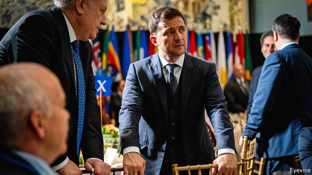

###### Hope and fear

# Can Volodymyr Zelensky live up to the expectations he has created? 

 

> print-edition iconPrint edition | Europe | Sep 28th 2019 

“WE WANTED TO drain the swamp here in our country,” said Ukraine’s new president, Volodymyr Zelensky, in his now notorious phone call with Donald Trump in July. “We brought in many new people. Not…the typical politicians, because we want to have a new…type of government. You are a great teacher for us in that.” 

Beyond the sycophancy inevitable from the president of a weak country that needs protection against a regional superpower that is occupying part of its territory, the conversation offers some insights into Mr Zelensky’s challenge. Having won a landslide victory in April’s presidential election and a parliamentary one after that, he has to persuade Ukrainian voters and Westerners who hold the purse-strings that he is serious about ending both corruption and the war with Russia, which has claimed 13,000 lives and displaced 1.5m people. 

To these ends, he has lifted immunity from prosecution from members of parliament, long a marketplace of money for political favours, and he has brought home 35 Ukrainians, including 24 sailors, who were being held by Russia. Their return was met with nationwide jubilation and a surge in Mr Zelensky’s approval rating, which now stands at 70%. But in order to sustain his appeal, he will have to fulfil his promises. 

A recent flurry of diplomatic activity has rekindled hopes for a moribund peace process. The Minsk agreement, brokered by France and Germany in 2014-15, halted the slaughter of the Ukrainian army by Russian forces but was never implemented, so Russia still controls the Donbas region in south-eastern Ukraine. 

Neither side was much interested in a peace settlement back then. The war allowed Vladimir Putin, Russia’s president, not just to destabilise Ukraine but also to portray himself as defending ethnic Russians in the country against a nationalist Ukrainian junta. Petro Poroshenko, Mr Zelensky’s presidential predecessor, also came to see the conflict with Russia as a useful way of consolidating his electoral base and diverting attention from corruption and economic woes. 

Mr Zelensky’s victory has changed this calculus. Being of Jewish origin and coming from the Russian-speaking part of the country, he undermines the Kremlin’s narrative about Ukrainian fascists usurping power in Kiev. He is also keen to reverse Mr Poroshenko’s policies. To signal that he is serious about ending the conflict, he has unilaterally pulled back from a couple of places along the 400km “separation line”. For Mr Putin, the foreign adventures which once entertained the Russian public have become irritants; a rise in the pension age and economic stagnation are also eating away at his popularity. He wants to normalise relations with Europe and ensure the lifting of the economic sanctions imposed on Russia. He also needs the West to acquiesce in his annexation of Crimea and his retention of power after his (supposedly final) term expires in 2024. 

Both Mr Trump and Emmanuel Macron, France’s president, have been calling for the normalisation of relations with Russia, mooting its return to the G7 club, though for different reasons. Mr Trump sees Ukraine at best as an irritant that frustrates his relationship with Mr Putin. Mr Macron, who has ambitions to shape a new European security architecture, has argued that “pushing Russia away from Europe is a profound strategic error”. 

All this gives cause for both optimism and caution. The details of any new deal are paramount. Mr Putin wants Donbas to be granted special status within the Ukrainian constitution, provided Moscow retains influence over it and can use it to crank up the pressure on Kiev when it wants to. Ukraine has held out the possibility of holding local elections in Donbas and granting it more autonomy over local matters as long as elections are free and fair. For this to happen, however, Ukraine and its allies insist that Russia must withdraw its military hardware from Donbas; that the region’s residents must be free of thuggish militants; that those who were forced to flee Donbas must be allowed to vote; and that Ukraine must be able to control its external border with Russia. 

How firmly the West stands by Ukraine, however, depends largely on Mr Zelensky’s ability to defeat corruption. All Ukrainian eyes are on the battle over PrivatBank, formerly owned by Igor Kolomoisky, an oligarch who allegedly siphoned off $5.5bn from the bank in what the government described as a massive Ponzi scheme. He denies the claims. In 2016 the government nationalised the bank and filed a lawsuit against Mr Kolomoisky in London, which is ongoing. 

Mr Zelensky is in a tricky position. Although his popularity depends on being seen to fight corruption, he has close links with Mr Kolomoisky. The oligarch’s television station hosted the comedy show that brought the president to prominence. When Mr Zelensky rose to power Mr Kolomoisky, who had spent the previous three years in self-imposed exile in Switzerland and Israel, returned to Kiev. His former lawyer, Andriy Bogdan, is now the president’s chief of staff. 

Mr Kolomoisky has secured a ruling in a Ukrainian court that the nationalisation of his bank was illegal. Meanwhile, Valeria Gontareva, the former central-bank governor who nationalised PrivatBank and who now lives in London, has been summoned for questioning by the authorities in Kiev. Earlier this month Ms Gontareva was hit a by a car in London, her son’s car was torched in Kiev and her house in Ukraine was set ablaze. Mr Kolomoisky vehemently denies any involvement. 

Ukraine’s prime minister has now mooted the idea of a compromise with Mr Kolomoisky. This has infuriated the IMF, which is keeping the Ukrainian economy afloat. Backsliding on the nationalisation of PrivatBank could not just cost Ukraine the IMF’s programme but also undermine Western willingness to support it politically and militarily. 

“The most important thing is that nobody forgets about Ukraine,” Mr Zelensky said as he headed to the UN General Assembly. With Ukraine embroiled in Mr Trump’s impeachment controversy, there is little chance of that. But there is a risk that it will be remembered for the wrong reason. ■ 

