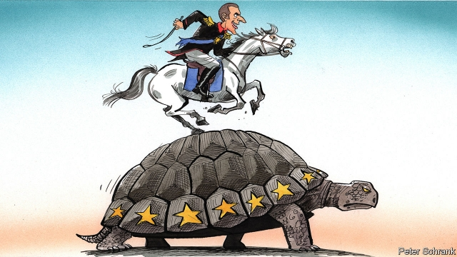

###### Charlemagne

# Emmanuel Macron’s long game 

 

> print-edition iconPrint edition | Europe | Sep 28th 2019 

ON SEPTEMBER 26TH 2017 a freshly elected Emmanuel Macron gave a speech at the Sorbonne University in Paris. It lasted over one-and-a-half hours and argued for a hugely more ambitious EU. Amid poetic overtures about Europe’s common fate was a long list of proposals to integrate the continent more tightly, in order to toughen it up for a more demanding world. “European sovereignty requires constructing, and we must do it,” insisted the new leader. Yet now, on the speech’s second birthday and as Mr Macron nears the midpoint of his presidential term, his roster of European achievements is modest. 

The timing was poor. Delivered just after Germany’s federal election, the speech was meant to inspire the incoming government there. Yet the coalition talks dragged on; then the young German government was plunged into a squabble about immigration; then the anti-establishment gilets jaunes (yellow jackets) protesters took to French streets and mired Mr Macron in domestic matters. His approval ratings have recovered in recent months and Macroniste minds are once more turning to the European picture. 

But timing was not the only problem. Berlin works differently from Paris; speeches there are not battering-rams but ship’s tillers, gently adjusting a course. Some German leaders felt ambushed by the Sorbonne talk. Angela Merkel found it too ambitious (the chancellor and the president admire each other, but she finds him cocky and he finds her complacent). French and German officials can be pessimistic about each other’s countries. In Paris they mutter darkly about Germany’s export-dependent economic model; in Berlin they fret about the president’s fragile grip on his country. 

Proposals to integrate the euro zone were just one part of the Sorbonne speech, but a crucial one. They have made virtually no progress. A nascent budget for the monetary union, which Mr Macron suggested in 2017 should be worth “several” percentage points of its GDP, will be tiny. A coalition of northern states led by the Netherlands has bolstered Germany’s opposition to anything bigger. A single European banking system and a common government bond, the best ways to avoid the euro zone’s collapse in a future crisis, remain distant prospects. The balance in other areas is also meagre. Europe still lacks a “common strategic culture” and member states are generally too divided to talk to their African neighbours, let alone China, with a single voice. A “genuine European asylum office” enforcing a common migration regime has not materialised. The president’s hints at a realignment of European party politics, disrupting the established pan-continental party groups, has led merely to the rebranding of the existing liberal group in the European Parliament after May’s elections. 

It is therefore tempting to write off the Sorbonne agenda as a flight of a fancy by a naïf new president. This would be wrong. Some of Mr Macron’s aspirations have been realised. A European Defence Fund is now financing common projects, the euro budget might yet prove a first step to something bigger, and an array of smaller initiatives (European university networks, for example) are in train. One German official claims that Berlin and Paris have achieved more together in the past two years than during the presidencies of any of Mr Macron’s recent predecessors. 

Anyway, it is unfair to judge the president’s ideas after only two years. His initial priority was to change Europe’s attitudes (its “software” as they are known in Macron-land) towards how ambitious the bloc can and should be. In Brussels and other capitals this is obviously under way; even Berlin is now proposing a common European unemployment reinsurance scheme. Outside events—a fracturing transatlantic relationship, fears of China, security threats, a looming slowdown—are helping. The process of transforming Europe, Mr Macron argued at the Sorbonne, should come during the EU’s 2019-2024 institutional term. 

Now that is beginning and his prospects look better. The president successfully proposed Ursula von der Leyen, a like-minded German minister, to lead the incoming European Commission. In its personnel and its programme her “geopolitical commission” has a Macroniste flavour. Nathalie Loiseau, the president’s former Europe minister and now an ally in the European Parliament, notes that its priorities—such as a more activist industrial strategy, better technology policies and stronger European defence—echo those of the president. That the president also levered Christine Lagarde, an economically doveish Frenchwoman, into the presidency of the European Central Bank also helps him. 

Mr Macron has had to adapt. He has discovered that Germany is a cautious and insufficient ally. So he is building a broader network of friends. At an EU summit in May he advocated a carbon-neutral EU by 2050 with seven other environmentally minded governments. That pushed sceptics like Mrs Merkel to accept the goal and other member states followed. The president is similarly striving to build “coalitions of the willing” with Germany and others on migration; and with the Nordics and central Europeans on defence. He is learning the value of going out on a limb. At the G7 summit in Biarritz last month he seized the initiative to mediate between America and Iran. It is less clear that his new quest for a breakthrough in talks with Russia over Ukraine will succeed. 

The Sorbonne agenda, then, is entering its implementation phase. Mr Macron wants to persuade the new commission to accelerate progress on subjects like digital regulation, trade deals, “strategic” investment in new technologies and co-operation on migration. The goal is a Europe in 2024 that is more confident, sovereign and hard-nosed. He will not achieve all, or perhaps even most, of the ambitions he articulated at the Sorbonne. Even his re-election as president in 2022, though looking more likely than six months ago, is far from certain. But he stands a good chance of realising parts of his vision. That in itself would be an achievement. ■ 

