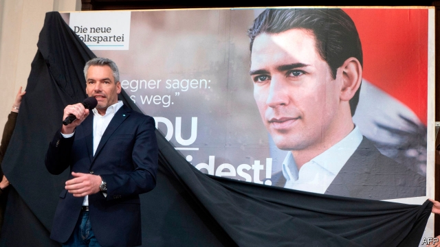
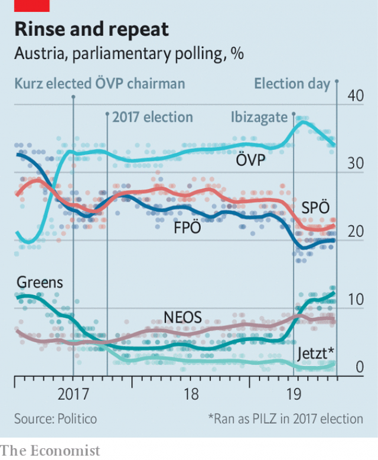

###### Kurz’s comeback

# Four months after facing crisis, Sebastian Kurz looks like winning again 

 

> print-edition iconPrint edition | Europe | Sep 28th 2019 

THE CAMERAS flash, the crowd cheers, the music blares. Sebastian Kurz has finally arrived. Teenagers and grandmothers swarm for selfies with the young leader of Austria’s conservative People’s Party (öVP). The upper stories on the handsome Theaterplatz, in Baden bei Wien, a spa town south of Vienna, are decked with banners in the öVP’s regulation turquoise. Someone has baked a cake. The atmosphere is somewhere between a supercharged summer fete and a heavyweight bout in Vegas. 

On September 29th the öVP is set to win a second consecutive election for the first time since the 1960s. As in 2017 its victory will belong in large part to Mr Kurz; the 33-year-old is Austria’s most popular party leader by far. Detested by many urban liberals,he enjoys a star following in much of the rest of the country. “He’s the only guy who wants to make a change,” says Konrad Mylius, one of several teenage volunteers at the Baden rally sporting turquoise “Wir für Kurz” (“We’re for Kurz”) T-shirts. 

It is all the more remarkable given that it is only four months since the spectacular implosion of Mr Kurz’s government, a coalition with the right-wing Freedom Party (FPö). In May two German newspapers published footage of Heinz-Christian Strache, FPö leader and vice-chancellor, and an aide promising state contracts to a woman posing as the niece of a Russian oligarch in exchange for favourable press coverage. The video, filmed during a boozy evening at an Ibiza villa five months before Mr Strache entered government, was dynamite. A furious Mr Kurz ejected the FPö, and soon afterwards became the first Austrian chancellor to lose a confidence vote. 

Yet he has shrugged it all off. True, the culprits were not in his party. But it was Mr Kurz who, to the consternation of Austria’s European partners, invited the FPö, a party with Nazi roots, to join him in government in 2017. Even before Ibizagate the FPö had proved a troublesome partner. Herbert Kickl, the interior minister and an FPö ideologue, ordered a raid on a domestic intelligence agency. The government’s collapse seemed to vindicate those who warned about the dangers of embracing the far right. Yet not only is Mr Kurz sure to be reinstalled as chancellor, he may well pick up where he left off with the FPö. 

Understanding how that is possible requires familiarity with the weariness that had descended on Austrian politics before Mr Kurz burst on to the scene. He built his brand in two ways. First, by spotting the gap in the centre-right market for a harder line on refugees. Having previously presented a liberal face on migration, during the 2015-16 crisis Mr Kurz, then foreign minister, began to talk tough on borders and asylum, and worked with Balkan governments to close migrant routes. Many voters lapped it up, though others feared Mr Kurz was normalising the far right. 

 

His second trick was to address Austrians’ appetite for change. By 2017 endless “grand coalitions” between the öVP and the Social Democrats (SPö) had visibly run their course; two-thirds of voters said the country was on the wrong track. Mr Kurz took over the leadership of his ailing party, centralising control and instantly catapulting it from third to first place in the polls. Since then he has retained the aura of the outsider. By convincing voters that only a coalition with the FPö could unleash his reformist energy, he assembled his government without much protest. “The work we did as a coalition was very successful,” he tells The Economist in Baden, offering tax cuts and debt reduction as examples. 

Mr Kurz has brushed off recent mini-scandals over election spending and destroyed hard drives. Forming a government will be a bigger test. There are three main options: a grand coalition; a re-run of the partnership with the FPö, which has emerged mostly unscathed from Ibizagate (although Mr Kurz will not work with Mr Kickl); or a dirndlgovernment (so-called for the colours of a traditional dress) with the Greens and the liberal Neos, who may between them command 20% of the vote. 

Each constellation presents problems. Reverting to a grand coalition would torpedo Mr Kurz’s reputation for disruption. A dirndl government would be tested by strains on migration and welfare. And to team up with the FPö is to be exposed to its penchant for drama and scandal; all four governments the party has belonged to have collapsed in ignominy. Thomas Hofer, a political analyst, compares Mr Kurz’s predicament to “a choice between the plague, cholera and Ebola”. The comeback kid’s biggest challenge may lie ahead. ■ 

