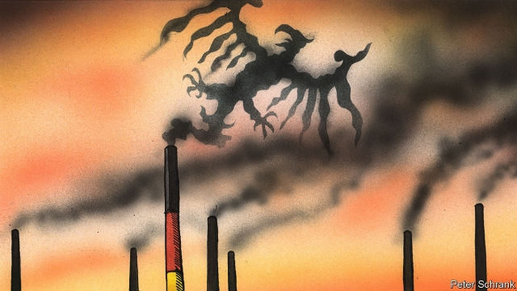

###### Not good enough

# Germany’s new climate-change package is widely panned 

 

> print-edition iconPrint edition | Europe | Sep 28th 2019 

LIKE DISORGANISED students, Germany’s ministers had to pull an all-nighter to meet a deadline they had known about for months. On September 20th, after the members of the “climate cabinet” had spent 19 hours negotiating in the office of Angela Merkel, the chancellor, they unveiled a set of measures aimed at getting their environmentally wayward country back on track. It was a “Marshall Plan for climate protection”, beamed Markus Söder, leader of the conservative Christian Social Union, Mrs Merkel’s electoral partner. But it was instantly dismissed as inadequate. 

Germany, the world’s sixth-biggest emitter of carbon dioxide, will miss its emissions goal next year. The target for 2030, by when emissions are supposed to have fallen by 55% from 1990 levels, is also looking difficult. Hitting it means cutting annual emissions from 866m tonnes, last year’s figure, to 563m in 12 years. The new package aims to chart a path to that goal. 

The paper is a potpourri of subsidies and regulations, including investment in electric-car infrastructure and rail, incentives for cleaner heating systems, and expansion of wind power. At its heart is a carbon price for sectors not included in the EU’s existing emissions-trading scheme, notably transport and buildings. The ultimate goal is carbon neutrality by 2050. 

The criticism has been withering. Some experts had hoped for an initial carbon price of at least €50 ($55) per tonne, eventually rising to over €100, to spur investment in clean fuels and retrofitting buildings, and to encourage a faster shift from the coal plants that provide 29% of Germany’s electricity. Instead, the opening price will be just €10 per tonne in 2021, rising to €35 in 2025, and thereafter trading within a prescribed price “corridor”. Critics also lament the government’s unwillingness to touch environmentally harmful subsidies, such as tax relief for diesel. “The whole package is just a big failure,” says Lisa Badum, the Green Party’s climate spokeswoman. 

Ambitions are limited on investment, too. Olaf Scholz, the finance minister, said spending would amount to €54bn in the next four years, all of it financed from fresh revenues. Yet although it can currently borrow at negative rates, the government retains its commitment to the “black zero” rule that requires it to balance the budget. Claudia Kemfert at DIW, a think-tank, maintains it should be spending far more on trains, insulating buildings and research into cleaner fuel. 

Defenders of the package point to an annual review mechanism, monitored by experts, who can oblige the government to adjust policy if sectors slip behind their emission targets. And pressure from the Greens during the package’s passage through parliament into law may ensure a higher initial carbon price. 

Acknowledging the criticism, Mrs Merkel says politicians have to ensure they bring citizens along with them. The chancellor knows that voters’ commitment to climate protection fades when asked about specific sacrifices they are prepared to make. Better to leave hard decisions to the next government. ■ 

