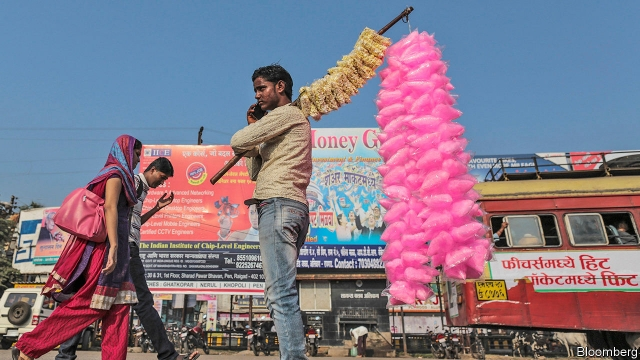

###### India’s indigestible sugar lump

# A sickly tale of price distortions 

 

> print-edition iconPrint edition | Finance and economics | Sep 28th 2019 

OCEANS OF CLOYING chai; coils of sticky jalebi—Indians cannot get enough of the sweet stuff. Already the world’s largest consumer of sugar (though with relatively low consumption per person, at 19kg per year, against a global average of 23kg), last year India pipped Brazil to become the world’s biggest producer. On September 30th its sugar industry’s book-keeping year ends. A reckoning is due. 

A production bonanza, spurred by the brief scare of a shortfall in 2016-17 and by higher-yielding sugar-cane varieties, has driven India’s output to record levels. This year it is expected to hit 33m tonnes of crystalline sugar, compared with domestic demand of about 26m tonnes. The cumulative build-up of sugar means that the mills crushing fresh-cut cane could end up sitting on as much as 14.5m tonnes. That is thought to be the most sugar any country has stockpiled, ever. 

India has long granted sugar-cane farmers special perks. It forces mills to pay sky-high prices for sugar cane and makes it hard for them to import it. Uttar Pradesh, the state with the greatest acreage of cane, sets an extra-generous “state-advised price”, which guarantees farmers a huge return on their basic costs and labour. Thanks to such artificial pricing, processing sugar anywhere in the country is more expensive than in other big producing nations. Mills often don’t pay their bills. This month some farmers in Uttar Pradesh are burning their crops in protest at the mills’ arrears. Abinash Verma of the Indian Sugar Mills Association notes wistfully that Australian and Brazilian mills buy cane at a price linked to what they can get for the juice, meaning they have healthy margins. 

India rigs the sugar market for social and political reasons. The industry is a colossal employer of poor people, in particular in two politically weighty states, Uttar Pradesh and Maharashtra. The average farmer of sugar cane grows it on just 1-2 hectares and so must—the thinking goes—be protected from volatile world prices. Some 35m-50m people are directly employed in sugar-cane cultivation; 7.5% of the rural population depends upon the crop. Complicating things further, sugar barons often become politicians, and vice versa. A survey of 183 sugar mills in Maharashtra between 1993 and 2005 found that most had chairmen who had run for office. 

World sugar prices are close to a ten-year low. Despite this India has sold 3.4m tonnes abroad this year (though that fell short of a target of 5m tonnes). Indonesia has promised to take more, though talk of shipping sugar-laden barges down riverways to Bangladesh was inconclusive. On August 28th India said it would pay mills a bonus of 10.5 rupees (15 cents) per kilo exported, adding up to 63bn rupees ($877m). 

India thus supports farmers to grow sugar, and then subsidises its export. Far better to follow Brazil’s lead and help the industry diversify by using sugar-cane juice to distil ethanol, an alternative fuel. Tarun Sawhney of Triveni Engineering & Industries, which owns seven mills, says investors might be keener on the ethanol industry if the government set out a transparent framework for prices, rather than simply announcing them each year. Mr Verma believes that officials make sure that the price of ethanol tracks that of sugar cane. At which point the logic of price controls—such as it is—reaches a limit. Ethanol is a fuel for cars, not for people. ■ 

