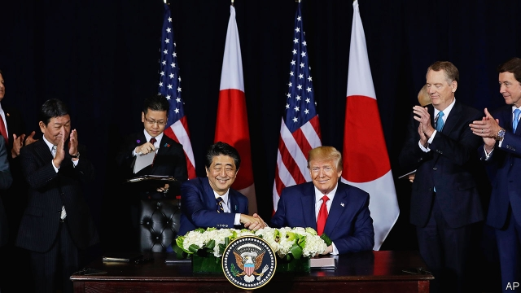

###### Over the line

# America signs a limited trade agreement with Japan 

 

> print-edition iconPrint edition | Finance and economics | Sep 26th 2019 

PRESIDENT DONALD TRUMP teased trade-watchers on September 25th when he reannounced a deal with Japan (just weeks after announcing an agreement in principle). He promised it would mean “really big dollars for our farmers and for our ranchers”. A White House press release boasted about the extra access American exporters of beef, pork and cheese would get to the Japanese market. Robert Lighthizer, the United States Trade Representative, told journalists that American tariff reductions would arrive by January 1st. But despite all the fanfare, the text of the deal remained unpublished. 

There had been hopes that Mr Trump might sign a mini-deal with India, too, during his meeting with the country’s prime minister, Narendra Modi, on September 24th. American companies complain that India’s price controls on heart stents and knee implants force them to sell at below cost price. The hope was that, in return for a package that solved that problem, India might be reinstated as a member of America’s Generalised System of Preferences, which offers lower tariffs on some products. But negotiators failed to resolve their differences in time. 

The mismatch between the demand for photo opportunities and the supply of worked-out trade deals explains both anticlimaxes. Such agreements are complex legal documents, and the language needs to be clear enough that neither side can squeeze out more concessions on the sly. This is trickier when neither trusts the other. The deal with Japan was as difficult as any other, even though the negotiators had relatively recently sealed the Trans-Pacific Partnership (TPP), an agreement including America and Japan negotiated by the Obama administration, only to be rejected by Mr Trump. 

Despite the lack of detail, one thing is clear: the deal will be narrow. Apart from some rules on digital trade, it seems to be focused on tariff barriers. It omits cars and car parts, even though these account for around two-fifths of Japanese goods exports to America. This has drawn criticism. Myron Brilliant of the US Chamber of Commerce, a lobby group, described the agreement as “not enough”. 

The narrow scope is partly because the Trump administration wants to avoid having to seek full congressional approval. (American trade law allows small tariff concessions to be made without it.) But it raises questions about whether the agreement complies with the rules of the World Trade Organisation, which say deals must include “substantially all the trade” if they are to withstand legal challenge. 

The WTO does permit smaller interim agreements—and, mirabile dictu, that is how the Trump administration describes this one. The leaders’ joint statement said that within four months of the mini-deal coming into force, the two countries hope to finish consultations and “thereafter” start negotiating a deal that would address issues including barriers to trade in services and investment. 

Some are sceptical. Wendy Cutler, a former negotiator on the TPP, fears “negotiating fatigue”. Even with domestic pressure from American producers to whom the interim deal offered nothing, “it’s difficult to see how the second stage would be concluded on an expedited basis,” she says. 

Further doubts stem from the leverage that has been granted to Japanese negotiators. They were brought to the table after America walked away from the TPP by the threat of tariffs on cars and car parts. Now they have concessions they can roll back if the Trump administration enacts those. Threats have worked once. But they could be less use in securing the big concessions needed if this supposed staging post is not to become the final destination. ■ 

