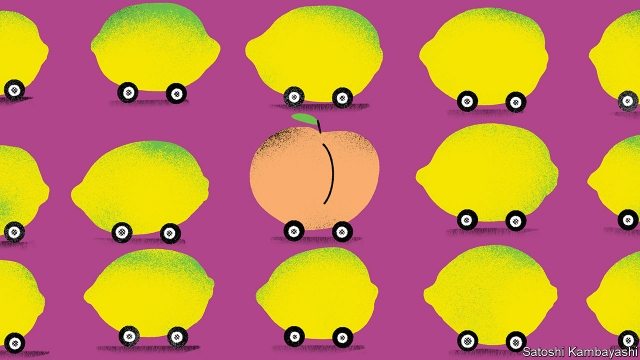

###### The juicy market for lemons

# Can you buy a good second-hand car? 

 

> print-edition iconPrint edition | Finance and economics | Sep 28th 2019 

IN 1970 GEORGE AKERLOF penned one of the most famous papers in economics. “The market for lemons” shows how, in markets where sellers know more than buyers, trade can dry up. His example is not fruit but used cars—a “lemon” is one with hidden defects. Buyers want reliable wheels, or “peaches”. Not knowing which they are buying, they shave their offers. That puts off peach-sellers, some of whom exit the market, raising the chance of buyers getting a lemon, pushing prices down still further. It becomes impossible to sell a peach for what it should be worth. 

Such “adverse selection” can be found in markets from insurance to education. The paper helped to win Mr Akerlof the Nobel prize. But although it contained path-breaking theoretical insight, it cannot be taken literally, because not all used cars for sale are lemons. A new paper examines the extent to which lemons really are a problem. 

Richard Blundell of University College London and four co-authors analysed car prices, administrative data on car ownership and income-tax records in Denmark. They estimated the value of cars in their sample by depreciating sale prices over time. They then calculate how big a discount, according to their model, peach-owners had to accept to sell their car to a (lemon-fearing) dealer. 

The results provide clear evidence of market failure. The authors find a “lemons penalty” of 18% in the first year of car ownership, and of 8% in the second year. The effect decreases further over time. The lemons penalty for cars that were owned for at least three years hovers around 2-5%. It completely vanishes by the ninth year of ownership. If a car is sufficiently old, it seems, dealers do not expect hidden defects—perhaps because its problems are obvious. A new car for sale, however, might arouse suspicion. “There is a different car market for different ages,” says Hamish Low of Oxford University, one of the authors. 

The lemons problem might therefore help explain a well-known phenomenon: that brand-new cars lose a great deal of their value the moment they are bought. However, although the lemons penalty is enough to deter transactions, as Mr Akerlof predicted, the authors found that some peaches still get sold. Sellers may accept a cut-price sale because they badly need cash, or because they have a burning desire to upgrade to something better. Reality is always more complicated than theory. It is enough to send economists bananas. 

