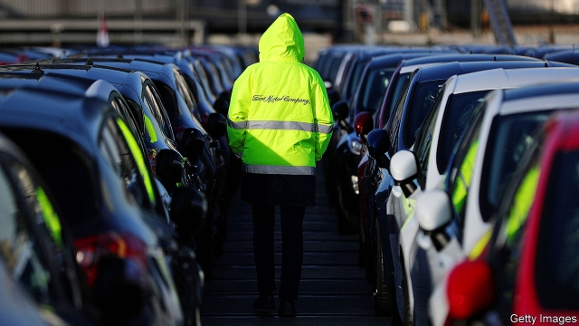
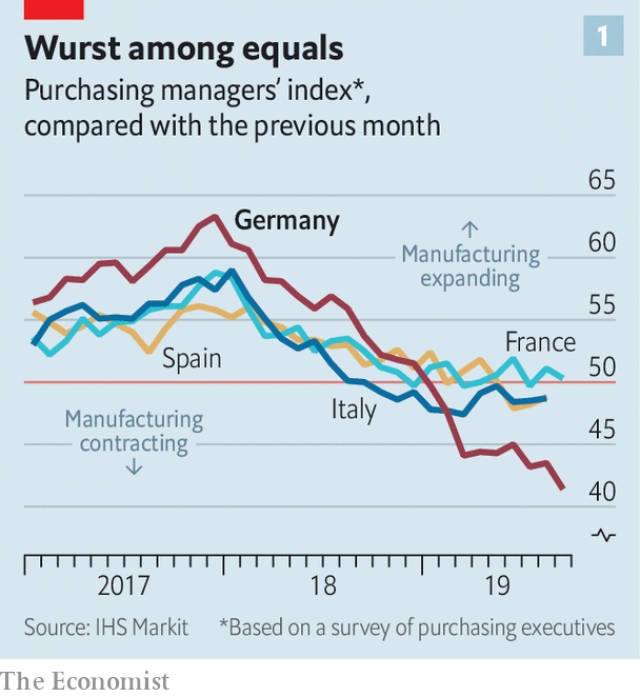
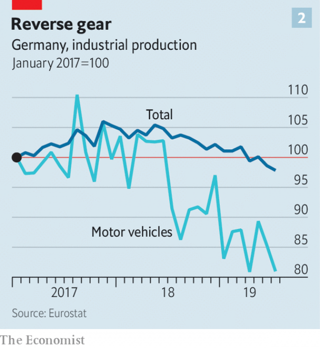

###### The gloom deepens

# Europe’s manufacturing slowdown shows no sign of letting up 

 

> print-edition iconPrint edition | Finance and economics | Sep 28th 2019 

“SIMPLY AWFUL” is how Phil Smith of IHS Markit, a data provider, describes the latest survey reading of Germany’s manufacturing output. For months the purchasing-managers’ index has languished below 50, indicating contraction. An early release published on September 23rd showed it had slid to 41.4, signifying the sharpest decline in manufacturing activity since 2009. The services sector also lost momentum—for the first time in over four years, managers said they were winning less new business. 

A slowdown in Germany’s economy that started a year ago was initially expected to be short-lived. But the gloom has deepened. Output shrank in the second quarter, and many economists, including those at the Bundesbank, think it is still contracting—satisfying the definition of a recession. As a consequence, the euro zone seems set barely to grow. 

Global trade has moderated, and with it industrial activity across Europe. The continent has suffered collateral damage in the trade war between America and China. But there are other reasons for its woes. Take Germany’s exports to both countries, for instance. Carsten Brzeski of ING, a Dutch bank, points out that these have held up better than exports to other markets. Brexit-related uncertainty means that exports to Britain have taken a bigger hit. Even so, researchers at the European Central Bank (ECB) find that external causes explain only around a third of the decline in the euro zone’s industrial production over the past year. The rest of the trouble originates within the currency union. 

 

Much of it appears to stem from supply disruptions in Germany. Its manufacturing sector has taken a much more severe beating than those of France, Italy or Spain (see chart 1). Oliver Rakau of Oxford Economics, a consultancy, reckons that stalling car production alone explains nearly half of the fall in Germany’s industrial output in the second quarter. Once the effects on the rest of the supply chain are added, it might explain as much as three-quarters. Distracted by the fallout from the emissions-cheating scandal, and by new emissions-testing procedures, carmakers delayed production and postponed new models. 

Surveys suggest that European demand for cars is holding up well. Mr Rakau thinks that Germany’s carmakers should recover market share as they launch new models in the autumn and work off a large backlog of orders. But the risk is that the country’s auto giants struggle to regain ground lost to foreign competitors. Meanwhile, trade headwinds could strengthen and fears of protectionism could deter companies from investing. Economists are downgrading expectations for economic growth in 2020 in both Germany and the euro zone. 

 

The silver lining so far has been that the domestic economy was on an upswing. Unemployment rates have returned to pre-crisis lows, and pay is growing at its fastest pace in a decade. But on September 23rd Mario Draghi, the head of the ECB, told members of the European Parliament that the longer the manufacturing slowdown continued, the more likely that the rest of the economy would follow. Analysts at Capital Economics, a consultancy, recently said that services such as technical support and logistics that are exposed to manufacturing are already decelerating. 

The ECB’s decision on September 12th to launch a package of easing measures, including cutting interest rates and restarting asset purchases, might thus seem well-timed. But since then the heads of several national central banks, including France’s and Germany’s, have said that restarting bond-buying is unnecessary. Klaas Knot, the head of the Dutch central bank, went as far as releasing a statement describing the ECB’s stimulus package as “disproportionate”. Mr Draghi fretted to EU parliamentarians that outspoken dissent risked undermining the bank’s pledges to keep interest rates low and to continue with asset purchases until it achieved its inflation target. On September 25th Sabine Lautenschläger, a member of the bank’s executive board, resigned unexpectedly, even though her term expires only in 2022. She gave no reason for her decision, but is known to have opposed restarting asset purchases. 

It is thus even more important for national governments to heed the ECB’s oft-repeated pleas, and do more to counter the slowdown with fiscal stimulus. That government-bond yields in many countries are sub-zero bolsters the case. On September 17th the Netherlands took a tentative step in that direction, announcing tax cuts amounting to €3bn ($3.3bn, or 0.3% of GDP), and promising to publish plans next year for a public-investment fund. Germany pledged spending measures to cut carbon emissions (see article), though these are fiscally neutral. It will take even more dreadful data releases for Europe’s politicians to stop trying to balance the books at the expense of growth. 

