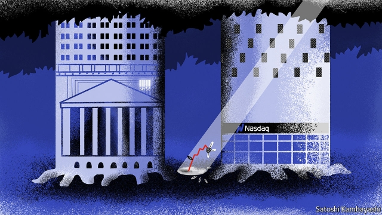
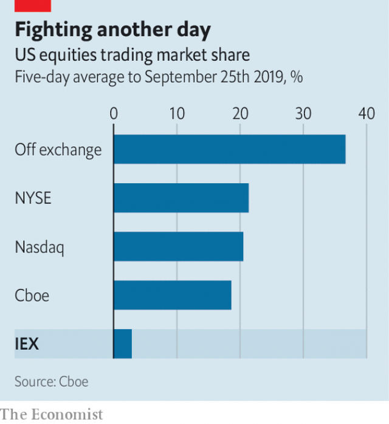

###### Flash boys in the pan

# IEX loses a battle but not yet the war 

 

> print-edition iconPrint edition | Finance and economics | Sep 28th 2019 

TECHNOLOGY HAS robbed stock exchanges of their theatrics. Opening days are an exception. Blue-chip firms listing on Nasdaq, America’s second-biggest exchange, get an hour of exclusive advertising on its tower in Times Square. On the New York Stock Exchange (NYSE), the biggest, they earn the right to be deafened by a bell above a 116-year-old trading floor. 

Yet behind the pageant, competition for listings is cut-throat. Last year Nasdaq snatched 18 listings from NYSE; six went the other way. Now Investors Exchange (IEX), an independent upstart created in 2012, is giving up the fight. On September 23rd it said it would shut its listings unit to focus on trading and new services. “We’ve spent many, many, many hours flying around the world trying to educate companies,” says Brad Katsuyama, its boss. “The return on our efforts was not where it needed to be.” 

Under America’s equity-exchange duopoly, Mr Katsuyama argues, retail investors pay too much for data and a fast connection, and are outpaced by high-speed traders’ algorithms (Cboe, the third-largest, focuses on exchange-traded funds). IEX’s fees, he says, are fair and simple by comparison. It also routes orders over a “speed bump”, a coil of fibre-optic cable that slows access to the market by 350 microseconds. 

Listings were not originally part of its plans. All exchanges can trade any stock, wherever it is listed; indeed few do listings at all. But “Flash Boys”, a bestseller on high-frequency trading published in 2014, cast Mr Katsuyama and IEX as champions of ordinary investors against rigged markets. The publicity piqued companies’ interest. Listings can be lucrative: Nasdaq earned $290m in listings fees last year. And winning listings from the giants would have been a pleasing endorsement. 

 

Yet after 18 months IEX had secured just one: Interactive Brokers, an electronic brokerage that switched from Nasdaq last October (this week it said it would go back). Market participants say IEX may have been held back by its relatively low trading volumes (see chart). Exchanges determine the opening and closing prices of stocks they list; more bids should mean more accurate, less volatile quotes. Price discovery seems to have mattered more to prospective listers than IEX’s modest fees and championing of the little guy. 

Despite the failed listings experiment, IEX is still making inroads. Though small compared with Nasdaq and NYSE, it trades 6,000-7,000 stocks and exchange-traded funds each day, making it the world’s seventh-largest exchange operator by trading value. It has plans for new business lines, such as IEX Cloud, which offers data to software developers, and IEX Astral, a data platform built with fund managers. It is rolling out IEX C-Peg, machine-learning software that predicts short-term price movements to help companies time stock buy-backs. 

And IEX has helped focus attention on its pet issues. Supported by large asset managers, the Securities and Exchange Commission, America’s main financial regulator, is waging court battles against NYSE and Nasdaq over data and transaction fees. Other newcomers, such as the Long-Term Stock Exchange and Members Exchange, are also gearing up to trade equities. Meanwhile, IEX’s main innovation is being copied. By 2020 a dozen markets, from Toronto to Moscow, plan to use some sort of speed bump. Enough, perhaps, to ring alarm bells in Times Square. ■ 

