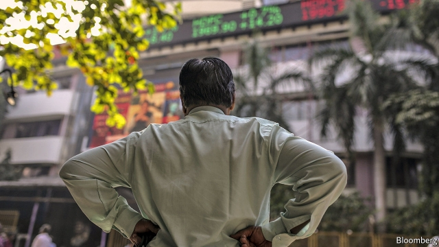
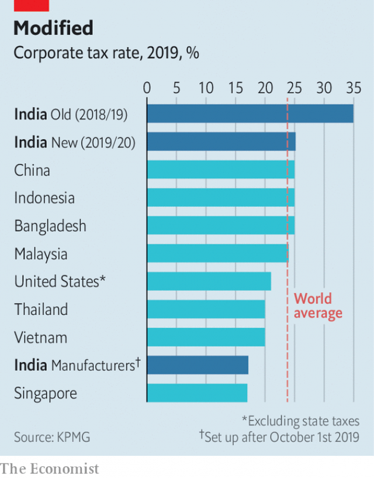

###### Ray of light

# India’s government delights businesses by slashing corporate tax 

 

> print-edition iconPrint edition | Finance and economics | Sep 28th 2019 

INDIAN BUSINESSFOLK have been morose of late. GDP growth is slowing. Corporate earnings and sales have been dismal, with the automotive industry walloped particularly hard. Redundancies are rising, suggesting that a broader downturn is around the corner. Though the government of Narendra Modi has offered a few goodies and pick-me-ups, including abandoning a new levy on foreign investment, India Inc has been sunk in gloom. 

On September 20th the malaise lifted, with a surprise announcement by Nirmala Sitharaman, the finance minister, of steep reductions in corporate taxes. There were reports the plan had been cobbled together in a breathless 36 hours—and suspicions that the government hoped to get ahead of further bad economic news. If so, it will have been gratified by the response. Stock trading, which had been lethargic, perked up. The benchmark Sensex index saw its strongest two-day rise in a decade, of 8.3%. 

The suddenness was characteristic of Mr Modi’s government, which has a penchant for dramatic moves. It says the tax cuts will leave an additional $20bn, or 0.7% of GDP, in companies’ coffers. Tanvee Gupta Jain, an economist at UBS, puts the figure a bit lower, at $15bn. She adds that the tax cut should raise India’s GDP growth rate by 0.2 percentage points, this year and in the future, by helping to attract manufacturers keen to move out of China. So far most have gone to Bangladesh, Indonesia, Thailand or Vietnam instead, since they offer lower taxes and fewer legal pitfalls. 

Earnings for the big firms in the Nifty 50 index will be boosted by 8-10%, analysts reckon. The biggest winners will be profitable businesses paying the highest rates, such as supermarkets, brewers and consumer-product companies. Firms that already have temporary tax breaks, such as IT consultancies, will eventually benefit when their perks expire. 

India’s tax system is so fiddly that it can reduce even grizzled executives to tears. Accountants were besieged by clients seeking guidance. Hitesh Gajaria, a partner at KPMG, a global accounting firm, said the tax reduction was the largest he had seen in his 34-year career—and so too was the number of people wanting to hear the details. Nearly 1,500 dialled into two webinars he held on September 23rd. 

 

The current base rate for the largest companies is 30%. But surcharges push this above 35%, on top of which companies are taxed on the dividends they pay. The recipients of those dividends may have to pay yet more tax. Another levy was recently imposed on share buy-backs. The new base rate will be 22% (25.2% with surcharges). The buy-back tax has been lifted for some firms, but the dividend tax remains. 

A new discounted rate of 15% (17.2% with surcharges) is supposed to attract manufacturers. That is better than the overall rate in any other large country, and nearly matches low-tax Singapore. The average for all firms in Asia, says Mr Gajaria, is 21%, and for the world 24%. Manufacturers who take the plunge in India will be unable to accept any other incentives, such as accelerated depreciation, credits for research and development, or perks that result from locating in a particular place. 

Simplification is a virtue of the plan. But in India nothing is entirely simple. Debate has already started about the precise definition of manufacturing and thus who is eligible for the new incentive for the sector. Existing manufacturers in India are pressing to be included, asking why they should be penalised for committing when others held back. 

Tax is only one reason why India has failed to capture a windfall as supply chains shift away from China. Restrictive labour and land-acquisition laws hamper hiring and construction. Changing these would require state governments’ approval. Sadly for Indian businesses, that rules out another welcome surprise. ■ 

