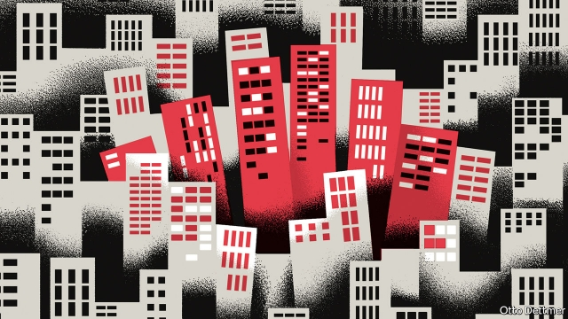

###### Free exchange

# Repo-market ructions were a reminder of the financial crisis 

 

> print-edition iconPrint edition | Finance and economics | Sep 28th 2019 

FOR ANYONE who lived through the global financial crisis, trouble in the market for repurchase agreements, or repos, induces a cold sweat. During the week of September 16th the repo market—the epicentre of the crisis 12 years ago—ran short of liquidity, forcing the Federal Reserve to intervene suddenly by injecting funds. By the following week fears of a reprise of the global crisis were easing, though banks remained eager recipients of Fed liquidity. But the episode was a reminder that financial dangers lurk. At some point one will give post-crisis reforms a real-world stress test. It is unclear whether they are up to the challenge. 

The financial crisis combined several storms into a single maelstrom. It was part debt-fuelled asset boom. A long run of rising home prices in America led to complacency about the risks of mortgage lending. Ever more recklessness fuelled the upward march of prices, until the mania could no longer be sustained. Borrowers began to default, saddling lenders with losses and creating a widening gyre of insolvency. Painful enough on its own, America’s housing bust became truly explosive thanks to an old-fashioned bank run. 

Banks fund themselves on a short-term basis via demand deposits, but also on money markets, such as that for repos. Many bank assets, by contrast, are illiquid and long-term, such as loans to firms and homebuyers. This mismatch leaves banks vulnerable. During the Great Depression, many failed when nervous depositors demanded their cash all at once. Though government-provided deposit insurance now protects against this hazard, it did not extend to money markets. In 2008, then, questions about the health of banks and their collateral triggered a flight from those markets, leaving healthy and unhealthy banks alike unable to roll over short-term loans and at risk of imminent collapse. 

These twin woes were amplified by the global financial system’s interconnectedness. Cross-border capital flows soared in the years before the crisis, from 5% of global GDP in 1990 to 20% in 2007, spreading financial excess and outstripping regulators’ capacity for oversight. Money from around the world poured into America’s mortgage market, and the resulting pain was correspondingly global. The Fed’s first crisis intervention, in August 2007, was in response to money-market turmoil prompted by financial difficulties at funds run by a French bank, BNP Paribas. 

Chastened by the near-death experience, governments introduced regular stress-testing and made banks adopt “living wills”: plans to wind themselves down in the event of failure without endangering the system as a whole. Central banks added credit-risk indicators to their policy dashboards. Regulators increased banks’ capital and liquidity requirements: bigger buffers against losses and liquidity droughts, respectively. In advanced economies bank balance-sheets look stronger than in 2007, and no obvious debt-fuelled bubbles have inflated. 

Yet all that is less reassuring than might be hoped. Post-crisis, both governments and markets have proved surprisingly tolerant of risky borrowing. Despite household deleveraging, companies have taken on enough debt to keep private borrowing high; at 150% of GDP in America, for instance, roughly the level of 2004. In America the market for syndicated business loans has boomed, to over $1trn in 2018, and loan standards have fallen. Many loans are packaged into debt securities, much as dodgy mortgages were before the crisis. Regulators have declined to intervene—remarkably, considering how recent was the crisis. 

Just as the threat of bank runs migrated from depositors to money markets, so systemic risk may now be building up in non-bank institutions. Investment funds, pension managers and insurance companies have been eager buyers of securitised bank loans. As recently noted by Brad Setser of the Council on Foreign Relations, an American think-tank, some have begun to take on an ominously bank-like maturity mismatch. Insurers in some countries, including Japan and Korea, have been hoovering up hundreds of billions of dollars of foreign bonds, hedging the exchange-rate risk on a rolling, short-term basis. If, in a crisis, these funds cannot renew their hedges, they could be exposed to significant losses. The vulnerabilities of supposedly staid firms may be an underappreciated source of risk for big banks. 

These obscure dangers arise because finance remains extraordinarily globalised. Outstanding cross-border financial claims, though lower than just before the crisis, remain well above the historical norm. Money continues to slosh around the global economy, seeping into cracks beyond the reach or outside the view of national regulators. It is impossible to be sure that unanticipated turmoil in one corner of the financial system cannot spiral into something catastrophic. 

Troubles in repo markets illustrate the threat posed by this opacity. Market-watchers blamed the cash crunch on firms’ need to pay corporate-tax bills at the same time as sucking up more new government debt than usual. But banks were aware of these factors well ahead of time. Other, as yet poorly understood, forces seemed to have provided the nudge that tipped repo markets into disarray. 

No obvious disaster looms. But the world did not appreciate the peril it faced in 2007 until too late. There are ways to keep financial risk in check. The Great Depression convinced many people that financial capitalism was inherently dangerous, but in the 40 years that followed, crises were infrequent—a testament to draconian financial regulation and capital controls. Since the deregulation of the 1970s and 1980s, crises have been depressingly common. Just how far back the pendulum has swung will be clear only decades from now, when it becomes possible to look back and count the consequent misfortunes. Rattled once more by repo gyrations, it is tempting to say not far enough. ■ 

