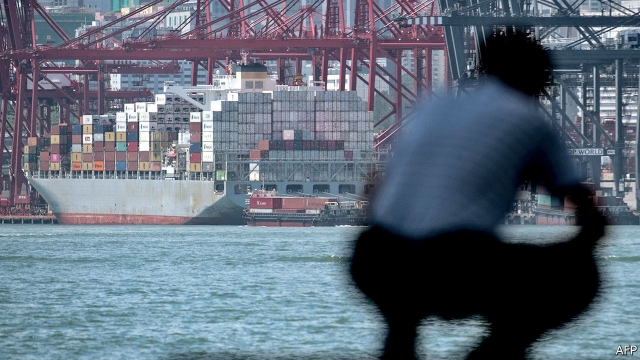

###### System failure

# The trade war did not start with President Donald Trump 

 

> print-edition iconPrint edition | Finance and economics | Sep 28th 2019 

Schism: China, America and the Fracturing of the Global Trading System. By Paul Blustein. CIGI Press; 280 pages; $35. 

AMERICA’S ECONOMIC relationship with China is rupturing. Tariffs now cover around two-thirds of the countries’ bilateral trade in goods, and will include almost all of it from December 15th. A timely new book by a former reporter for the Washington Post and Wall Street Journal explores the origins of the conflict, which date from well before Donald Trump’s presidency. 

China hawks contend that America should have blocked China’s entry into the World Trade Organisation (WTO) in 2001. Even then, they reckon, it was obvious China would never embrace the Western economic model. Once in, they say, it abused other members’ trust, depressing the value of its currency for competitive gain, subsidising its industries and stealing American intellectual property. 

But it is worth recalling that the terms set for China were much more severe than those for other emerging markets. It had to agree that other members could impose special, defensive tariffs on its exports. Many within China felt that it had been accorded second-class status. And to say that China’s accession achieved nothing is too harsh. China made significant domestic reforms, for example promising that only published laws to which other WTO members had easy access would be enforced. (Previously, some laws had been known only to the authorities.) 

Even so, China’s membership has fallen far short of the more glowing hopes. After the first few years reforms stalled, and it became clear that the state was not going to loosen its grip much further. Companies complained that the price of entry to the Chinese market was steeper than had been agreed. Close and tangled relations between China’s government and private sector continued to be a problem, as cheap loans and subsidies kept Chinese producers pumping out products even as prices were telling producers elsewhere to stop. The “China shock” caused by a flood of imports meant that many Americans regarded the competition as unfair. 

As Mr Blustein explains, some of the problems were exacerbated by American policy choices. George W. Bush was reluctant to use the defences that negotiators had secured against Chinese imports, for fear of hurting American consumers and encouraging other sectors to clamour for protection. Perhaps the threat of tariffs would have convinced the Chinese to let their currency appreciate more quickly. Probably not, reckons Mr Blustein. But America might have tried. 

Other challenges were deeper, and harder to resolve by threatening tariffs. Rules are useful only if they can be enforced. China’s economic system therefore sits awkwardly alongside international trade law. When it is hard to distinguish between the private and public sectors, it is hard to work out what counts as a subsidy. When laws are enforced selectively by local officials, gathering evidence to sue the Chinese for rule-breaking is nigh-impossible. 

More recent history suggests no easy solution to this clash of economic systems. The Trump administration’s critics lambasted it for pulling out of the Trans-Pacific Partnership (TPP), a trade deal between America and 11 countries around the Pacific Rim, thereby abandoning the chance to write rules that could eventually reshape China’s domestic policies. But Mr Blustein doubts it would have changed China’s path. Among the bits of Chinese manufacturing most at risk from the TPP were sectors such as footwear and apparel. But it was already seeking to develop beyond these. 

Diplomacy had seemed to bring some success, as when Barack Obama struck a deal in which the Chinese agreed to stop hacking American companies’ computer systems and stealing their intellectual property. (Mr Blustein reminds readers of the double standards of America’s security services, who fretted that Huawei, a Chinese telecommunications giant, might install surveillance equipment in hardware used around the world—even as they were trying to do the same.) But it could do only so much. China is a large sovereign nation with domestic constituents to please. 

Readers will probably finish this excellent book feeling gloomy. Mr Blustein sees two possible ways forward: forging a common China policy with allies; and strengthening the WTO. Sadly, the Trump administration is pursuing neither. ■ 

