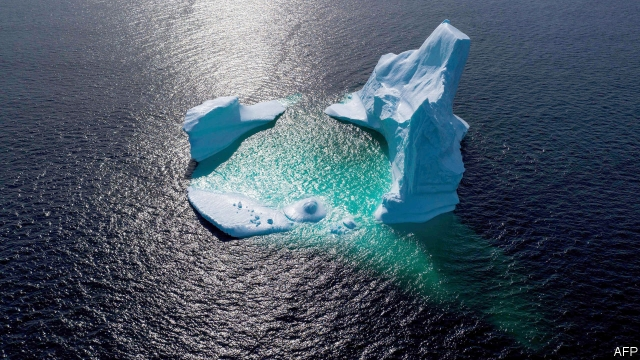
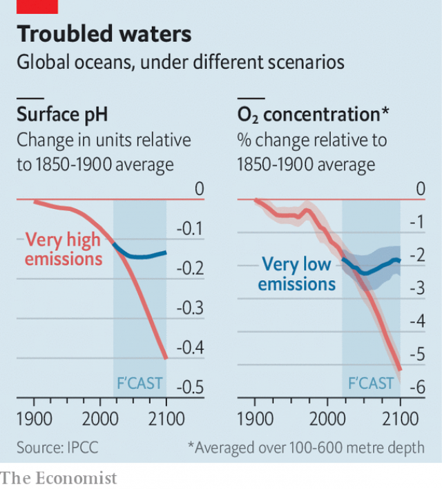

###### Sea changes

# Oceans are increasingly bearing the brunt of global warming 

 

> print-edition iconPrint edition | International | Sep 26th 2019 

THE WORLD’S oceans are getting warmer, stormier and more acidic. They are becoming less productive as the ecosystems within them collapse. Melting glaciers and ice sheets are causing sea levels to rise, increasing the risk of inundation and devastation to hundreds of millions of people living in coastal areas. 

The latest special report from the Intergovernmental Panel on Climate Change (IPCC), on how the oceans and frozen regions of the planet are changing in response to the rising carbon dioxide levels in the atmosphere, is a predictably grim read. The final text, pored and argued over by scores of scientists and policymakers from 36 countries over the course of marathon meetings in the past week in Monaco, makes reference to almost 7,000 relevant scientific studies. 

 

For decades, the oceans have provided a buffer against the full impact of a warming planet. Since 1970, says the report, they have soaked up more than 90% of the excess heat associated with greenhouse gases and absorbed around a quarter of the carbon dioxide emitted from cars, power stations and factories. As oceans warm, the layers of water within them mix less and the supply of oxygen and nutrients decreases. The upper layers of the world’s seas have lost 1-3% of their oxygen in recent years and the increased absorption of CO² has made the water more acidic, complicating life for creatures such as coral that need to build carbonate shells. As this continues, the report predicts that around 15% of animals are likely to disappear by the end of the century, and that fish catches could decline by as much as a quarter relative to average levels between 1986 and 2005. 

Farther towards the poles, the permafrost—permanently frozen soil—is at risk. Even if the average global temperature increase is limited to 2°C above pre-industrial levels—already an ambitious target—a quarter will thaw. If greenhouse-gas emissions and temperatures increase further, almost 70% of this near-surface permafrost could melt. Frozen in that earth are 1,460-1,600 gigatons of carbon, says the report, almost twice the amount already in the atmosphere, much of which could be released if the soil thaws. 

The IPCC process is rooted in science but reaching any consensus is tricky. The politics demand some sacrifices. Big producers of fossil fuels such as Saudi Arabia, for example, often quibble with the strong conclusions in such reports. For the sake of unanimity, some of the language was weakened. Even so, this latest report provides a new, unified portrait of Earth’s oceans and ice realms that should better inform policymakers. And better informed could mean better protected. 

