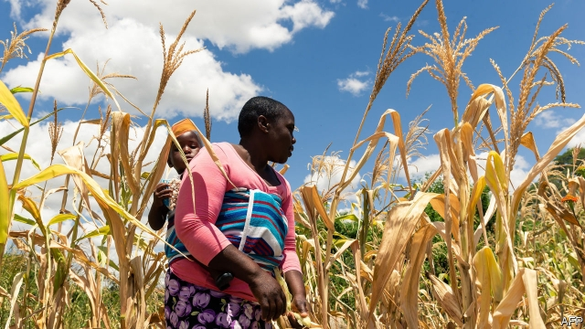
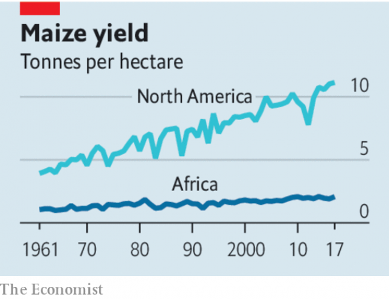

###### Bureaucratic herbicide

# Africa’s farmers need better seeds 

 

> print-edition iconPrint edition | Leaders | Sep 28th 2019 

A CENTURY AGO American crop scientists began experimenting with the plant known there as corn, and elsewhere as maize. They discovered that by crossing two inbred strains they could create seeds that would consistently grow better than either of the parent plants. It was the beginning of a seed revolution. By the 1940s American agricultural productivity was shooting up; by the 1960s Asia had joined the race, thanks to improved varieties of rice and wheat. 

In most of the world, the green revolution continues. Open an American seed catalogue today and you will see dozens of varieties of each plant, many of them labelled “new” to show that they have been released or improved somehow just in the past year. 

But on one continent, it never quite happened. African farmers still tend to use open-pollinated seeds held back from the previous year’s crop or commercial hybrids that were developed years ago. That’s one of the main reasons for the continent’s chronically low productivity. The average field planted with maize—Africa’s most important crop, which supplies 30% of people’s calories in some countries—yields a third as much as a Chinese maize field of the same size and just a fifth as much as an American one. 

The problem is not a paucity of science. Although crop research in Africa is not as well funded as it is in rich countries, there is enough public and private investment to ensure a stream of new seeds to suit local soils and climates. Nor is the problem ideology. African governments have mostly ignored the arguments, from some charities, that old-fashioned farming is best and that wicked, profit-seeking seed firms should be barred. They know that modern seeds make farming more productive. 

 

The problem is that government policies prevent farmers from getting good seeds. Many insist on lengthy field trials and obstruct the approval of seeds that have already been certified for planting elsewhere. As a result, those on the market are always several years behind the scientific cutting edge. It need not be so. Zambia has liberalised its certification system, including by allowing seed companies to inspect themselves. In the past two decades, maize productivity there has doubled. 

Although Africa’s governments have mostly got out of the seed-production business, governments often subsidise seeds and former state monopolies still dominate the seed trade (see article). They flood markets with seeds that are often of poor quality or unsuited to local conditions, crowding out more efficient private distributors with better goods. 

It is not a bad idea for governments to subsidise seeds to persuade farmers to try productive varieties for the first time. But that should be the limit. State resources would be better spent on research, on tackling counterfeit seeds—a big problem in many countries—or on educating farmers about how to use improved seeds and fertiliser. Ethiopia, though not a paragon of market openness, has done that well. Its maize fields are now almost twice as productive as the African average. 

The bravest governments could also relax the bans that almost all have imposed on genetically modified crops. Their caution is hardly unusual. GM crops are permitted in some other places, but only on the assumption that they would be fed to livestock. In Africa they would be eaten by people. And many of the European countries that Africa exports to are hostile to GM crops. But genetic technology is often the quickest route to seeing off the pests and diseases that afflict the continent more than other parts of the world, and is the best way of producing seeds that will flourish in a changing climate. Who says that Africa should always be the last to innovate?■ 

