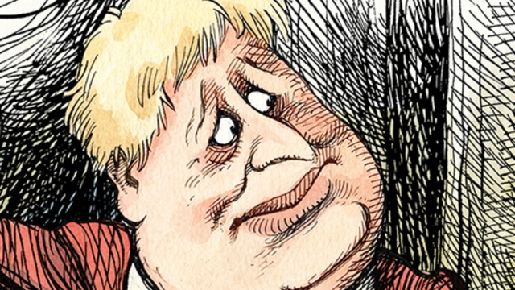

###### The Supreme Court

# Brexit has infected British politics from top to bottom 

 

> print-edition iconPrint edition | Leaders | Sep 26th 2019 

NO BRITISH INSTITUTION is any longer immune to the Brexit virus. On September 24th the Supreme Court ruled that the queen herself had been led to act unlawfully when her prime minister, Boris Johnson, advised her to suspend Parliament in the run-up to Britain’s departure from the European Union (see article). Unanimous, the judges ruled that the government had not provided “any reason—let alone a good reason” for this intrusion on “the fundamentals of democracy”. The very next day MPs returned to work triumphant. 

This was the worst week in Mr Johnson’s extraordinarily bad two months in office. The unelected prime minister has lost every vote he has faced, squandered his majority and fired a score of MPs from his Conservative Party. Following the court’s ruling, he was dragged back from a UN summit in New York to face the music in Westminster, where MPs now have ample time to grill him not only about his fraying Brexit plans but also on allegations of corruption during his stint as mayor of London. 

Mr Johnson is an unworthy occupant of 10 Downing Street. And yet the man who would replace him, Labour’s Jeremy Corbyn, is hardly more appealing. At its conference this week Labour set out a platform of wildly far-left policies, including the expropriation of a tenth of the equity of every large company, a big round of nationalisation, the seizure of private schools’ assets and a four-day working week. The extreme nature of the programme was matched only by the extreme viciousness of the infighting, and the extreme incompetence with which plots were hatched and backs were stabbed. 

It may seem like an awful twist of fate that at such a crucial time Britain has both the worst prime minister and worst leader of the opposition in living memory. But it is no coincidence. Both men, wholly inadequate to their roles, are in place only because Brexit has upended the normal rules of politics. This turbulent week has shown more clearly than ever that, until Britain’s relationship with the EU is resolved, its broader politics will be dangerously dysfunctional. 

The Supreme Court’s welcome slapping down of Mr Johnson’s unlawful suspension of Parliament was a model of neutrality. But the unrepentant prime minister told a febrile Parliament that the court had been wrong to intervene. MPs are sabotaging Brexit, he thundered; by ruling out a no-deal Brexit they are surrendering to the Europeans. The man who claimed he wanted to leave the EU to restore power to British institutions has again shown himself ready to vandalise them when it suits him. 

There is no doubt, though, that the person most damaged by the ruling is the prime minister himself. As well as the ignominy of losing the case, the judgment brings more immediate problems. One is the prospect of MPs digging into new claims that, as mayor, he funnelled public money to companies owned by a close friend. (He says funds were dispensed to her with “utter propriety”.) Another is that his promise to leave the EU on October 31st under any circumstances looks rasher than ever. He is desperate to do a deal, but striking one that satisfies both the EU and his hardline Brexiteers in Parliament will be a tall order—as it was for his predecessor, Theresa May. The court has shown that it will not tolerate the kind of chicanery that his advisers seemed to think might get him out of this hole. 

If Mr Johnson feels tormented by Brexit, he should think again. His lifelong aim of becoming Conservative leader had long been blocked by fellow MPs, who identified him as a lightweight and a liar. Only their panicked belief that the party needed a leader who had backed Leave, and who could win voters from the hardline Brexit Party, persuaded them to overlook the glaring flaws in his character. Brexit may well make Mr Johnson the shortest-serving prime minister. But it was also Brexit that made him any sort of prime minister. 

Something similar is true of Mr Corbyn. He, too, is frustrated that Brexit, which does not much interest him, is distracting from his plans for transforming Britain. Labour’s internal split on the issue is more likely than anything else to bring him down. But it is also Brexit that has catapulted him to the extraordinary position of preparing to form a socialist government before the end of the year. Brexit has done for two Tory prime ministers and counting, and split the party system in such a way that Labour might yet take office on only a small share of the vote. Even with their humiliations, the Conservatives are ten points ahead in polls. Imagine how poorly Mr Corbyn, the most unpopular opposition leader on record, would be faring in normal times. 

Voters will soon face an unappetising choice between these two inadequate leaders. With the government some 40 votes short of a majority, an election is coming. Polls show that many voters (like quite a few MPs) are defecting to the moderate Liberal Democrats—a sign that they reject the drift to the extremes in the two main parties. Yet under first-past-the-post voting it would take an earthquake for the next prime minister to be anyone other than Mr Johnson or Mr Corbyn. And as for the great matter of the day, neither man has yet been able to say precisely what type of Brexit, if any, he could bring about. Given the polls, it is likely that neither will end up with a majority, leaving Parliament just as logjammed as today. 

That is why the Brexit question is best answered by returning it to voters, via a second referendum. We have long argued that they deserve a chance to say whether the final exit deal is preferable to the one they have as EU members. A referendum would resurrect bitter arguments and infuriate Leavers, who see it as a rematch of a contest they already won. But nearly four years will have passed between the original vote and a likely exit date. In addition, what was promised has turned out starkly different from the reality, especially if Britain proposes to leave without a deal. It is thus more important than ever to find out if voters are really in favour of what is being done in their name. The public supports the idea of a second vote and there is just about a majority for it in Parliament, which can agree on little else. Only when people are given a clear choice on this question can the country begin to shake off the Brexit virus. ■ 

